# Install and Configure Help for SQL Server

This article walks you through how to install local Help, and how to display online and local Help. The article covers Help viewer 1.1 and 2.2, and documentation for [!INCLUDE[ssSQL14_md](../../TokenContainer/ssSQL14_md.md)] and for SQL Server 2016.

## [!INCLUDE[ssSQL14_md](../../TokenContainer/ssSQL14_md.md)] and Help Viewer 1.1
 Help Viewer 1.1 is available in [!INCLUDE[ssSQL14_md](../../TokenContainer/ssSQL14_md.md)] Management Studio and versions of Visual Studio prior to Visual Studio 2012. 
 
**To install local Help to use with Help Viewer 1.1**
1. Navigate to the [download site](https://www.microsoft.com/en-us/download/details.aspx?id=42557) for the Help content and click **Download**.
2. Click **Save** in the message box to save the SQLServer2014Documentation_*.exe file to your computer.
   >[!NOTE]For firewall and proxy restricted environments, save the download to a USB drive or other portable media that can be carried into the environment. 
3. Double-click the .exe to unpack the Help content file and save the file to a local or shared folder.
4. Open the **Help Library Manager** by launching SQL Server Management Studio or Visual Studio and clicking **Manage Help Settings** on the **Help** menu.
7. Click **Install content from disk**, and browse to the folder where you unpacked the Help content file.

Select Install content from disk  |Browse to Help content file 
---------|---------
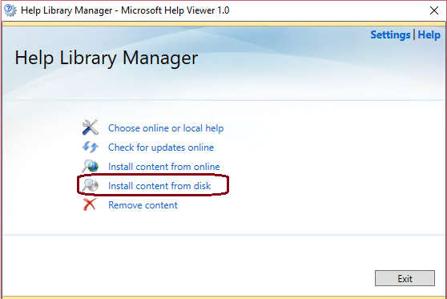    | 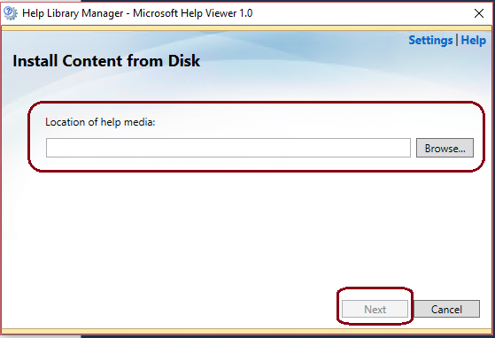        

>[!IMPORTANT] To avoid installing local Help content that has only a partial table of contents, use the **Install content from disk** option in the **Help Library Manager**.
>>If you've used the **Install content from online** option and the Help Viewer is displaying a partial table of contents, see this [blog post](https://blogs.msdn.microsoft.com/womeninanalytics/2016/03/30/troubleshoot-local-help-for-sql-server-2014/) for troubleshooting steps.
8. Click the HelpContentSetup.msha file, click **Open**, and then click **Next**.
9. Click **Add** next to the documentation you want to install, and then click **Update**.

   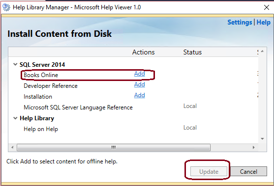
10. Click **Finish**, click **Exit**, and then open the Help Viewer to see the content by clicking **View Help** on the **Help** menu. You should see the content you've installed listed in the table of contents, in the left pane.

    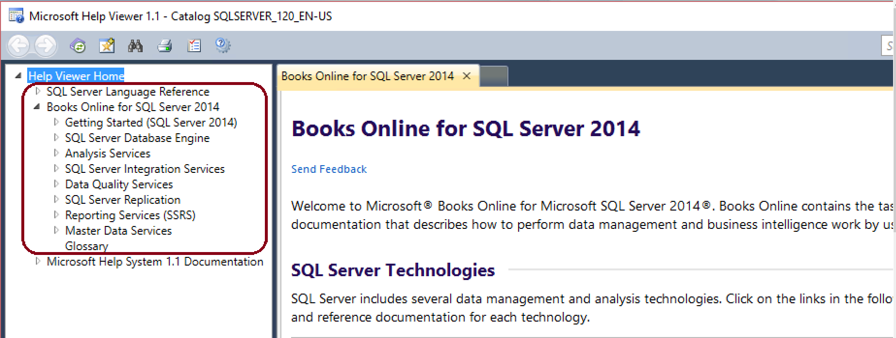

**To display local Help or online Help**
1. Open the **Help Library Manager** by clicking **Manage Help Settings** on the **Help** menu.
2. In the **Help Library Manager** dialog box, click **Choose online or local help**.

   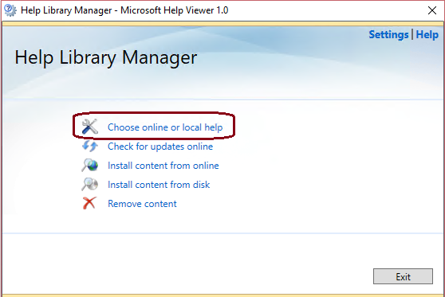
3. Do one of the following, and then click **OK**, and click **Exit**.
   * Click **I want to use online help**
   * Click **I want to use local help**.

   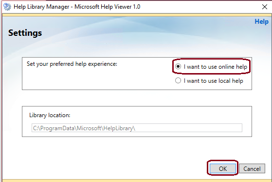

If you selected to use online Help, when you click **View Help** on the **Help** menu, the browser launches and displays the [Books Online for SQL Server 2014](https://msdn.microsoft.com/library/ms130214(v=sql.120).aspx) article on MSDN. If you selected to use local Help, when you click **View Help** the Help Viewer launches.

## [!INCLUDE[ssNoVersion_md](../../TokenContainer/ssNoVersion_md.md)] and Help Viewer 2.2
Help Viewer 2.2 is available in [!INCLUDE[ssCurrent_md](../../TokenContainer/ssCurrent_md.md)]  Management Studio starting with the April 2016 Preview (13.0.12500.29) and in Visual Studio 2015.
**To install local Help to use with Help Viewer 2.2**
1. Open Help Viewer 2.2 by launching SQL Server Management Studio or Visual Studio, and clicking **Add and Remove Help Content** on the **Help** menu.
2. Click the **Manage Content** tab.
3. To install the Help from an online source, click **Online** in the **Installation source** area.
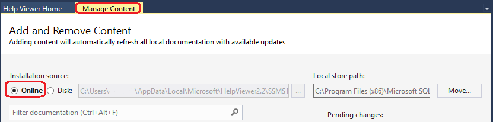
4. To install the Help from a local or shared folder, do the following.
   1. Navigate to the download site for the Help content and click **Download**.
   6. Click **Save** in the message box to save the *.exe file to your computer.
   7. Double-click the .exe to unpack the Help content file and save the file to a local or shared folder.
   7. Click **Disk** in the **Installation source** area and click the ellipsis button to browse to the folder where you unpacked the Help content file.
   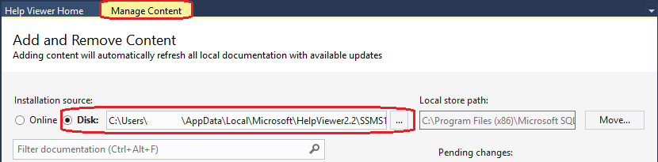
   
      >[!NOTE]For firewall and proxy restricted environments, save the download to a USB drive or other portable media that can be carried into the environment.
7. Click **Add** next to the documentation you want to install, and then click **Update**.
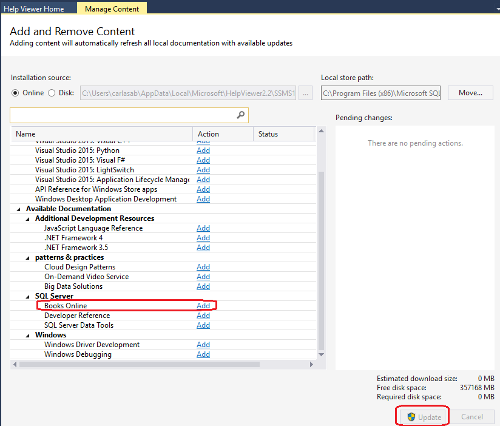   

   >[!IMPORTANT] In SQL Server Management Studio, the Help Viewer application may freeze (hang) during the process of adding the documentation. To resolve this issue, do the following. For more information about this issue, see [Visual Studio Help Viewer freezes](https://msdn.microsoft.com/library/mt654096.aspx).
   >>Open the %LOCALAPPDATA%\Microsoft\HelpViewer2.2\HlpViewer_SSMS16_en-US.settings file in Notepad and change the date in the following code to some date in the future.
   >>>Cache LastRefreshed="12/31/2017 00:00:00"

   
 
When you click the **Help Viewer Home** tab, the table of contents in the left pane automatically updates to include the documentation you've added.
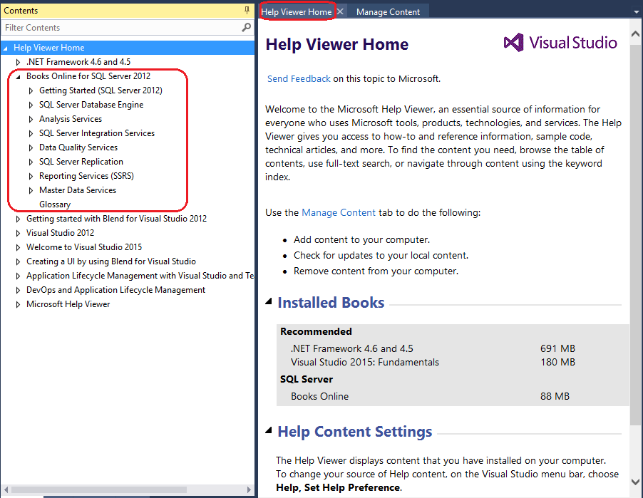

**To display local Help or online Help in SQL Server Management Studio**
* To view local Help, click **Add and Remove Help Content** on the **Help** menu, and then click the **Help Viewer Home** tab to see the documentation.
    >[!NOTE]The text, **Help Viewer Home**, changes based on which topic you've clicked in the table of contents. 
* To view online Help, click **View Help** on the **Help** menu. Documentation displays in a browser.
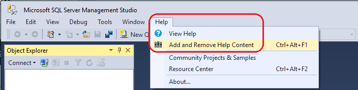

**To display local Help or online Help in Visual Studio**
* Click **Help Set Preference** on the **Help** menu, and do one of the following.
   * Click **Launch in Browser** to view online Help. When you click **View Help** on the **Help** menu, documentation displays in a browser.
   * Click **Launch in Help Viewer** to view local Help. When you click **View Help** on the **Help** menu, documentation displays in the Help Viewer.
   
     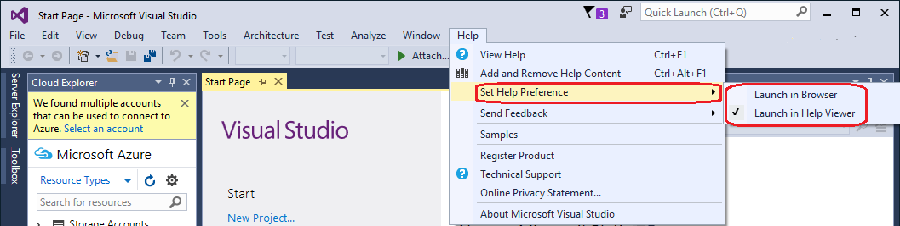

