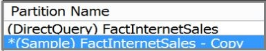

# Add  sample data to a DirectQuery model in Design Mode
By default, a DirectQuery model in Analysis Services is empty of data in the modeling environment.  
  
 However, you can add data to your model, for use at design time, to help you validate  modeling decisions as you go. The dataset you specify is retrieved when using **Analyze in Excel** in SQL Server Data Tools (SSDT), or from other client applications that can connect to your workspace database.  
  
 Sample data is specified via a query on a partition used only during design. It's cached with the model.  
  
 In DirectQuery mode, partitions are used to either create data subsets used during modeling, or create alternatives of a full data view, for example if you are deploying variations of your database for specific regions.  When deployed, only one partition is allowed per table, and that partition by necessity must be full data view, whose query determines retrievable data. Any additional partition is either a substitute for full data view  or sample data.  
  
> [!TIP]  
>  Even in DirectQuery mode on an empty model, you can always view a small built-in rowset for each table. In [!INCLUDE[ssBIDevStudio](../../Topics/TopicNameContainA/includes/ssBIDevStudio_md.md)], click **Table** > **Table Properties** to view the 50-row dataset.  
  
## Add sample data to a Tabular model at compatibility level 1200  
 These instructions are for Tabular models created at or upgraded to compatibility level 1200. Models at lower compatibility levels use different properties to get cached data. See [Enable DirectQuery mode in SSMS](../../Topics/TopicNameNotContainA/Enable-DirectQuery-mode-in-SSMS.md) for property descriptions.  
  
1.  In SQL Server Data Tools, in Diagram or the tabbed Data View, click a fact table to open its properties page. Fact tables provide the aggregated, numeric data and measures in your model. You might have more than one.  
  
2.  In Table properties, click to edit **Partitions**. This opens the Partition Management dialog box.  
  
3.  Notice that the default partition is **(Direct Query) <table name\>**. This is the full data view. Leave this partition alone. This is the partition that will be used when the model is deployed to a server.  
  
4.  Select the partition and click **Copy**.  
  
       
  
5.  Select the copied partition and then click the **Edit SQL Query** button to add a filter. If you selected **DimDate** from AdventureWorksDW, your filter might look like the following:  
  
    ```  
    SELECT [dbo].[FactInternetSales].* FROM [dbo].[FactInternetSales]  
    JOIN DimSalesTerritory as ST  
    ON ST.SalesTerritoryKey = FactInternetSales.SalesTerritoryKey  
    WHERE ST.SalesTerritoryGroup='North America';  
    ```  
  
6.  Click **Validate** to check for syntax errors.  
  
     Notice that in DirectQuery mode, in addition to **New** , **Copy**, and **Delete** buttons on the Partitions dialog box, there is also a toggle button that alternately reads **Set as Sample** or **Set as DirectQuery**.  
  
     Only one partition can be the DirectQuery partition. You can control that by selecting any partition defined for the table and clicking **Set as Sample**.  
  
7.  Process the table.  
  
## See Also  
 [Analyze in Excel (SSAS Tabular)](../../Topics/TopicNameNotContainA/Analyze-in-Excel--SSAS-Tabular-.md)   
 [Compatibility Level for Tabular models in Analysis Services](../../Topics/TopicNameNotContainA/Compatibility-Level-for-Tabular-models-in-Analysis-Services.md)