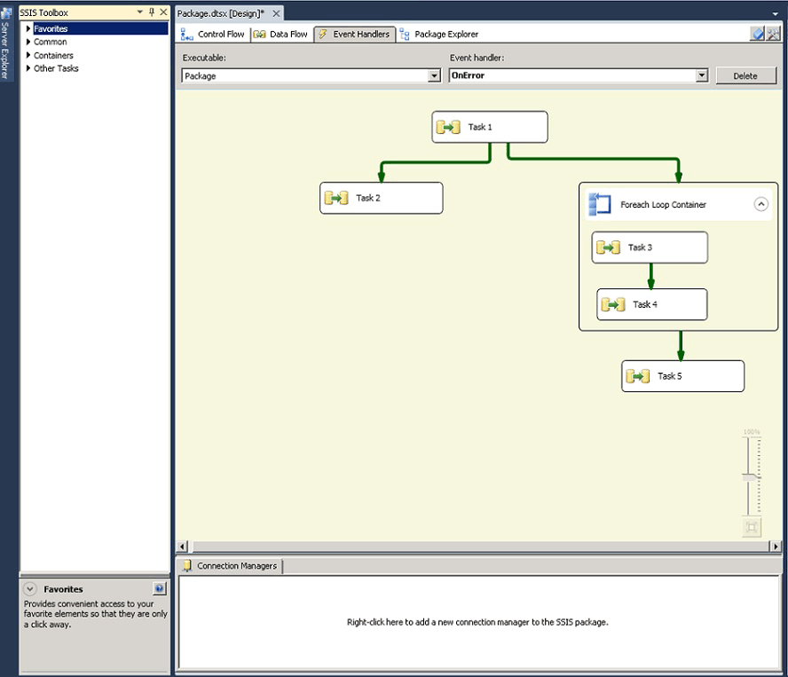

# Add an Event Handler to a Package
At run time, containers and tasks raise events. You can create custom event handlers that respond to these events by running a workflow when the event is raised. For example, you can create an event handler that sends an e-mail message when a task fails.  
  
 An event handler is similar to a package. Like a package, an event handler can provide scope for variables, and includes a control flow and optional data flows. You can build event handlers for packages, the Foreach Loop container, the For Loop container, the Sequence container, and all tasks.  
  
 You create event handlers by using the design surface of the **Event Handlers** tab in [!INCLUDE[ssIS](../../Topics/TopicNameContainA/includes/ssIS_md.md)] Designer.  
  
 When the **Event Handlers** tab is active, the **Control Flow Items** and **Maintenance Plan Tasks** nodes of the Toolbox in [!INCLUDE[ssIS](../../Topics/TopicNameContainA/includes/ssIS_md.md)] Designer contain the task and containers for building the control flow in the event handler. The **Data Flow Sources**, **Transformations**, **and Data Flow Destinations** nodes contain the data sources, transformations, and destinations for building the data flows in the event handler. For more information, see [Control Flow](../../Topics/TopicNameNotContainA/Control-Flow.md) and [Data Flow](../../Topics/TopicNameNotContainA/Data-Flow.md).  
  
 The **Event Handlers** tab also includes the **Connections** Managers area where you can create and modify the connection managers that event handlers use to connect to servers and data sources. For more information, see [Create Connection Managers](../../Topics/TopicNameNotContainA/Create-Connection-Managers.md).  
  
### To create an event handler  
  
1.  In [!INCLUDE[ssBIDevStudioFull](../../Topics/TopicNameContainA/includes/ssBIDevStudioFull_md.md)], open the [!INCLUDE[ssISnoversion](../../Topics/TopicNameContainA/includes/ssISnoversion_md.md)] project that contains the package you want.  
  
2.  In Solution Explorer, double-click the package to open it.  
  
3.  Click the **Event Handlers** tab.  
  
       
  
     Creating the control flow and data flows in an event handler is similar to creating the control flow and data flows in a package. For more information, see [Control Flow](../../Topics/TopicNameNotContainA/Control-Flow.md) and [Data Flow](../../Topics/TopicNameNotContainA/Data-Flow.md).  
  
4.  In the **Executable** list, select the executable for which you want to create an event handler.  
  
5.  In the **Event handler** list, select the event handler you want to build.  
  
6.  Click the link on the design surface of the **Event Handler** tab.  
  
7.  Add control flow items to the event handler, and connect items using a precedence constraint by dragging the constraint from one control flow item to another. For more information, see [Control Flow](../../Topics/TopicNameNotContainA/Control-Flow.md).  
  
8.  Optionally, add a Data Flow task, and on the design surface of the **Data Flow** tab, create a data flow for the event handler. For more information, see [Data Flow](../../Topics/TopicNameNotContainA/Data-Flow.md).  
  
9. On the **File** menu, click **Save Selected Items** to save the package.  
  
## See Also  
 [SQL Server Integration Services](../../Topics/TopicNameNotContainA/SQL-Server-Integration-Services.md)   
 [Integration Services (SSIS) Logging](../../Topics/TopicNameNotContainA/Integration-Services--SSIS--Logging.md)