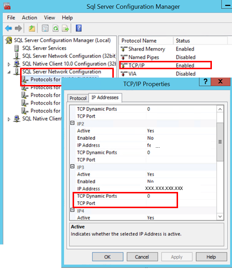

# Configure a Server to Listen on a Specific TCP Port (SQL Server Configuration Manager)
This topic describes how to configure an instance of the [!INCLUDE[ssDEnoversion](../../Topics/TopicNameContainA/includes/ssDEnoversion_md.md)] to listen on a specific fixed port by using the SQL Server Configuration Manager. If enabled, the default instance of the [!INCLUDE[ssDEnoversion](../../Topics/TopicNameContainA/includes/ssDEnoversion_md.md)] listens on TCP port 1433. Named instances of the [!INCLUDE[ssDE](../../Topics/TopicNameContainA/includes/ssDE_md.md)] and [!INCLUDE[ssEW](../../Topics/TopicNameContainA/includes/ssEW_md.md)] are configured for [dynamic ports](https://msdn.microsoft.com/library/dd981060). This means they select an available port when the [!INCLUDE[ssNoVersion](../../Topics/TopicNameContainA/includes/ssNoVersion_md.md)] service is started. When you are connecting to a named instance through a firewall, configure the [!INCLUDE[ssDE](../../Topics/TopicNameContainA/includes/ssDE_md.md)] to listen on a specific port, so that the appropriate port can be opened in the firewall.  
  
 For more information about the default Windows firewall settings, and a description of the TCP ports that affect the Database Engine, Analysis Services, Reporting Services, and Integration Services, see [Configure the Windows Firewall to Allow SQL Server Access](../../Topics/TopicNameNotContainA/Configure-the-Windows-Firewall-to-Allow-SQL-Server-Access.md).  
  
> [!TIP]  
>  When selecting a port number, consult [http://www.iana.org/assignments/port-numbers](http://www.iana.org/assignments/port-numbers) for a list of port numbers that are assigned to specific applications. Select an unassigned port number. For more information, see [The default dynamic port range for TCP/IP has changed in Windows Vista and in Windows Server 2008](http://support.microsoft.com/kb/929851).  
  
> [!WARNING]  
>  The Database Engine begins listening on a new port when restarted. However the [!INCLUDE[ssNoVersion](../../Topics/TopicNameContainA/includes/ssNoVersion_md.md)] Browser service monitors the registry and reports the new port number as soon as the configuration is changed, even though the Database Engine might not be using it. Restart the Database Engine to ensure consistency and avoid connection failures.  
  
 **In This Topic**  
  
-   **To configure a server to listen on a specific TCP port, using:**  
  
     [SQL Server Configuration Manager](#SSMSProcedure)  
  
##   Using SQL Server Configuration Manager  
  
#### To assign a TCP/IP port number to the SQL Server Database Engine  
  
1.  In SQL Server Configuration Manager, in the console pane, expand **SQL Server Network Configuration**, expand **Protocols for <instance name\>**, and then double-click **TCP/IP**.  
  
    > [!NOTE]  
    >  If you are having trouble opening [!INCLUDE[ssNoVersion](../../Topics/TopicNameContainA/includes/ssNoVersion_md.md)] Configuration Manager, see [SQL Server Configuration Manager](../../Topics/TopicNameNotContainA/SQL-Server-Configuration-Manager.md).  
  
2.  In the **TCP/IP Properties** dialog box, on the **IP Addresses** tab, several IP addresses appear in the format **IP1**, **IP2**, up to **IPAll**. One of these is for the IP address of the loopback adapter, 127.0.0.1. Additional IP addresses appear for each IP Address on the computer. (You will probably see both IP version 4  and IP version 6 addresses.) Right-click each address, and then click **Properties** to identify the IP address that you want to configure.  
  
3.  If the **TCP Dynamic Ports** dialog box contains **0**, indicating the [!INCLUDE[ssDE](../../Topics/TopicNameContainA/includes/ssDE_md.md)] is listening on dynamic ports, delete the 0.  
  
       
  
4.  In the **IP***n* **Properties** area box, in the **TCP Port** box, type the port number you want this IP address to listen on, and then click **OK**.  
  
5.  In the console pane, click **SQL Server Services**.  
  
6.  In the details pane, right-click **SQL Server (**<instance name\>**)** and then click **Restart**, to stop and restart [!INCLUDE[ssNoVersion](../../Topics/TopicNameContainA/includes/ssNoVersion_md.md)].  
  
 After you have configured [!INCLUDE[ssNoVersion](../../Topics/TopicNameContainA/includes/ssNoVersion_md.md)] to listen on a specific port, there are three ways to connect to a specific port with a client application:  
  
-   Run the [!INCLUDE[ssNoVersion](../../Topics/TopicNameContainA/includes/ssNoVersion_md.md)] Browser service on the server to connect to the [!INCLUDE[ssDE](../../Topics/TopicNameContainA/includes/ssDE_md.md)] instance by name.  
  
-   Create an alias on the client, specifying the port number.  
  
-   Program the client to connect using a custom connection string.  
  
## See Also  
 [Create or Delete a Server Alias for Use by a Client (SQL Server Configuration Manager)](../../Topics/TopicNameContainA/Create-or-Delete-a-Server-Alias-for-Use-by-a-Client--SQL-Server-Configuration-Manager-.md)   
 [SQL Server Browser Service](../../Topics/TopicNameNotContainA/SQL-Server-Browser-Service.md)