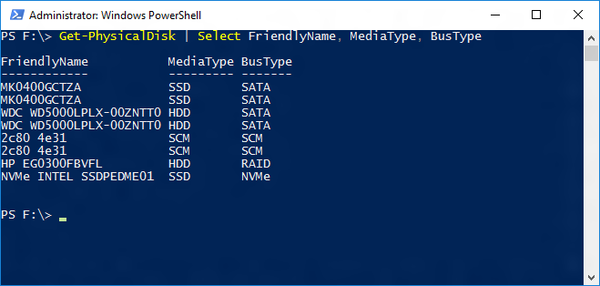
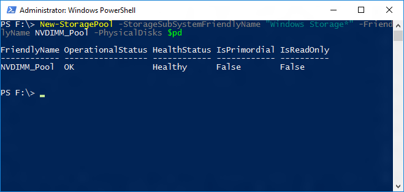
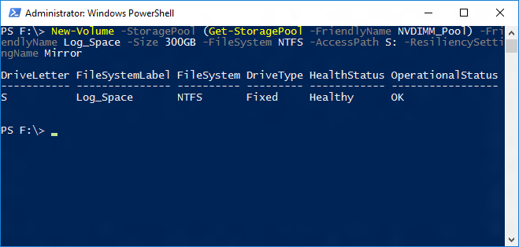
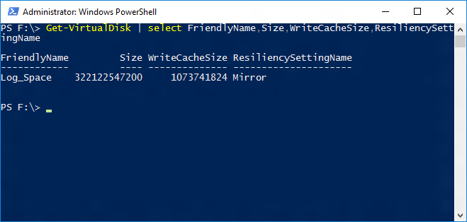

# Configuring Storage Spaces with a NVDIMM-N write-back cache
Windows Server 2016 supports NVDIMM-N devices that allow for extremely fast input/output (I/O) operations. One attractive way of using such devices is as a write-back cache to achieve low write latencies. This topic discusses how to set up a mirrored storage space with a mirrored NVDIMM-N write-back cache as a virtual drive to store the SQL Server transaction log. If you are looking to utilize it to also store data tables or other data, you may include more disks in the storage pool, or create multiple pools, if isolation is important.  
  
 To view a Channel 9 video using this technique, see [Using Non-volatile Memory (NVDIMM-N) as Block Storage in Windows Server 2016](https://channel9.msdn.com/Events/Build/2016/P466).  
  
## Identifying the right disks  
 Setup of storage spaces in Windows Server 2016, especially with advanced features, such as write-back caches is most easily achieved through PowerShell. The first step is to identify which disks should be part of the Storage Spaces pool that the virtual disk will be created from. NVDIMM-Ns have a media type and bus-type of SCM (storage class memory) , which can be queried via the Get-PhysicalDisk PowerShell cmdlet.  
  
```  
Get-PhysicalDisk | Select FriendlyName, MediaType, BusType  
```  
  
   
  
> [!NOTE]  
>  With NVDIMM-N devices, you no longer need to specifically select the devices that can be write-back cache targets.  
  
 In order to build a mirrored virtual disk with mirrored write-back cache, at least 2 NVDIMM-Ns, and 2 other disks are needed. Assigning the desired physical disks to a variable before building the pool makes the process easier.  
  
```  
$pd =  Get-PhysicalDisk | Select FriendlyName, MediaType, BusType | WHere-Object {$_.FriendlyName -like 'MK0*' -or $_.FriendlyName -like '2c80*'}  
```  
  
 The screenshot shows the $pd variable and the 2 SSDs and 2 NVDIMM-Ns it is assigned to returned using the following PowerShell cmdlet.  
  
```  
$pd | Select FriendlyName, MediaType, BusType  
```  
  
   
  
## Creating the Storage Pool  
 Using the $pd variable containing the PhysicalDisks, it is easy to build the storage pool using the New-StoragePool PowerShell cmdlet.  
  
```  
New-StoragePool –StorageSubSystemFriendlyName “Windows Storage*” –FriendlyName NVDIMM_Pool –PhysicalDisks $pd  
```  
  
   
  
## Creating the Virtual Disk and Volume  
 Now that a pool has been created, the next step is to carve out a virtual disk and format it. In this case only 1 virtual disk will be created and the New-Volume PowerShell cmdlet can be used to streamline this process:  
  
```  
New-Volume –StoragePool (Get-StoragePool –FriendlyName NVDIMM_Pool) –FriendlyName Log_Space –Size 300GB –FileSystem NTFS –AccessPath S: -ResiliencySettingName Mirror  
```  
  
   
  
 The virtual disk has been created, initialized, and formatted with NTFS. The screen capture below shows that it has a size of 300GB and a write-cache size of 1GB, which will be hosted on the NVDIMM-Ns.  
  
   
  
 You can now view this new volume visible in your server. You can now use this drive for your SQL Server transaction log.  
  
   
  
## See Also  
 [Windows Storage Spaces in Windows 10](http://windows.microsoft.com/en-us/windows-10/storage-spaces-windows-10)   
 [Windows Storage Spaces in Windows 2012 R2](https://technet.microsoft.com/en-us/library/hh831739.aspx)   
 [The Transaction Log (SQL Server)](../../Topics/TopicNameNotContainA/The-Transaction-Log--SQL-Server-.md)   
 [View or Change the Default Locations for Data and Log Files (SQL Server Management Studio)](../../Topics/TopicNameNotContainA/View-or-Change-the-Default-Locations-for-Data-and-Log-Files--SQL-Server-Management-Studio-.md)