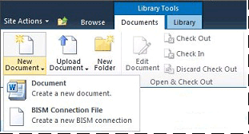
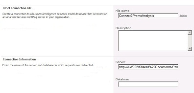

# Create a BI Semantic Model Connection to a Power Pivot Workbook
Use the information in this topic to set up a BI semantic model connection that redirects to a [!INCLUDE[ssGemini](../../Topics/TopicNameContainA/includes/ssGemini_md.md)] workbook in the same farm.  
  
 After you create a BI semantic model connection and configure SharePoint permissions, you can use it as a data source for Excel or [!INCLUDE[ssCrescent](../../Topics/TopicNameContainA/includes/ssCrescent_md.md)] reports.  
  
 This topic includes the following sections. Perform each task in the order given.  
  
 [Review Prerequisites](#bkmk_prereq)  
  
 [Create a Connection](#bkmk_create)  
  
 [Configure SharePoint Permissions on the BI Semantic Model Connection](#bkmk_permissions)  
  
 [Configure SharePoint Permissions on the Workbook](#bkmk_userdb)  
  
 [Next Steps](#bkmk_next)  
  
##   Review Prerequisites  
 You must have Contribute permissions or above to create a BI semantic model connection file.  
  
 You must have a library that supports the BI semantic model connection content type. For more information, see [Add a BI Semantic Model Connection Content Type to a Library (Power Pivot for SharePoint)](../../Topics/TopicNameContainA/Add-a-BI-Semantic-Model-Connection-Content-Type-to-a-Library--Power-Pivot-for-SharePoint-.md).  
  
 You must know the URL of the [!INCLUDE[ssGemini](../../Topics/TopicNameContainA/includes/ssGemini_md.md)] workbook for which you are setting up a BI semantic model connection (for example, http://adventure-works/shared documents/myworkbook.xlsx). The workbook must be in the same farm.  
  
 All computers and users that participate in the connection sequence must be in the same domain or trusted domain (two-way trust).  
  
##   Create a Connection  
  
1.  In the library that will contain the BI semantic model connection, click **Documents** on the SharePoint ribbon. Click the down arrow on New Document, and select **BISM Connection File** to open the New BI Semantic Model Connection page.  
  
       
  
2.  Set the **Server** property to the SharePoint URL of the [!INCLUDE[ssGemini](../../Topics/TopicNameContainA/includes/ssGemini_md.md)] workbook (for example, **http://mysharepoint/shared documents/myWorkbook.xlsx**. In a [!INCLUDE[ssGemini](../../Topics/TopicNameContainA/includes/ssGemini_md.md)] for SharePoint deployment, data can be loaded on any server in the farm. For this reason, data source connections to [!INCLUDE[ssGemini](../../Topics/TopicNameContainA/includes/ssGemini_md.md)] data specify just the path to the workbook. The [!INCLUDE[ssGemini](../../Topics/TopicNameContainA/includes/ssGemini_md.md)] System Service determines which server loads the data.  
  
     Do not use the **Database** property; it is not used when specifying the location of a [!INCLUDE[ssGemini](../../Topics/TopicNameContainA/includes/ssGemini_md.md)] workbook.  
  
     Your page should look similar to the following illustration.  
  
       
  
     Optionally, if you have SharePoint permissions to the workbook, an extra validation step is performed, ensuring that the location is valid. If you do not have permission to access the data, you are given the option of saving the BI semantic model connection without the validation response.  
  
##   Configure SharePoint Permissions on the BI Semantic Model Connection  
 Ability to use a BI semantic model connection as a data source for an Excel workbook or Reporting Services report requires **Read** permissions on the BI semantic model connection item in a SharePoint library. The Read permission level includes the **Open Items** permission that enables downloading BI semantic model connection information to an Excel desktop application.  
  
 There are several ways to grant permissions in SharePoint. The following instructions explain how to create a new group called **BISM Users** that have the **Read** permission level.  
  
 You must be a site owner to change permissions.  
  
1.  In Site Actions, click **Site Permissions**.  
  
2.  Click **Create Group** and name the new group **BISM Users**.  
  
3.  Choose the **Read** permission level and click **Create**.  
  
4.  Select **BISM Users** in People and Groups.  
  
5.  Point to New, click **Add Users**, and then add user or group accounts.  
  
     These users and groups will now have Read permissions throughout the site, including all libraries and lists that inherit permissions from the site level. If these permissions are too high, you can selectively remove this group from specific libraries, lists, or items.  
  
 To selectively remove permissions at the item level, do the following:  
  
1.  In a library, select a document. Click the right down arrow and then click **Manage Permissions**.  
  
2.  By default, an item inherits permissions. To change the permissions of individual documents in this library, click **Stop Inheriting Permissions**.  
  
3.  Select the checkbox next to **BISM Users**.  
  
4.  Click **Remove User Permissions**.  
  
##   Configure SharePoint Permissions on the Workbook  
 If you are using a [!INCLUDE[ssGemini](../../Topics/TopicNameContainA/includes/ssGemini_md.md)] database inside an Excel workbook, the SharePoint permissions on the Excel workbook determine data access via the BI semantic model connection. All users who access the workbook must have Read permissions on the workbook in order to use it as an external data source.  
  
 If you created a **BISM Users** group using the instructions in the previous section, user and group accounts that are members of **BISM Users** will have sufficient permission on the workbook as well as the BI semantic model connection file, assuming the workbook uses inherited permissions.  
  
##   Next Steps  
 After you create and secure a BI semantic model connection, you can specify it as a data source. For more information, see [Use a BI Semantic Model Connection in Excel or Reporting Services](../../Topics/TopicNameContainA/Use-a-BI-Semantic-Model-Connection-in-Excel-or-Reporting-Services.md).  
  
## See Also  
 [Power Pivot BI Semantic Model Connection (.bism)](../../Topics/TopicNameNotContainA/Power-Pivot-BI-Semantic-Model-Connection--.bism-.md)   
 [Use a BI Semantic Model Connection in Excel or Reporting Services](../../Topics/TopicNameContainA/Use-a-BI-Semantic-Model-Connection-in-Excel-or-Reporting-Services.md)   
 [Create a BI Semantic Model Connection to a Tabular Model Database](../../Topics/TopicNameContainA/Create-a-BI-Semantic-Model-Connection-to-a-Tabular-Model-Database.md)