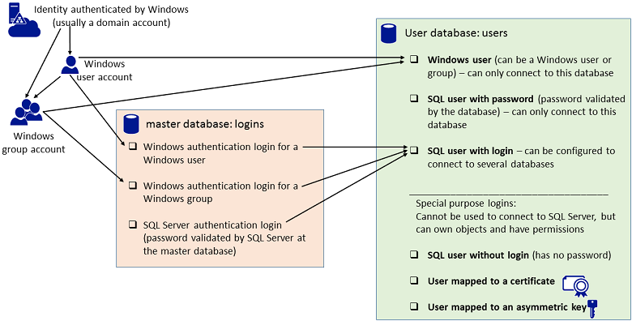

# Create a Database User
This topic describes how to create the most common types of database users. There are eleven type of users. The complete list is provided in the topic [CREATE USER (Transact-SQL)](assetId:///01de7476-4b25-4d58-85b7-1118fe64aa80). All varieties of [!INCLUDE[ssNoVersion](../../Topics/TopicNameContainA/includes/ssNoVersion_md.md)] support database users, but not necessarily all types of users.  
  
 You can create a database user by using [!INCLUDE[ssManStudioFull](../../Topics/TopicNameContainA/includes/ssManStudioFull_md.md)] or by using [!INCLUDE[tsql](../../Topics/TopicNameContainA/includes/tsql_md.md)].  
  
##  <a name="Understanding"></a> Understanding the Types of Users  
 [!INCLUDE[ssManStudio](../../Topics/TopicNameContainA/includes/ssManStudio_md.md)] presents 6 options when creating a database user. The following graphic shows the 6 options in the green box, and indicates what they represent.  
  
   
  
### Selecting the Type of User  
 **Login or user that is not mapped to a login**  
  
 If you are new to [!INCLUDE[ssNoVersion](../../Topics/TopicNameContainA/includes/ssNoVersion_md.md)], it can be difficult to determine what type of user you want to create. First ask yourself, does the person or group that needs to access the database have a login? Logins in the master database are common for the people who manage the [!INCLUDE[ssNoVersion](../../Topics/TopicNameContainA/includes/ssNoVersion_md.md)] and for people who need to access many or all of the database on the instance of [!INCLUDE[ssNoVersion](../../Topics/TopicNameContainA/includes/ssNoVersion_md.md)]. For this situation, you will create a **SQL user with login**. The database user is the identity of the login when it is connected to a database. The database user can use the same name as the login, but that is not required. This topic assumes that a login already exists in [!INCLUDE[ssNoVersion](../../Topics/TopicNameContainA/includes/ssNoVersion_md.md)]. For information about how to create a login, see [Create a Login](../../Topics/TopicNameContainA/Create-a-Login.md)  
  
 If the person or group that needs to access the database does not have a login and if they only need access to one or few databases, create a **Windows user** or a **SQL user with password**. Also called a contained database user, it is not associated with a login in the master database. This is an excellent choice when you want to be able to easily move your database between instances of [!INCLUDE[ssNoVersion](../../Topics/TopicNameContainA/includes/ssNoVersion_md.md)]. To use this option on [!INCLUDE[ssSQL15](../../Topics/TopicNameContainA/includes/ssSQL15_md.md)], an administrator must first enable contained databases for the [!INCLUDE[ssNoVersion](../../Topics/TopicNameContainA/includes/ssNoVersion_md.md)], and the database be enabled for containment. For more information, see [Contained Database Users - Making Your Database Portable](../../Topics/TopicNameNotContainA/Contained-Database-Users---Making-Your-Database-Portable.md).  
  
> [!IMPORTANT]  
>  When connecting as a contained database user you must provide the name of the database as part of the connection string. To specify the database in [!INCLUDE[ssManStudio](../../Topics/TopicNameContainA/includes/ssManStudio_md.md)], in the **Connect to** dialog box, click **Options**, and then click the **Connection Properties** tab.  
  
 Select **SQL user with password** or a **SQL user with login** based on a **SQL Server authentication login**, when the person connecting cannot authenticate with Windows. This is common when people outside of your organization (for example customers) are connecting to your [!INCLUDE[ssNoVersion](../../Topics/TopicNameContainA/includes/ssNoVersion_md.md)].  
  
> [!TIP]  
>  For people inside your organization, Windows authentication is a better choice, because they won't have to remember an additional password, and because Windows authentication offers additional security features such as Kerberos.  
  
##  <a name="Restrictions"></a> Background  
 A user is a database level security principal. Logins must be mapped to a database user to connect to a database. A login can be mapped to different databases as different users but can only be mapped as one user in each database. In a partially contained database, a user can be created that does not have a login. For more information about contained database users, see [CREATE USER (Transact-SQL)](assetId:///01de7476-4b25-4d58-85b7-1118fe64aa80). If the guest user in a database is enabled, a login that is not mapped to a database user can enter the database as the guest user.  
  
> [!IMPORTANT]  
>  The guest user is ordinarily disabled. Do not enable the guest user unless it is necessary.  
  
 As a security principal, permissions can be granted to users. The scope of a user is the database. To connect to a specific database on the instance of [!INCLUDE[ssNoVersion](../../Topics/TopicNameContainA/includes/ssNoVersion_md.md)], a login must be mapped to a database user. Permissions inside the database are granted and denied to the database user, not the login.  
  
##  <a name="Permissions"></a> Permissions  
 Requires **ALTER ANY USER** permission on the database.  
  
##  <a name="SSMSProcedure"></a> Using SQL Server Management Studio  
  
##### To create a database user  
  
1.  In Object Explorer, expand the **Databases** folder.  
  
2.  Expand the database in which to create the new database user.  
  
3.  Right-click the **Security** folder, point to **New**, and select **User…**.  
  
4.  In the **Database User – New** dialog box, on the **General** page, select one of the following user types from the **User type** list:  
  
    -   **SQL user with login**  
  
    -   **SQL user with password**  
  
    -   **SQL user without login**  
  
    -   **User mapped to a certificate**  
  
    -   **User mapped to an asymmetric key**  
  
    -   **Windows user**  
  
5.  When you select an option, the remaining options in the dialog may change. Some options only apply to specific types of database users. Some options can be left blank and will use a default value.  
  
     **User name**  
     Enter a name for the new user. If you have chosen **Windows user** from the **User type** list, you can also click the ellipsis **(…)** to open the **Select User or Group** dialog box.  
  
     **Login name**  
     Enter the login for the user. Alternately, click the ellipsis **(…)** to open the **Select Login** dialog box. **Login name** is available if you select either **SQL user with login** or **Windows user** from the **User type** list.  
  
     **Password** and **Confirm password**  
     Enter a  password for users who authenticate at the database.  
  
     **Default language**  
     Enter the default language of the user.  
  
     **Default schema**  
     Enter the schema that will own objects created by this user. Alternately, click the ellipsis **(…)** to open the **Select Schema** dialog box. **Default schema** is available if you select either **SQL user with login**, **SQL user without login**, or **Windows user** from the **User type** list.  
  
     **Certificate name**  
     Enter the certificate to be used for the database user. Alternately, click the ellipsis **(…)** to open the **Select Certificate** dialog box. **Certificate name** is available if you select **User mapped to a certificate** from the **User type** list.  
  
     **Asymmetric key name**  
     Enter the key to be used for the database user. Alternately, click the ellipsis **(…)** to open the **Select Asymmetric Key** dialog box. **Asymmetric key name** is available if you select **User mapped to an asymmetric key** from the **User type** list.  
  
6.  [!INCLUDE[clickOK](../../Topics/TopicNameContainA/includes/clickOK_md.md)]  
  
### Additional Options  
 The **Database User – New** dialog box also offers options on four additional pages: **Owned Schemas**, **Membership**, **Securables**, and **Extended Properties**.  
  
-   The **Owned Schemas** page lists all possible schemas that can be owned by the new database user. To add schemas to or remove them from a database user, under **Schemas owned by this user**, select or clear the check boxes next to the schemas.  
  
-   The **Membership** page lists all possible database membership roles that can be owned by the new database user. To add roles to or remove them from a database user, under **Database role membership**, select or clear the check boxes next to the roles.  
  
-   The **Securables** page lists all possible securables and the permissions on those securables that can be granted to the login.  
  
-   The **Extended properties** page allows you to add custom properties to database users. The following options are available on this page.  
  
     **Database**  
     Displays the name of the selected database. This field is read-only.  
  
     **Collation**  
     Displays the collation used for the selected database. This field is read-only.  
  
     **Properties**  
     View or specify the extended properties for the object. Each extended property consists of a name/value pair of metadata associated with the object.  
  
     **Ellipsis (…)**  
     Click the ellipsis **(…)** after **Value** to open the **Value for Extended Property** dialog box. Type or view the value of the extended property in this larger location. For more information, see [Value for Extended Property Dialog Box](http://msdn.microsoft.com/library/ms189353.aspx).  
  
     **Delete**  
     Removes the selected extended property.  
  
##  <a name="TsqlProcedure"></a> Using Transact-SQL  
  
#### To create a database user  
  
1.  In **Object Explorer**, connect to an instance of [!INCLUDE[ssDE](../../Topics/TopicNameContainA/includes/ssDE_md.md)].  
  
2.  On the **Standard** bar, click **New Query**.  
  
3.  Copy and paste the following example into the query window and click **Execute**.  
  
    ```  
    -- Creates the login AbolrousHazem with password '340$Uuxwp7Mcxo7Khy'.  
    CREATE LOGIN AbolrousHazem   
        WITH PASSWORD = '340$Uuxwp7Mcxo7Khy';  
    GO  
  
    -- Creates a database user for the login created above.  
    CREATE USER AbolrousHazem FOR LOGIN AbolrousHazem;  
    GO  
    ```  
  
 For more information, see [CREATE USER (Transact-SQL)](assetId:///01de7476-4b25-4d58-85b7-1118fe64aa80) which contains many more [!INCLUDE[tsql](../../Topics/TopicNameContainA/includes/tsql_md.md)] examples.  
  
## See Also  
 [Principals (Database Engine)](../../Topics/TopicNameNotContainA/Principals--Database-Engine-.md)   
 [Create a Login](../../Topics/TopicNameContainA/Create-a-Login.md)   
 [CREATE LOGIN (Transact-SQL)](assetId:///eb737149-7c92-4552-946b-91085d8b1b01)