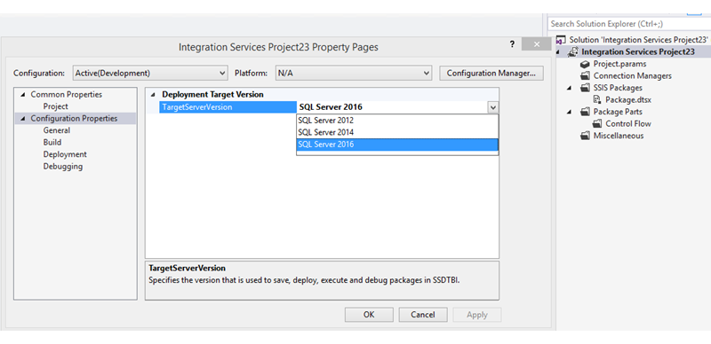

# Create a New Integration Services Project
This procedure creates a new project and a new [!INCLUDE[ssISnoversion](../../Topics/TopicNameContainA/includes/ssISnoversion_md.md)] solution.  
  
### To create a new Integration Services project  
  
1.  Open [!INCLUDE[ssBIDevStudioFull](../../Topics/TopicNameContainA/includes/ssBIDevStudioFull_md.md)].  
  
2.  On the **File** menu, point to **New**, and then click **Project**.  
  
3.  In the **New Project** dialog box, in the **Templates** pane, select the **Integration Services Project** template.  
  
     The **Integration Services Project** template creates an [!INCLUDE[ssISnoversion](../../Topics/TopicNameContainA/includes/ssISnoversion_md.md)] project that contains a single, empty package.  
  
4.  (Optional) Edit the project name and the location.  
  
     The solution name is automatically updated to match the project name.  
  
5.  To create a separate folder for the solution file, select **Create directory for solution**. This is the default option.  
  
6.  If source control software is installed on the computer, select **Add to source control**  to associate the project with source control.  
  
7.  If the source control software is [!INCLUDE[msCoName](../../Topics/TopicNameContainA/includes/msCoName_md.md)] Visual SourceSafe, the **Visual SourceSafe Login** dialog box opens. In **Visual SourceSafe Login**, provide a user name, a password, and the name of the [!INCLUDE[msCoName](../../Topics/TopicNameContainA/includes/msCoName_md.md)] Visual SourceSafe database. Click **Browse** to locate the database.  
  
    > [!NOTE]  
    >  To view and change the selected source control plug-in and to configure the source control environment, click **Options** on the **Tools** menu, and then expand the **Source Control** node.  
  
8.  Click **OK** to add the solution to **Solution Explorer** and add the project to the solution.  
  
### To choose the target version of a project and its packages  
  
1.  In Solution Explorer, right-click on an Integration Services project and select **Properties** to open the property pages for the project.  
  
2.  On the **General** tab of **Configuration Properties**, select the **TargetServerVersion** property,  and then choose SQL Server 2016, SQL Server 2014, or SQL Server 2012.  
  
       
  
 You can create, maintain, and run packages that target SQL Server 2016, SQL Server 2014, or SQL Server 2012.  
  
## See Also  
 [Integration Services (SSIS) Projects](../../Topics/TopicNameNotContainA/Integration-Services--SSIS--Projects.md)   
 [Add or Remove an Integration Services Project in a Solution](../../Topics/TopicNameContainA/Add-or-Remove-an-Integration-Services-Project-in-a-Solution.md)