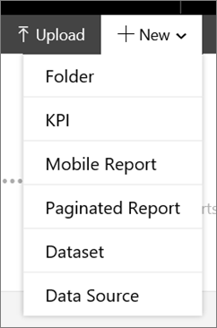
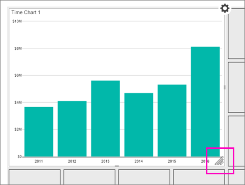
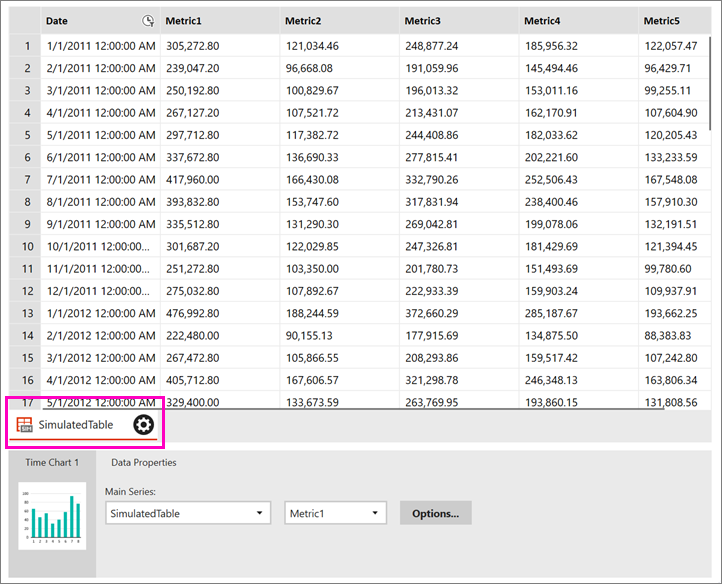
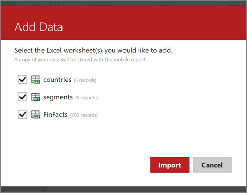
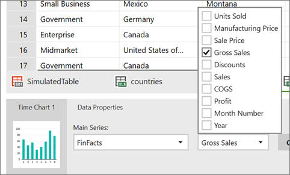
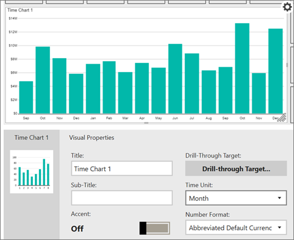

# Create a Reporting Services mobile report
With [!INCLUDE[SS_MobileReptPub_Long](../../Topics/TopicNameContainA/includes/SS_MobileReptPub_Long.md)], you can quickly create [!INCLUDE[PRODUCT_NAME](../../Topics/TopicNameContainA/includes/ssCurrent.md)] [!INCLUDE[ssRSnoversion](../../Topics/TopicNameContainA/includes/ssRSnoversion.md)] mobile reports that scale well to any screen size, on a design surface with adjustable grid rows and columns, and flexible mobile report elements.  
  
The first time you create a mobile report, you can install [!INCLUDE[SS_MobileReptPub_Long](../../Topics/TopicNameContainA/includes/SS_MobileReptPub_Short.md)] on your local machine from the [!INCLUDE[ssRSnoversion](../../Topics/TopicNameContainA/includes/ssRSnoversion.md)] web portal. Or you can install it from the [Microsoft Download Center](http://go.microsoft.com/fwlink/?LinkID=733527). After the first time, you can start it either from the web portal or locally.   
    
1. In the top bar of the [!INCLUDE[ssRSnoversion](../../Topics/TopicNameContainA/includes/ssRSnoversion.md)] web portal, select **New** > **Mobile Report**.  
  
     
     
2. On the **Layout** tab in [!INCLUDE[SS_MobileReptPub_Long](../../Topics/TopicNameContainA/includes/SS_MobileReptPub_Short.md)], select a navigator, gauge, chart, map, or datagrid and drag it to the design grid.  
  
3. Grab the lower-right corner of the element and drag it to the size you want.  
  
     
  
   This is the **Master** design grid, where you create the elements you want in your report. Later, you can [lay out the report for a tablet or phone](../../Topics/TopicNameContainA/Lay-out-a-Reporting-Services-mobile-report-for-phone-or-tablet.md).     
     
   In **Visual Properties** below the design grid, notice the various properties you can set.  
     
4. Select the **Data** tab in the upper-left corner, and you see the chart already has simulated data associated with it.   
  
     
  
5. Select **Add Data** in the upper-right corner.  
  
6. Select **Local Excel** or **Report Server**.  
  
   >**Tips**: If you're adding data from Excel, make sure:  
    >* You [prepare the Excel data](../../Topics/TopicNameNotContainA/Prepare-Excel-data-for-Reporting-Services-mobile-reports.md) to work in your mobile report.  
    >* You close the file first.  
7. Select the worksheets you want, and select **Import**.   
   You can add more than one worksheet from a workbook at a time.  
    
       
  
8. Still on the **Data** tab, in the **Data Properties** box select the table and field you want in the chart.  
  
     
  
9. Back on the **Layout** tab, in the **Visual Properties** box you can set properties like **Title**, **Time Unit**, and **Number Format**.  
  
     
    
10. Select **Preview** in the upper left to see how your report is shaping up.  
  
11. Time to save your report. Select the Save icon in the upper left, and either **Save Locally** or **Save to Server**.  
  
   To save it to a server, you need access to a [!INCLUDE[PRODUCT_NAME](../../Topics/TopicNameContainA/includes/ssCurrent.md)] [!INCLUDE[ssRSnoversion](../../Topics/TopicNameContainA/includes/ssRSnoversion.md)] report server.  
     
   ### See also  
     
-   [Create and publish mobile reports with SQL Server Mobile Report Publisher](../../Topics/TopicNameNotContainA/Create-mobile-reports-with-SQL-Server-Mobile-Report-Publisher.md)  
-   [Lay out a Reporting Services mobile report for phone or tablet](../../Topics/TopicNameContainA/Lay-out-a-Reporting-Services-mobile-report-for-phone-or-tablet.md)  
  
   