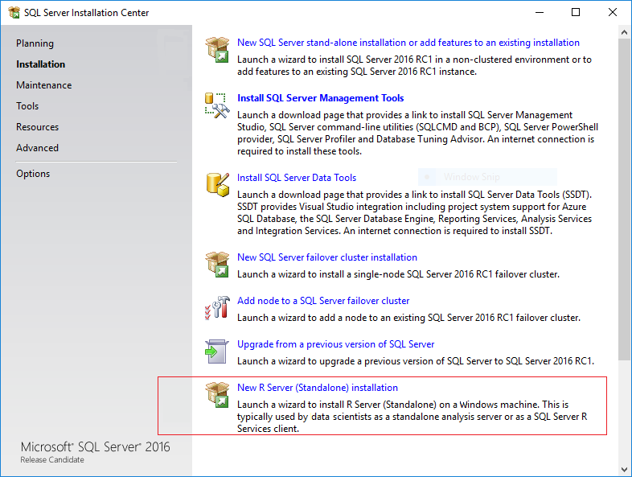

# Create a Standalone R Server
[!INCLUDE[ssNoVersion](../../Topics/TopicNameContainA/includes/ssNoVersion_md.md)] setup now includes the option to install **Microsoft R Server (Standalone)**. This option lets you  host distributed, high performance R solutions on a Windows desktop computer or server. You can also use Microsoft R Server to develop solutions for deployment to an instance of [!INCLUDE[ssNoVersion](../../Topics/TopicNameContainA/includes/ssNoVersion_md.md)] that supports R script execution.  
  
 When you install R Server (Standalone), you get the same enhanced R packages and connectivity tools that are provided in [!INCLUDE[rsql_productname](../../Topics/TopicNameContainA/includes/rsql_productname_md.md)], but an instance of [!INCLUDE[ssNoVersion](../../Topics/TopicNameContainA/includes/ssNoVersion_md.md)] is not required.  
  
> [!NOTE]  
>  Microsoft R Server is available only in Enterprise Edition.  
>   
>  If you have installed a previous version of Microsoft R Server, you must uninstall it first.  See [Uninstall an Older Version of Microsoft R Server](#bkmk_Uninstall).  
  
##   Install Microsoft R Server (Standalone)  
  
1.  Run [!INCLUDE[ssNoVersion](../../Topics/TopicNameContainA/includes/ssNoVersion_md.md)] setup.  
  
2.  On the **Installation** tab, click **New R Server (Standalone) installation** .  
  
       
  
3.  On the **Feature Selection** page, the following option should be already selected:  
  
    -   **R Server (Standalone)**  
  
         This  option installs shared features, including open source R tools and base packages, and the enhanced R packages and connectivity tools provided by Microsoft R Services.  
  
     All other options can be ignored.  
  
4.  Accept the license terms for downloading and installing Microsoft R Open.  
  
     If the computer you are using does not have Internet access, you can download the installers separately as described here: [Installing R Components without Internet Access](../../Topics/TopicNameNotContainA/Installing-R-Components-without-Internet-Access.md)  
  
    > [!TIP]  
    >  Installation of these components (and any prerequisites they might require) might take a while. When the Accept button becomes unavailable, you can click **Next**.  
  
5.  On the **Ready to Install** page, verify your selections. Click **Install**  
  
## What is Installed and Where to Find R Packages  
 Setup for Microsoft R Server installs the R base packages and a set of enhanced R packages that support parallel processing, improved performance, and connectivity to data sources including [!INCLUDE[ssNoVersion](../../Topics/TopicNameContainA/includes/ssNoVersion_md.md)] and Hadoop.  
  
-   **R  packages**  
  
     The R libraries are installed together with other tools and utilities that are installed with Microsoft SQL Server 2016. For example:  
  
     `C:\Program Files\Microsoft SQL Server\130\R_SERVER`  
  
     Additionally, in this section you will find documentation for the R base packages, sample data, and the R library.  
  
    > [!NOTE]  
    >  If you have installed an instance of SQL Server with R Services (In-Database) on the same computer, the R libraries and tools are installed into a different folder:  `C:\Program Files\Microsoft SQL Server\130\R_SERVER`  
    >   
    >  Do not use the R packages or utilities associated with the [!INCLUDE[ssNoVersion](../../Topics/TopicNameContainA/includes/ssNoVersion_md.md)] instance. Always use the R tools and packages in the R_SERVER folder.  
  
-   **R  tools**  
  
     An R development IDE is not installed as part of setup. You can install RStudio, [!INCLUDE[rsql_rtvs](../../Topics/TopicNameContainA/includes/rsql_rtvs_md.md)],  or any other development environment you prefer.  
  
     However, additional tools aren't required. All the standard base R tools are included in `C:\Program Files\Microsoft SQL Server\130\R_SERVER\bin`.  
  
     For more information, see [Setup or Configure R Tools](../../Topics/TopicNameNotContainA/Setup-or-Configure-R-Tools.md).  
  
##   Upgrading from an Older Version of Microsoft R Server  
 If you installed the RC2 version of Microsoft R Server, you must uninstall it before you can upgrade to a newer version.  
  
#### Uninstall R Server (Standalone)  
  
1.  In **Control Panel**, click **Add/Remove Programs**, and select Microsoft SQL Server 2016 CTP*nn*.  
  
2.  In the dialog box with options to **Add**, **Repair**, or **Remove** components, select **Remove**.  
  
3.  On the **Select Features** page, under **Shared Features**, select **R Server (Standalone)**. Click **Next**, and then click **Finish** to uninstall just the selected components.  
  
## Troubleshooting  
  
-   **Installation fails with error Only one Revolution Enterprise product can be installed at a time.**  
  
     You must uninstall any previous versions before you can install a newer version of Microsoft R Server.  
  
-   **Cannot uninstall older components**  
  
     If you have problems removing an older version, you can also edit the registry to remove related keys.  
  
     Open the Windows Registry, and locate this key: `HKLM\Software\Microsoft\Windows\CurrentVersion\Uninstall`.  
  
     Delete any of the following entries, if present, and if the key contains only the value `sEstimatedSize2`:  
  
    -   E0B2C29E-B8FC-490B-A043-2CAE75634972        (for 8.0.2)  
  
    -   46695879-954E-4072-9D32-1CC84D4158F4        (for 8.0.1)  
  
    -   2DF16DF8-A2DB-4EC6-808B-CB5A302DA91B        (for 8.0.0)  
  
    -   5A2A1571-B8CD-4AAF-9303-8DF463DABE5A        (for 7.5.0)  
  
## See Also  
 [Troubleshooting R Services Setup](../../Topics/TopicNameNotContainA/Troubleshooting-R-Services-Setup.md)