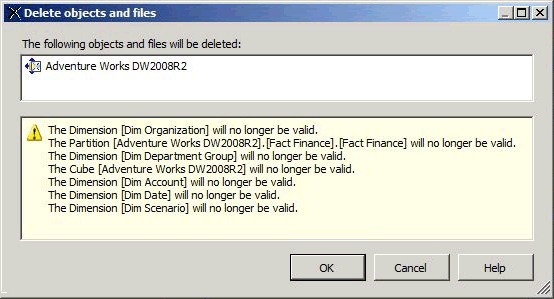

# Delete a Data Source View (Analysis Services)
If you are no longer using a data source view (DSV) in an OLAP project, you can delete it from the project in [!INCLUDE[ssBIDevStudioFull](../../Topics/TopicNameContainA/includes/ssBIDevStudioFull_md.md)].  
  
 Deleting a DSV is permanent. You cannot restore a deleted DSV to a [!INCLUDE[ssASnoversion](../../Topics/TopicNameContainA/includes/ssASnoversion_md.md)] project or database.  
  
 DSVs that other objects depend on cannot be deleted from an [!INCLUDE[ssASnoversion](../../Topics/TopicNameContainA/includes/ssASnoversion_md.md)] database opened by [!INCLUDE[ssBIDevStudioFull](../../Topics/TopicNameContainA/includes/ssBIDevStudioFull_md.md)] in online mode. To delete a DSV from a project that is connected o a database running on a server, you must first delete all objects in the [!INCLUDE[ssASnoversion](../../Topics/TopicNameContainA/includes/ssASnoversion_md.md)] database that depend on that DSV before deleting the DSV itself.  
  
 Deleting a DSV will invalidate other [!INCLUDE[ssASnoversion](../../Topics/TopicNameContainA/includes/ssASnoversion_md.md)] objects that depend on it, so before you delete the DSV, you will see the list of objects that will become invalid once the DSV is removed. Review this list carefully to be sure that it does not include objects you still expect to use.  
  
   
  
## See Also  
 [Data Source Views in Multidimensional Models](../../Topics/TopicNameNotContainA/Data-Source-Views-in-Multidimensional-Models.md)   
 [Change Properties in a Data Source View (Analysis Services)](../../Topics/TopicNameContainA/Change-Properties-in-a-Data-Source-View--Analysis-Services-.md)