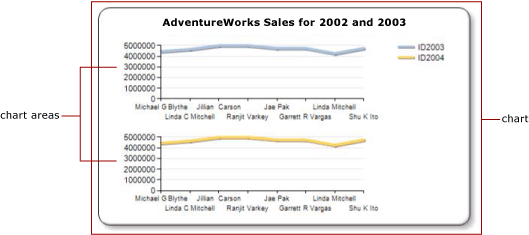

# Multiple Series on a Chart (Report Builder and SSRS)
When multiple series are present on a chart, you must determine the best way to compare the series. You can use a stacked chart to show relative proportions of each series. If you are comparing only two series that share a common category (x) axis, use the secondary axis. This is useful when showing two related series of data, for example, price and volume, or income and tax. If the chart becomes unreadable, consider using multiple chart areas to create more visual separation between each series.  
  
 In addition to using chart features, it is important to decide which chart type should be used for your data. If the fields in your dataset are related, consider using a range chart.  
  
> [!NOTE]  
>  [!INCLUDE[ssRBRDDup](../../Topics/TopicNameContainA/includes/ssRBRDDup_md.md)]  
  
## Using Stacked and 100% Stacked Charts  
 Stacked charts are commonly used to display multiple series in one chart area. Consider using stacked charts when the data that you are trying to show is closely related. It is also a good practice to show four or less series on a stacked chart. If you want to compare the proportion that each series contributes to the whole, use a 100% stacked area, bar, or column chart. These charts calculate the relative percentage that each series contributes to the category. For more information, see [Area Charts (Report Builder and SSRS)](../../Topics/TopicNameNotContainA/Area-Charts--Report-Builder-and-SSRS-.md), [Bar Charts (Report Builder and SSRS)](../../Topics/TopicNameNotContainA/Bar-Charts--Report-Builder-and-SSRS-.md) and [Column Charts (Report Builder and SSRS)](../../Topics/TopicNameNotContainA/Column-Charts--Report-Builder-and-SSRS-.md).  
  
## Using the Secondary Axis  
 When a new series is added to the chart, it is plotted using the primary x and y axes. When you want to compare values that are of a different unit of measure, consider using the *secondary axis* so that you can plot two series on separate axes. The secondary axis is useful when comparing values that are of a different unit of measure. The secondary axis is drawn on the opposite side of the primary axis. The chart only supports a primary and a secondary axis. The secondary axis has the same properties as the primary axis. For more information, see [Plot Data on a Secondary Axis (Report Builder and SSRS)](../../Topics/TopicNameContainA/Plot-Data-on-a-Secondary-Axis--Report-Builder-and-SSRS-.md).  
  
 If you want to display more than two series that have different ranges of data, consider putting the series in separate chart areas.  
  
## Using Chart Areas  
 The chart is the top-level container that includes the outer border, the chart title, and the legend. By default, the chart contains one default chart area. The chart area is not visible on the chart surface, but you can think of the chart area as a container that includes only the axis labels, the axis title, and the plotting area of one or more series. The following illustration shows the concept of chart areas within a single chart.  
  
   
  
 Using the **Chart Area Properties** dialog box, you can specify the 2D and 3D orientation of all series contained in the chart area, align multiple chart areas within the same chart, and format the colors of the plotting area. When a new chart area is defined on a chart that contains only one default chart area, the available space for a chart area is horizontally divided by two and the new chart area is positioned below the first chart area.  
  
 Each series can be connected to only one chart area. By default, all series are added to the default chart area. When using area, column, line, and scatter charts, any combination of these series can be displayed on the same chart area. For example, you can display a column series and a line series on the same chart area. The advantage of using the same chart area for multiple series is that end users can make comparisons easily.  
  
 Bar, radar, and shape charts cannot be combined with any other chart type in the same chart area. If you want to make comparisons with multiple series that are of type bar, radar, or shape, you will need to do one of the following:  
  
-   Change all series in the chart area to be of the same chart type.  
  
-   Create a new chart area and move one or more of the series from the default chart area into the newly created chart area.  
  
 The multiple chart area on a single chart feature is also useful if you are trying to compare data that has different scales of values. For example, if your first series contains data in the range of 10 to 20 and your second series contains data in the range of 400 to 800, the values in your first series may become obscured. Consider separating each series into a different chart area. For more information, see [Specify a Chart Area for a Series (Report Builder and SSRS)](../../Topics/TopicNameContainA/Specify-a-Chart-Area-for-a-Series--Report-Builder-and-SSRS-.md).  
  
## Using Range Charts  
 Range charts have two values per data point. If your chart contains two series that share the same category (x) axis, you can use a range chart to show the difference between the two series. Range charts are best suited for displaying high-low or top-bottom information. For example, if your first series contains the highest sale for each day in January, and your second series contains the lowest sale for each day in January, you can use a range chart to show the difference between the highest and lowest sale for each day. For more information, see [Range Charts (Report Builder and SSRS)](../../Topics/TopicNameNotContainA/Range-Charts--Report-Builder-and-SSRS-.md).  
  
## See Also  
 [Charts (Report Builder and SSRS)](../../Topics/TopicNameNotContainA/Charts--Report-Builder-and-SSRS-.md)   
 [Displaying a Series with Multiple Data Ranges on a Chart (Report Builder and SSRS)](../../Topics/TopicNameContainA/Displaying-a-Series-with-Multiple-Data-Ranges-on-a-Chart--Report-Builder-and-SSRS-.md)   
 [Chart Types (Report Builder and SSRS)](../../Topics/TopicNameNotContainA/Chart-Types--Report-Builder-and-SSRS-.md)