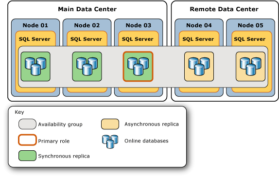
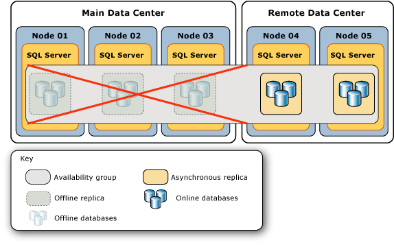
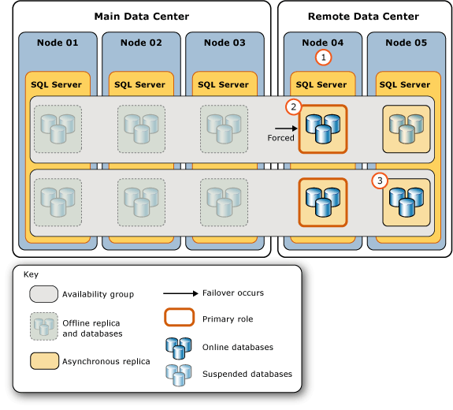
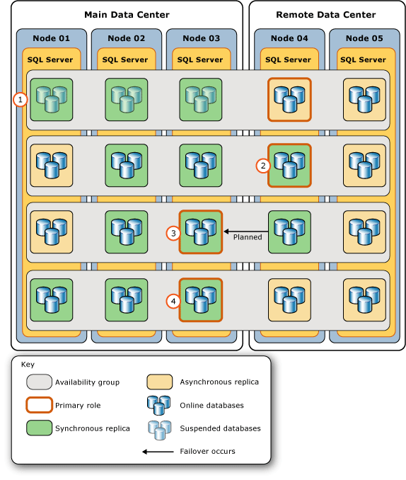

# Perform a Forced Manual Failover of an Availability Group (SQL Server)
This topic describes how to perform a forced failover (with possible data loss) on an Always On availability group by using [!INCLUDE[ssManStudioFull](../../Topics/TopicNameContainA/includes/ssManStudioFull_md.md)], [!INCLUDE[tsql](../../Topics/TopicNameContainA/includes/tsql_md.md)], or PowerShell in [!INCLUDE[ssCurrent](../../Topics/TopicNameContainA/includes/ssCurrent_md.md)]. A forced failover is a form of manual failover that is intended strictly for disaster recovery, when a [planned manual failover](../../Topics/TopicNameContainA/Perform-a-Planned-Manual-Failover-of-an-Availability-Group--SQL-Server-.md) is not possible. If you force failover to an unsynchronized secondary replica, some data loss is possible. Therefore, we strongly recommend that you force failover only if you must restore service to the availability group immediately and you are willing to risk losing data.  
  
 After a forced failover, the failover target to which the availability group was failed over becomes the new primary replica. The secondary databases in the remaining secondary replicas are suspended and must be manually resumed. When the former primary replica becomes available, it transitions to the secondary role, causing the former primary databases to become secondary databases and transition into the SUSPENDED state. Before you resume a given secondary database, you might be able to recover lost data from it. However, notice that transaction log truncation is delayed on a given primary database while any of its secondary databases is suspended.  
  
> [!IMPORTANT]  
>  Data synchronization with the primary database will not occur until the secondary database is resumed. For information about resuming a secondary database, see [Essential Tasks After a Forced Failover](#FollowUp) later in this article.  
  
 Performing a forced failover is necessary in the following emergency situations:  
  
-   After forcing quorum on the WSFC cluster (*forced quorum*), you need to force failover each availability group (with possible data loss). Forcing failover is required because the real state of the WSFC cluster values might have been lost. However, you can avoid data loss, if are able to force failover on the server instance that was hosting the replica that was the primary replica before you forced quorum or to a secondary replica that was synchronized before you forced quorum. For more information, see [Potential Ways to Avoid Data Loss After Quorum is Forced](#WaysToAvoidDataLoss), later in this topic.  
  
    > [!IMPORTANT]  
    >  If quorum is regained by natural means instead of being forced, the availability replicas will go through normal recovery. If the primary replica is still unavailable after quorum is regained, you can perform a planned manual failover to a synchronized secondary replica.  
  
     For information about forcing quorum, see [WSFC Disaster Recovery through Forced Quorum (SQL Server)](../../Topics/TopicNameNotContainA/WSFC-Disaster-Recovery-through-Forced-Quorum--SQL-Server-.md). For information about why forcing failover is required after forcing quorum, see [Failover and Failover Modes (Always On Availability Groups)](../../Topics/TopicNameNotContainA/Failover-and-Failover-Modes--Always-On-Availability-Groups-.md).  
  
-   If the primary replica becomes unavailable when the WSFC cluster has a healthy quorum, you can force failover (with possible data loss), to any replica whose role is in the SECONDARY or RESOLVING state. If possible, force failover to a synchronous-commit secondary replica that was synchronized when the primary replica was lost.  
  
    > [!TIP]  
    >  When the WSFC cluster has a healthy quorum, if you issue a force failover command on a synchronized secondary replica, the replica actually performs a planned manual failover.  
  
> [!NOTE]  
>  For more information about the prerequisites and recommendations for forcing failover and for an example scenario that uses a forced failover to recover from a catastrophic failure, see [Example Scenario: Using a Forced Failover to Recover from a Catastrophic Failure](../../Topics/TopicNameContainA/Perform-a-Forced-Manual-Failover-of-an-Availability-Group--SQL-Server-.md#ExampleRecoveryFromCatastrophy), later in this topic.  
  
-   **Before you begin:**  
  
     [Limitations and Restrictions](#Restrictions)  
  
     [Prerequisites](#Prerequisites)  
  
     [Recommendations](#Recommendations)  
  
     [Potential Ways to Avoid Data Loss After Quorum is Forced](#WaysToAvoidDataLoss)  
  
     [Security](#Security)  
  
-   **To force failover (with possible data loss), using:**  
  
     [SQL Server Management Studio](#SSMSProcedure)  
  
     [Transact-SQL](#TsqlProcedure)  
  
     [PowerShell](#PowerShellProcedure)  
  
-   **Follow Up:** [Essential Tasks After a Forced Failover](#FollowUp)  
  
-   **Example Scenario:** [Using a Forced Failover to Recover from a Catastrophic Failure](#ExampleRecoveryFromCatastrophy)  
  
-   [Related Tasks](#RelatedTasks)  
  
-   [Related Content](#RelatedContent)  
  
##  <a name="BeforeYouBegin"></a> Before You Begin  
  
###  <a name="Restrictions"></a> Limitations and Restrictions  
  
-   The only time that you cannot perform a forced failover is when Windows Server Failover Clustering (WSFC) cluster lacks quorum.  
  
-   Data loss is possible during the forced failover of an availability group. In addition, if the primary replica is running when you initiate a forced failover, clients might still be connected to former primary databases. Therefore, we strongly recommend that you force failover only if the primary replica is no longer running and if you are willing to risk losing data in order to restore access to databases in the availability group.  
  
-   When a secondary database in the REVERTING or INITIALIZING state, forcing failover would cause the database to fail to start as a primary database. If the database was in the INTIAILIZGING state the you will need to apply the missing log records from a database backup or fully restore the database from scratch. If the database was in the REVERTING state you will need to fully restore the database from backups.  
  
-   A failover command returns as soon as the failover target has accepted the command. However, database recovery occurs asynchronously after the availability group has finished failing over.  
  
-   Cross-database consistency across databases within the availability group might not be maintained on failover.  
  
    > [!NOTE]  
    >  Support for cross-database and distributed transactions vary by SQL Server and operating system versions. For more information, see [Cross-Database Transactions and Distributed Transactions for Always On Availability Groups and Database Mirroring (SQL Server)](../../Topics/TopicNameNotContainA/Cross-Database-Transactions-and-Distributed-Transactions-for-Always-On-Availability-Groups-and-Database-Mirroring--SQL-Server-.md).  
  
###  <a name="Prerequisites"></a> Prerequisites  
  
-   The WSFC cluster has quorum. If the cluster lacks quorum, see [WSFC Disaster Recovery through Forced Quorum (SQL Server)](../../Topics/TopicNameNotContainA/WSFC-Disaster-Recovery-through-Forced-Quorum--SQL-Server-.md).  
  
-   You must be able to connect to a server instance that hosts a replica whose role is in the SECONDARY or RESOLVING state.  
  
###  <a name="Recommendations"></a> Recommendations  
  
-   Do not force failover while the primary replica is still running.  
  
-   If possible, force failover only to a failover target whose secondary databases are either in the NOT SYNCHRONIZED, SYNCHRONIZED, or SYNCHRONIZING state. For information about the implications of forcing failover when a secondary database is in the INTIAILIZGING or REVERTING state, see [Limitations and Restrictions](#Restrictions), earlier in this topic.  
  
-   Typically, the latency of a given secondary database, relative to the primary database, should be similar on different asynchronous-commit secondary replicas. However, when forcing failover, data loss can be a significant concern. Therefore, consider taking time to determine the relative latency of the copies of the databases on different secondary replicas. To determine which copy of a given secondary database has the least latency, compare their end-of-log LSNs. A higher the end-of-log LSN indicates less latency.  
  
    > [!TIP]  
    >  To compare end-of-log LSNs, connect to each online secondary replica, in turn, and query [sys.dm_hadr_database_replica_states](assetId:///1a17b0c9-2535-4f3d-8013-cd0a6d08f773) for the **end_of_log_lsn** value of each local secondary database. Then, compare the end-of-log LSNs of the different copies of each database. Note that different databases might have their highest LSNs on different secondary replicas. In this case, the most appropriate failover target depends on the relative importance that you place on the data in the different databases. That is, for which of these databases would you most want to minimize possible data loss?  
  
-   If clients are able to connect to the original primary, a forced failover incurs some risk of split brain behavior. Before you force failover, we strongly recommend that you prevent clients from accessing the original primary replica. Otherwise, after failover is forced, the original primary databases and the current primary databases could be updated independently of the other.  
  
###  <a name="WaysToAvoidDataLoss"></a> Potential Ways to Avoid Data Loss After Quorum is Forced  
 Under some failure conditions after quorum is lost, you can avoid prevent data loss, as follows:  
  
-   **If the original primary replica comes online**  
  
     If quorum is lost and forcing WSFC quorum restores the cluster node that hosts the primary replica of an availability group, you can prevent data loss for this availability group. Connect to the primary replica and perform a forced failover (FAILOVER_ALLOW_DATA_LOSS). This brings the primary replica back online. Because you perform the forced failover to the original primary replica, there is no data loss.  
  
-   **If a synchronized synchronous-commit secondary replica comes online**  
  
     If quorum is lost and forcing WSFC quorum restores a cluster node that hosts a synchronized secondary replica for an availability group, you should be able to prevent data loss for this availability group. If the restored node was up at the time that quorum was lost, you can determine whether data loss could occur on a given database by querying the **is_failover_ready** column of the [sys.dm_hadr_database_replica_cluster_states](assetId:///6f719071-ebce-470d-aebd-1f55ee8cd70a) dynamic management view. For example, for a server instance named `sql108w2k8r22`, issue the following query:  
  
    ```  
    SELECT * FROM sys.dm_hadr_database_replica_cluster_states  
       WHERE replica_id=(SELECT replica_id FROM sys.availability_replicas   
          WHERE replica_server_name ='sql108w2k8r22')  
    ```  
  
    > [!CAUTION]  
    >  If the restored node was not up at the time quorum was lost, **is_failover_ready** may not reflect the cluster's actual state at the time the primary replica went offline. Therefore, the **is_failover_ready** value is only good if the host node at the time of the failure. For more information, see "Why Forced Failover is Required After Forcing Quorum" in [Failover and Failover Modes (Always On Availability Groups)](../../Topics/TopicNameNotContainA/Failover-and-Failover-Modes--Always-On-Availability-Groups-.md).  
  
     If **is_failover_ready** = 1, the database is marked as synchronized in the cluster and is ready for a failover. If **is_failover_ready** = 1 on every database on a given secondary replica, you can perform a forced failover (FORCE_FAILOVER_ALLOW_DATA_LOSS) without data loss on this secondary replica. The synchronized secondary replica comes online in the primary role, that is, as the new primary replica, with all the data intact.  
  
     If **is_failover_ready** = 0, the database is not marked as synchronized in the cluster and is *not* ready for a planned manual failover. If you force failover to the host secondary replica, data will be lost on this database.  
  
    > [!NOTE]  
    >  When you force failover to a secondary replica, the amount of data loss will depend on how far the failover target is lagging behind the primary replica. Unfortunately, when the WSFC cluster lacks quorum or quorum has been forced, you cannot assess the amount of potential data loss. Note, however, that once the WSFC cluster regains a healthy quorum, you could begin to track potential data loss. For more information, see "Tracking Potential Data Loss" in [Failover and Failover Modes (Always On Availability Groups)](../../Topics/TopicNameNotContainA/Failover-and-Failover-Modes--Always-On-Availability-Groups-.md).  
  
###  <a name="Security"></a> Security  
  
####  <a name="Permissions"></a> Permissions  
 Requires ALTER AVAILABILITY GROUP permission on the availability group, CONTROL AVAILABILITY GROUP permission, ALTER ANY AVAILABILITY GROUP permission, or CONTROL SERVER permission.  
  
##  <a name="SSMSProcedure"></a> Using SQL Server Management Studio  
 **To force failover (with possible data loss)**  
  
1.  In Object Explorer, connect to a server instance that hosts a replica whose role is in the SECONDARY or RESOLVING state in the availability group that needs to be failed over, and expand the server tree.  
  
2.  Expand the **Always On High Availability** node and the **Availability Groups** node.  
  
3.  Right-click the availability group to be failed over, and select the **Failover** command.  
  
4.  This launches the Failover Availability Group Wizard. For more information, see [Use the Fail Over Availability Group Wizard (SQL Server Management Studio)](../../Topics/TopicNameNotContainA/Use-the-Fail-Over-Availability-Group-Wizard--SQL-Server-Management-Studio-.md).  
  
5.  After forcing an availability group to fail over, complete the necessary follow-up steps. For more information, see [Follow Up: Essential Tasks After a Forced Failover](#FollowUp), later in this topic.  
  
##  <a name="TsqlProcedure"></a> Using Transact-SQL  
 **To force failover (with possible data loss)**  
  
1.  Connect to a server instance that hosts a replica whose role is in the SECONDARY or RESOLVING state in the availability group that that needs to be failed over.  
  
2.  Use the [ALTER AVAILABILITY GROUP](assetId:///f039d0de-ade7-4aaf-8b7b-d207deb3371a) statement, as follows:  
  
     ALTER AVAILABILITY GROUP *group_name* FORCE_FAILOVER_ALLOW_DATA_LOSS  
  
     where *group_name* is the name of the availability group.  
  
     The following example forces the `AccountsAG` availability group to fail over to the local secondary replica.  
  
    ```  
    ALTER AVAILABILITY GROUP AccountsAG FORCE_FAILOVER_ALLOW_DATA_LOSS;  
    ```  
  
3.  After forcing an availability group to fail over, complete the necessary follow-up steps. For more information, see [Follow Up: Essential Tasks After a Forced Failover](#FollowUp), later in this topic.  
  
##  <a name="PowerShellProcedure"></a> Using PowerShell  
 **To force failover (with possible data loss)**  
  
1.  Change directory (**cd**) to a server instance that hosts a replica whose role is in the SECONDARY or RESOLVING state in the availability group that that needs to be failed over.  
  
2.  Use the **Switch-SqlAvailabilityGroup** cmdlet with the **AllowDataLoss** parameter in one of the following forms:  
  
    -   **-AllowDataLoss**  
  
         By default **-AllowDataLoss** parameter causes **Switch-SqlAvailabilityGroup** to prompt you to remind you that forcing failover might result in the loss of uncommitted transactions and to request confirmation. To continue, enter **Y**; to cancel the operation, enter **N**.  
  
         The following example performs a forced failover (with possible data loss) of the availability group `MyAg` to the secondary replica on the server instance named `SecondaryServer\InstanceName`. You will be prompted to confirm this operation.  
  
        ```  
        Switch-SqlAvailabilityGroup `  
           -Path SQLSERVER:\Sql\SecondaryServer\InstanceName\AvailabilityGroups\MyAg `  
           -AllowDataLoss  
        ```  
  
    -   **-AllowDataLoss**  
         **-Force**  
  
         To initiate a forced failover without confirmation, specify both the **-AllowDataLoss** and **-Force** parameters. This is useful if you want to include the command in a script and run it without user interaction.  However, use the **-Force** option with caution, because a forced failover might result in the loss of data from databases participating the availability group.  
  
         The following example performs a forced failover (with possible data loss) of the availability group `MyAg` to the server instance named `SecondaryServer\InstanceName`. The **-Force** option suppresses confirmation of this operation.  
  
        ```  
        Switch-SqlAvailabilityGroup `  
           -Path SQLSERVER:\Sql\SecondaryServer\InstanceName\AvailabilityGroups\MyAg `  
           -AllowDataLoss -Force  
        ```  
  
    > [!NOTE]  
    >  To view the syntax of a cmdlet, use the **Get-Help** cmdlet in the [!INCLUDE[ssNoVersion](../../Topics/TopicNameContainA/includes/ssNoVersion_md.md)] PowerShell environment. For more information, see [Get Help SQL Server PowerShell](../../Topics/TopicNameNotContainA/Get-Help-SQL-Server-PowerShell.md).  
  
3.  After forcing an availability group to fail over, complete the necessary follow-up steps. For more information, see [Follow Up: Essential Tasks After a Forced Failover](#FollowUp), later in this topic.  
  
 **To set up and use the SQL Server PowerShell provider**  
  
-   [SQL Server PowerShell Provider](../../Topics/TopicNameNotContainA/SQL-Server-PowerShell-Provider.md)  
  
##  <a name="FollowUp"></a> Follow Up: Essential Tasks After a Forced Failover  
  
1.  After a forced failover, the secondary replica to which you failed over becomes the new primary replica. However, to make that availability replica accessible to clients, you might need to reconfigure the WSFC quorum or adjust the availability-mode configuration of the availability group, as follows:  
  
    -   **If you failed over outside of the [!INCLUDE[ssFosAuto](../../Topics/TopicNameContainA/includes/ssFosAuto_md.md)]:**  Adjust the quorum votes of the WSFC nodes to reflect your new availability group configuration. If the WSFC node that hosts the target secondary replica does not have a WSFC quorum vote, you might need to force WSFC quorum.  
  
        > [!NOTE]  
        >  An [!INCLUDE[ssFosAuto](../../Topics/TopicNameContainA/includes/ssFosAuto_md.md)] exists only if two availability replicas (including the previous primary replica) are configured for synchronous-commit mode with automatic failover.  
  
         **To adjust quorum votes**  
  
        -   [View Cluster Quorum NodeWeight Settings](../../Topics/TopicNameNotContainA/View-Cluster-Quorum-NodeWeight-Settings.md)  
  
        -   [Configure Cluster Quorum NodeWeight Settings](../../Topics/TopicNameNotContainA/Configure-Cluster-Quorum-NodeWeight-Settings.md)  
  
        -   [Force a WSFC Cluster to Start Without a Quorum](../../Topics/TopicNameContainA/Force-a-WSFC-Cluster-to-Start-Without-a-Quorum.md)  
  
    -   **If you failed over outside of the [!INCLUDE[ssFosSync](../../Topics/TopicNameContainA/includes/ssFosSync_md.md)]:** We recommend that you consider adjusting the availability mode and failover mode on the new primary replica and on remaining secondary replicas to reflect your desired synchronous-commit and automatic failover configuration.  
  
        > [!NOTE]  
        >  A [!INCLUDE[ssFosSync](../../Topics/TopicNameContainA/includes/ssFosSync_md.md)] exists only if the current primary replica is configured for synchronous-commit mode.  
  
         **To change the availability mode and failover mode**  
  
        -   [Change the Availability Mode of an Availability Replica (SQL Server)](../../Topics/TopicNameNotContainA/Change-the-Availability-Mode-of-an-Availability-Replica--SQL-Server-.md)  
  
        -   [Change the Failover Mode of an Availability Replica (SQL Server)](../../Topics/TopicNameNotContainA/Change-the-Failover-Mode-of-an-Availability-Replica--SQL-Server-.md)  
  
2.  After a forced failover, all secondary databases are suspended. This includes the former primary databases, after the former primary replica comes back online and discovers that it is now a secondary replica. You must manually resume each suspended database individually on each secondary replica.  
  
     When a secondary database is resumed, it initiates data synchronization with the corresponding primary database. The secondary database rolls back any log records that were never committed on the new primary database. Therefore, if you are concerned about possible data loss on the post-failover primary databases, you should attempt to create a database snapshot on the suspended databases on one of the synchronous-commit secondary databases.  
  
    > [!IMPORTANT]  
    >  Transaction log truncation is delayed on a primary database while any of its secondary databases is suspended. Also the synchronization health of a synchronous-commit secondary replica cannot transition to HEALTHY as long as any local database remains suspended.  
  
     **To create a database snapshot**  
  
    -   [Create a Database Snapshot (Transact-SQL)](../../Topics/TopicNameContainA/Create-a-Database-Snapshot--Transact-SQL-.md)  
  
     **To resume an availability database**  
  
    -   [Resume an Availability Database (SQL Server)](../../Topics/TopicNameNotContainA/Resume-an-Availability-Database--SQL-Server-.md)  
  
    > [!CAUTION]  
    >  After resuming all the secondary databases, before attempting to fail over the group again, wait for every secondary database on the next failover target to enter the SYNCHRONIZING state. If any database is not yet SYNCHRONIZING, that database will be prevented from coming online as a primary database, and re-establishing data synchronization for the database might require restoring transaction logs, restoring a full database backup, or failing over back to the previous primary replica.  
  
3.  If an availability replica that failed will not be returning to the availability replica or will return too late for you to delay transaction log truncation on the new primary database, consider removing the failed replica from the availability group to avoid running out of disk space for your log files.  
  
     **To remove a secondary replica**  
  
    -   [Remove a Secondary Replica from an Availability Group (SQL Server)](../../Topics/TopicNameContainA/Remove-a-Secondary-Replica-from-an-Availability-Group--SQL-Server-.md)  
  
4.  If you follow a forced failover with one or more additional forced failovers, perform a log backup after each additional forced failover in the series. For information about the reason for this, see "Risks of Forcing Failover" in the "Forced Manual Failover (with Possible Data Loss)" section of [Failover and Failover Modes (Always On Availability Groups)](../../Topics/TopicNameNotContainA/Failover-and-Failover-Modes--Always-On-Availability-Groups-.md).  
  
     **To perform a log backup**  
  
    -   [Back Up a Transaction Log (SQL Server)](../../Topics/TopicNameContainA/Back-Up-a-Transaction-Log--SQL-Server-.md)  
  
##  <a name="ExampleRecoveryFromCatastrophy"></a> Example Scenario: Using a Forced Failover to Recover from a Catastrophic Failure  
 If the primary replica fails and no synchronized secondary replica is available, forcing the availability group to fail over might be an appropriate response. The appropriateness of forcing a failover depends on: (1) whether you expect the primary replica to be offline for longer than your service level agreement (SLA) tolerates, and (2) whether you are willing to risk potential data loss in order to make primary databases available quickly. If you decide that an availability group requires a forced failover, the actual forced failover is but one step of a multi-step process.  
  
 To illustrate the steps that are required to use a forced failover to recover from a catastrophic failure, this topic presents one possible disaster recovery scenario. The example scenario considers an availability group whose original topology consists of a main data center that hosts three synchronous-commit availability replicas, including the primary replica, and a remote data center that hosts two asynchronous-commit secondary replicas. The following figure illustrates the original topology of this example availability group. The availability group is hosted by a multi-subnet WSFC cluster with three nodes in the main data center (**Node 01**, **Node 02**, and **Node 03**) and two nodes in a remote data center (**Node 04** and **Node 05**).  
  
   
  
 The main data center shuts down unexpectedly. Its three availability replicas to go offline, and their databases become unavailable. The following figure illustrates the impact of this failure on the topology of the availability group.  
  
   
  
 The database administrator (DBA) determines that the best possible response is to force failover of the availability group to one of the remote, asynchronous-commit secondary replicas. This example illustrates the typical steps involved when you force failover of the availability group to a remote replica and, eventually, return the availability group to its original topology.  
  
 The failure-response presented here consists of the following two phases:  
  
-   [Responding to the catastrophic failure of the main data center](#FailureResponse)  
  
-   [Returning the Availability Group to its Original Topology](#ReturnToOrigTopology)  
  
###  <a name="FailureResponse"></a> Responding to the Catastrophic Failure of the Main Data Center  
 The following figure illustrates the series of actions performed at the remote data center in response a catastrophic failure at the main data center.  
  
   
  
 The steps in this figure indicate the following steps:  
  
|Step|Action|Links|  
|----------|------------|-----------|  
|**1.**|The DBA or network administrator ensures that the WSFC cluster has a healthy quorum. In this example, quorum needs to be forced.|[WSFC Quorum Modes and Voting Configuration (SQL Server)](../../Topics/TopicNameNotContainA/WSFC-Quorum-Modes-and-Voting-Configuration--SQL-Server-.md)<br /><br /> [WSFC Disaster Recovery through Forced Quorum (SQL Server)](../../Topics/TopicNameNotContainA/WSFC-Disaster-Recovery-through-Forced-Quorum--SQL-Server-.md)|  
|**2.**|The DBA connects to the server instance with the least latency (on **Node 04**) and performs a forced manual failover. The forced failover transitions this secondary replica to the primary role and suspends the secondary databases on the remaining secondary replica (on **Node 05**).|[sys.dm_hadr_database_replica_states](assetId:///1a17b0c9-2535-4f3d-8013-cd0a6d08f773) (Query the **end_of_log_lsn** column. For more information, see [Recommendations](#Recommendations), earlier in this topic.)|  
|**3.**|The DBA manually resumes each of the secondary databases on the remaining secondary replica.|[Resume an Availability Database (SQL Server)](../../Topics/TopicNameNotContainA/Resume-an-Availability-Database--SQL-Server-.md)|  
  
###  <a name="ReturnToOrigTopology"></a> Returning the Availability Group to its Original Topology  
 The following figure illustrates the series of actions that return the availability group to its original topology after the main data center comes back online and the WSFC nodes re-establish communication with the WSFC cluster.  
  
> [!IMPORTANT]  
>  If the WSFC cluster quorum has been forced, as the offline nodes restart they could form a new quorum if the following conditions both exist: (a) there is no network connectivity between any of the nodes in the forced-quorum set, and (b) the restarting nodes are the majority of the cluster nodes. This would result in a "split brain" condition in which the availability group would possess two independent primary replicas, one at each data center. Before forcing quorum to create a minority quorum set, see [WSFC Disaster Recovery through Forced Quorum (SQL Server)](../../Topics/TopicNameNotContainA/WSFC-Disaster-Recovery-through-Forced-Quorum--SQL-Server-.md).  
  
   
  
 The steps in this figure indicate the following steps:  
  
||Step|Links|  
|-|----------|-----------|  
|**1.**|The nodes in the main data center come back online and re-establish communication with the WSFC cluster. Their availability replicas come online as secondary replicas with suspended databases, and the DBA will need to manually resume each of these databases soon.|[Resume an Availability Database (SQL Server)](../../Topics/TopicNameNotContainA/Resume-an-Availability-Database--SQL-Server-.md)<br /><br /> Tip: If you are concerned about possible data loss on the post-failover primary databases, you should attempt to create a database snapshot on the suspended databases on one the synchronous-commit secondary database. Keep in mind that the transaction log truncation is delayed on a primary database while any of its secondary databases is suspended. Also the synchronization health of the synchronous-commit secondary replica cannot transition to HEALTHY as long as any local database remains suspended.|  
|**2.**|Once the databases are resumed, the DBA changes the new primary replica to synchronous-commit mode temporarily. This involves two steps:<br /><br /> 1) Change one offline availability replica to asynchronous-commit mode.<br /><br /> 2) Change the new primary replica to synchronous-commit mode. Note: This step enables resumed synchronous-commit secondary databases to become SYNCHRONIZED.|[Change the Availability Mode of an Availability Replica (SQL Server)](../../Topics/TopicNameNotContainA/Change-the-Availability-Mode-of-an-Availability-Replica--SQL-Server-.md)|  
|**3.**|Once the synchronous-commit secondary replica on **Node 03** (the original primary replica) enters the HEALTHY synchronization state, the DBA performs a planned manual failover to that replica, to make it the primary replica again. The replica on **Node 04** returns to being a secondary replica.|[sys.dm_hadr_database_replica_states](assetId:///1a17b0c9-2535-4f3d-8013-cd0a6d08f773)<br /><br /> [Use Always On Policies to View the Health of an Availability Group (SQL Server)](../../Topics/TopicNameNotContainA/Use-Always-On-Policies-to-View-the-Health-of-an-Availability-Group--SQL-Server-.md)<br /><br /> [Perform a Planned Manual Failover of an Availability Group (SQL Server)](../../Topics/TopicNameContainA/Perform-a-Planned-Manual-Failover-of-an-Availability-Group--SQL-Server-.md)|  
|**4.**|The DBA connects to the new primary replica and:<br /><br /> 1) Changes the former primary replica (in the remote center) back to asynchronous-commit mode.<br /><br /> 2) Changes the asynchronous-commit secondary replica in the main data center back to synchronous-commit mode.|[Change the Availability Mode of an Availability Replica (SQL Server)](../../Topics/TopicNameNotContainA/Change-the-Availability-Mode-of-an-Availability-Replica--SQL-Server-.md)|  
  
##  <a name="RelatedTasks"></a> Related Tasks  
 **To adjust quorum votes**  
  
-   [View Cluster Quorum NodeWeight Settings](../../Topics/TopicNameNotContainA/View-Cluster-Quorum-NodeWeight-Settings.md)  
  
-   [Configure Cluster Quorum NodeWeight Settings](../../Topics/TopicNameNotContainA/Configure-Cluster-Quorum-NodeWeight-Settings.md)  
  
-   [Force a WSFC Cluster to Start Without a Quorum](../../Topics/TopicNameContainA/Force-a-WSFC-Cluster-to-Start-Without-a-Quorum.md)  
  
 **Planned manual failover:**  
  
-   [Perform a Planned Manual Failover of an Availability Group (SQL Server)](../../Topics/TopicNameContainA/Perform-a-Planned-Manual-Failover-of-an-Availability-Group--SQL-Server-.md)  
  
-   [Use the Fail Over Availability Group Wizard (SQL Server Management Studio)](../../Topics/TopicNameNotContainA/Use-the-Fail-Over-Availability-Group-Wizard--SQL-Server-Management-Studio-.md)  
  
 **To troubleshoot:**  
  
-   [Troubleshoot Always On Availability Groups Configuration (SQL Server)](../../Topics/TopicNameNotContainA/Troubleshoot-Always-On-Availability-Groups-Configuration--SQL-Server-.md)  
  
-   [Troubleshoot a Failed Add-File Operation (Always On Availability Groups)](../../Topics/TopicNameContainA/Troubleshoot-a-Failed-Add-File-Operation--Always-On-Availability-Groups-.md)  
  
##  <a name="RelatedContent"></a> Related Content  
  
-   **Blogs:**  
  
     [SQL Server Always On Team Blogs: The official SQL Server Always On Team Blog](http://blogs.msdn.com/b/sqlAlways%20On/)  
  
     [CSS SQL Server Engineers Blogs](http://blogs.msdn.com/b/psssql/)  
  
-   **Whitepapers:**  
  
     [Microsoft SQL Server Always On Solutions Guide for High Availability and Disaster Recovery](http://go.microsoft.com/fwlink/?LinkId=227600)  
  
     [Microsoft White Papers for SQL Server 2012](http://msdn.microsoft.com/library/hh403491.aspx)  
  
     [SQL Server Customer Advisory Team Whitepapers](http://sqlcat.com/)  
  
## See Also  
 [Overview of Always On Availability Groups (SQL Server)](../../Topics/TopicNameNotContainA/Overview-of-Always-On-Availability-Groups--SQL-Server-.md)   
 [Availability Modes (Always On Availability Groups)](../../Topics/TopicNameNotContainA/Availability-Modes--Always-On-Availability-Groups-.md)   
 [Failover and Failover Modes (Always On Availability Groups)](../../Topics/TopicNameNotContainA/Failover-and-Failover-Modes--Always-On-Availability-Groups-.md)   
 [About Client Connection Access to Availability Replicas (SQL Server)](../../Topics/TopicNameNotContainA/About-Client-Connection-Access-to-Availability-Replicas--SQL-Server-.md)   
 [Monitoring of Availability Groups (SQL Server)](../../Topics/TopicNameNotContainA/Monitoring-of-Availability-Groups--SQL-Server-.md)   
 [Windows Server Failover Clustering (WSFC) with SQL Server](../../Topics/TopicNameNotContainA/Windows-Server-Failover-Clustering--WSFC--with-SQL-Server.md)