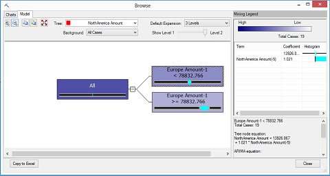

# View the Formula for a Time Series Model (Data Mining)
If you created a time series model using [!INCLUDE[ssNoVersion](../../Topics/TopicNameContainA/includes/ssNoVersion_md.md)] Data Mining, the easiest way to see the regression equation for the model is to use the **Mining Legend** of the [Microsoft Time Series Viewer](../../Topics/TopicNameContainA/Browse-a-Model-Using-the-Microsoft-Time-Series-Viewer.md), which presents all the constants in a readable format.  
  
### To view the ARTXP regression formula for a time series model  
  
1.  In [!INCLUDE[ssManStudioFull](../../Topics/TopicNameContainA/includes/ssManStudioFull_md.md)], select the time series model that you want to view, and click **Browse**.  
  
     -- or --  
  
     In [!INCLUDE[ssBIDevStudioFull](../../Topics/TopicNameContainA/includes/ssBIDevStudioFull_md.md)], select the time series model, and then click the **Mining Model Viewer** tab.  
  
2.  Click the **Model** tab.  
  
3.  If the model contains multiple trees, select a single tree from the **Tree** drop-down list.  
  
    > [!NOTE]  
    >  A model will always have multiple trees if you have more than one data series. However, you will not see as many trees in the **Time Series viewer** as you will see in the [Microsoft Generic Content Tree Viewer](../../Topics/TopicNameNotContainA/Microsoft-Generic-Content-Tree-Viewer--Data-Mining-.md). That is because the Time Series viewer combines the ARIMA and ARTXP information for each data series into a single representation.  
  
4.  Click any leaf node in the tree.  
  
     Nodes that are labeled as **Data Series** are always leaf nodes and can contain an equation. If an **(All)** node has no child nodes, it can also contain an equation.  
  
5.  If the **Mining Legend** is not available, right-click the node, and select **Show Legend**.  
  
     The ARTXP formula is displayed in the first half of the **Mining Legend**, as the **Tree node equation**.  
  
       
  
### To view the ARIMA formula for a time series model  
  
1.  In [!INCLUDE[ssManStudioFull](../../Topics/TopicNameContainA/includes/ssManStudioFull_md.md)], select the time series model that you want to view, and click **Browse**.  
  
     -- or --  
  
     In [!INCLUDE[ssBIDevStudioFull](../../Topics/TopicNameContainA/includes/ssBIDevStudioFull_md.md)], select the time series model, and then click the **Mining Model Viewer** tab.  
  
2.  Click the **Model** tab.  
  
3.  If the model contains multiple trees, select a single tree from the **Tree** drop-down list.  
  
    > [!NOTE]  
    >  The model will always have multiple trees if you include more than one data series.  
  
4.  Click any node in the tree.  
  
     The ARIMA formula is displayed in the second half of the **Mining Legend**, as the **ARIMA equation**.  
  
5.  If the **Mining Legend** is not available, right-click the node, and select **Show Legend**.  
  
### To get the coefficients and terms for the equation  
  
1.  You can also get the terms and coefficients of the regression formula for a time series model by creating a **content query** on the model content.  
  
     For more information, see [Time Series Model Query Examples](../../Topics/TopicNameNotContainA/Time-Series-Model-Query-Examples.md)  
  
2.  You can also browse the time series models and find the terms and coefficients by using the [Microsoft Generic Content Tree Viewer](../../Topics/TopicNameNotContainA/Microsoft-Generic-Content-Tree-Viewer--Data-Mining-.md).  
  
     For more information, see [Mining Model Content for Time Series Models (Analysis Services - Data Mining)](../../Topics/TopicNameNotContainA/Mining-Model-Content-for-Time-Series-Models--Analysis-Services---Data-Mining-.md).  
  
    > [!NOTE]  
    >  If you browse the content of a mixed model that uses both the ARIMA and ARTXP models, the two models are in separate trees, joined at the root node representing the model. Even though the ARIMA and ARTXP models are presented in one viewer for convenience, the structures are very different, as are the equations, which cannot be combined or compared. The ARTXP tree is more like a decision tree, whereas the ARIMA tree represents a series of moving averages.  
  
## See Also  
 [Mining Model Viewer Tasks and How-tos](../../Topics/TopicNameNotContainA/Mining-Model-Viewer-Tasks-and-How-tos.md)   
 [Browse a Model Using the Microsoft Time Series Viewer](../../Topics/TopicNameContainA/Browse-a-Model-Using-the-Microsoft-Time-Series-Viewer.md)