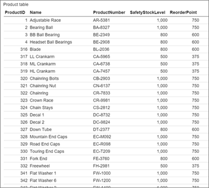
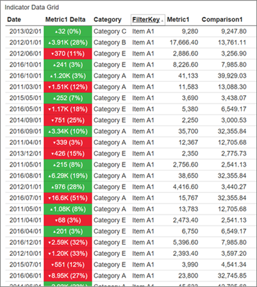
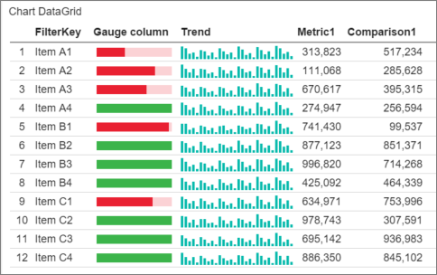

# Add data grids to mobile reports | Reporting Services
Sometimes the best visualization is the data itself. Learn about the three *data grids*, or tables, for displaying data in [!INCLUDE[SS_MobileReptPub_Long](../../Topics/TopicNameContainA/includes/SS_MobileReptPub_Long.md)]:
* Simple data grid
* Indicator data grid
* Chart data grid

## Simple data grid
The most basic, the simple data grid, can display multiple columns of data with custom formatting and headers. 

After you add a data grid to the design surface, you can connect it to real data.

1. Drag a simple data grid from the **Layout** tab to the design grid and make it the size you want.

2. Get [data from Excel or a shared dataset](../../Topics/TopicNameNotContainA/Data-for-Reporting-Services-mobile-reports.md).

3. Select the **Data** tab, and in the **Data properties** pane, under **Data for the grid view** select a data table.

4. In the **Columns** pane, select the columns you want. Reorder and rename them and set their format and aggregation. 

 
##  Indicator data grid
You can add columns with gauges to an indicator data grid.

1. Drag an indicator data grid from the **Layout** tab to the design grid and make it the size you want.

2. On the **Data** tab in the **Columns** pane, select **Add gauge column**. 

3. Select **Options**, then select a **Gauge type**. 

4. Set the **Value** and **Comparison** fields and **Value direction**, just as in [gauges you add directly to your mobile report](Add%20gauges%20to%20mobile%20reports%20%7C%20Reporting%20Services.md).

The data grid automatically feeds the gauge only the data specific to that row of the data grid.  

## Chart data grid
You can add you can add columns with either gauges or charts to a chart data grid. 

When you add a chart column to a data grid, you need to add a separate data table to provide data for the chart in each row. This second data table needs to share a field with the main data table, to link each row to its associated chart data. 

1. Drag a chart data grid from the **Layout** tab to the design grid and make it the size you want.

2. On the **Data** tab in the **Columns** pane, select **Add chart column**. 

3. Get [data from Excel or a shared dataset](../../Topics/TopicNameNotContainA/Data-for-Reporting-Services-mobile-reports.md) to add a second data table that shares a field with the main data table, if you haven't done so already.

4. Under **Data properties**, select the main data table in **Data for the Grid View**, then select the second table in **Reference Data for Chart Visualizations**.

5. Select **Options**, then select **Chart type**.
 
6. Select **Chart data field**, **Source lookup**, and **Destination lookup**. 
   These three properties determine how the data grid provides data to each chart in the column.
   
   *   **Source lookup** is set to a field in the data table in **Data for the Grid View**. This field acts as a per-row filter applied to the chart reference data table to provide data to the embedded chart for each row. 
   * **Destination lookup** is the field in the data table in **Reference data for chart visualizations**. The data for the chart in each row will be joined on those two fields.   
   * **Chart data field** determines which metric in the **Reference data for chart visualizations** data table to use as the y-axis value or series in the chart in each row.  

## See also 
* [Maps in Reporting Services mobile reports](../../Topics/TopicNameNotContainA/Maps-in-Reporting-Services-mobile-reports.md)
* [Navigators in Reporting Services mobile reports](../../Topics/TopicNameNotContainA/Add-navigators-to-Reporting-Services-mobile-reports.md)
* [Visualizations in Reporting Services mobile reports](../../Topics/TopicNameNotContainA/Add-visualizations-to-Reporting-Services-mobile-reports.md)
* [Gauges in Reporting Services mobile reports](Add%20gauges%20to%20mobile%20reports%20%7C%20Reporting%20Services.md)  
 
  
