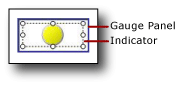

# Add or Delete an Indicator (Report Builder and SSRS)
Indicators are minimal gauges that convey the state of a single data value at a glance. For more information about them, see [Indicators (Report Builder and SSRS)](../../Topics/TopicNameNotContainA/Indicators--Report-Builder-and-SSRS-.md).  
  
 Indicators are commonly placed in cells in a table or matrix, but you can also use indicators by themselves, side-by-side with gauges, or embedded in gauges.  
  
 When you first add an indicator, it is by default configured to use percentages as measurement units. The percentage ranges are evenly distributed across members of the indicator set, and the scope of values shown by the indicator is the parent of the indicator such as a table or matrix.  
  
 You can update the values and states of indicators. For more information, see the following topics:  
  
-   [Change Indicator Icons and Indicator Sets (Report Builder and SSRS)](../../Topics/TopicNameNotContainA/Change-Indicator-Icons-and-Indicator-Sets--Report-Builder-and-SSRS-.md)  
  
-   [Set and Configure Measurement Units (Report Builder and SSRS)](../../Topics/TopicNameNotContainA/Set-and-Configure-Measurement-Units--Report-Builder-and-SSRS-.md)  
  
-   [Set Synchronization Scope (Report Builder and SSRS)](../../Topics/TopicNameNotContainA/Set-Synchronization-Scope--Report-Builder-and-SSRS-.md)  
  
 Because an indicator is positioned inside the gauge panel, you need to select the indicator instead of the panel when you want to configure the indicator by using the **Indicators Properties** dialog box or the **Properties** pane. The following picture shows a selected indicator in its gauge panel.  
  
   
  
> [!NOTE]  
>  Depending on column width and the length of data values, the text in table or matrix cells might wrap and display text on multiple lines. When this occurs, the indicator icon might be stretched and change shape. This can make the indicator icon less readable. Place the indicator inside a rectangle to ensure that the icon is never stretched.  
  
> [!NOTE]  
>  [!INCLUDE[ssRBRDDup](../../Topics/TopicNameContainA/includes/ssRBRDDup_md.md)]  
  
### To add an indicator to a table or matrix  
  
1.  Open an existing report or create a new report that contains a table and matrix with the data you want to display. For more information, see [Tables (Report Builder  and SSRS)](../../Topics/TopicNameNotContainA/Tables--Report-Builder--and-SSRS-.md) or [Create a Matrix (Report Builder and SSRS)](../../Topics/TopicNameContainA/Create-a-Matrix--Report-Builder-and-SSRS-.md).  
  
2.  Insert a column in your table or matrix. For more information, see [Insert or Delete a Column (Report Builder and SSRS)](../../Topics/TopicNameContainA/Insert-or-Delete-a-Column--Report-Builder-and-SSRS-.md).  
  
3.  Optionally, on the **Insert** tab, click **Rectangle**, and then click a cell in the new column.  
  
4.  On the **Insert** tab, click **Indicator**, and then click a cell in the new column.  
  
     If you added a rectangle to a cell, click that cell.  
  
5.  In the **Select Indicator Style** dialog box, in the left pane, click the indicator type you want, and then click the indicator set.  
  
6.  Click **OK**.  
  
7.  Click the indicator. The **Gauge Data** pane opens.  
  
8.  In the **Values** area, in the **(Unspecified)** drop-down list, click the field whose values you want to display as an indicator.  
  
     The indicator is configured to use default values. By default, indicators are configured use percentages as measurement units and the percentage ranges are evenly distributed across the members of the indicator and the value that the indicator conveys uses the scope of the nearest group.  
  
### To delete an indicator to a table or matrix  
  
1.  Right-click the indicator to delete and click **Delete**.  
  
    > [!NOTE]  
    >  An indicator might be positioned inside a gauge panel that contains other indicators or gauges. If the gauge panels contain multiple items, be sure to click the indicator to delete it, not the gauge panel. If you click and then delete the gauge panel, the gauge panels and all the items in it are deleted.  
  
2.  Click **Delete**.  
  
## See Also  
 [Indicators (Report Builder and SSRS)](../../Topics/TopicNameNotContainA/Indicators--Report-Builder-and-SSRS-.md)