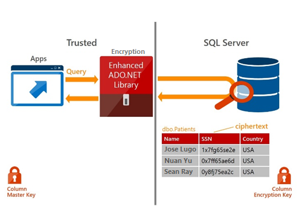

# Always Encrypted (Database Engine)
  
  
 Always Encrypted is a feature designed to protect sensitive data, such as credit card numbers or national identification numbers (e.g. U.S. social security numbers), stored in [!INCLUDE[ssSDSfull](../../Topics/TopicNameContainA/includes/ssSDSfull_md.md)] or [!INCLUDE[ssNoVersion](../../Topics/TopicNameContainA/includes/ssNoVersion_md.md)] databases. Always Encrypted allows clients to encrypt sensitive data inside client applications and never reveal the encryption keys to the [!INCLUDE[ssDE](../../Topics/TopicNameContainA/includes/ssDE_md.md)] ([!INCLUDE[ssSDS](../../Topics/TopicNameContainA/includes/ssSDS_md.md)] or [!INCLUDE[ssNoVersion](../../Topics/TopicNameContainA/includes/ssNoVersion_md.md)]). As a result, Always Encrypted provides a separation between those who own the data (and can view it) and those who manage the data (but should have no access). By ensuring on-premises database administrators, cloud database operators, or other high-privileged, but unauthorized users, cannot access the encrypted data, Always Encrypted enables customers to confidently store sensitive data outside of their direct control. This allows organizations to encrypt data at rest and in use for storage in Azure, to enable delegation of on-premises database administration to third parties, or to reduce security clearance requirements for their own DBA staff.  
  
 Always Encrypted makes encryption transparent to applications. An Always Encrypted-enabled driver installed on the client computer achieves this by automatically encrypting and decrypting sensitive data in the client application. The driver encrypts the data in sensitive columns before passing the data to the [!INCLUDE[ssDE](../../Topics/TopicNameContainA/includes/ssDE_md.md)], and automatically rewrites queries so that the semantics to the application are preserved. Similarly, the driver transparently decrypts data, stored in encrypted database columns, contained in query results.  
  
 Always Encrypted is available in [!INCLUDE[ssSQL15](../../Topics/TopicNameContainA/includes/ssSQL15_md.md)] and in preview in [!INCLUDE[ssSDS](../../Topics/TopicNameContainA/includes/ssSDS_md.md)]. For a Channel 9 presentation that includes Always Encrypted, see [Keeping Sensitive Data Secure with Always Encrypted](https://channel9.msdn.com/events/DataDriven/SQLServer2016/AlwaysEncrypted).  
  
## Typical Scenarios  
  
### Client and Data On-Premises  
 A customer has a client application and [!INCLUDE[ssNoVersion](../../Topics/TopicNameContainA/includes/ssNoVersion_md.md)] both running on-premises, at their business location. The customer wants to hire an external vendor to administer [!INCLUDE[ssNoVersion](../../Topics/TopicNameContainA/includes/ssNoVersion_md.md)]. In order to protect sensitive data stored in [!INCLUDE[ssNoVersion](../../Topics/TopicNameContainA/includes/ssNoVersion_md.md)], the customer uses Always Encrypted to ensure the separation of duties between database administrators and application administrators. The customer stores plaintext values of Always Encrypted keys in a trusted key store which the client application can access. [!INCLUDE[ssNoVersion](../../Topics/TopicNameContainA/includes/ssNoVersion_md.md)] administrators have no access to the keys and, therefore, are unable to decrypt sensitive data stored in [!INCLUDE[ssNoVersion](../../Topics/TopicNameContainA/includes/ssNoVersion_md.md)].  
  
### Client On-Premises with Data in Azure  
 A customer has an on-premises client application at their business location. The application operates on sensitive data stored in a database hosted in Azure ([!INCLUDE[ssSDS](../../Topics/TopicNameContainA/includes/ssSDS_md.md)] or [!INCLUDE[ssNoVersion](../../Topics/TopicNameContainA/includes/ssNoVersion_md.md)] running in a virtual machine on Microsoft Azure). The customer uses Always Encrypted and stores Always Encrypted keys in a trusted key store hosted on-premises, to ensure [!INCLUDE[msCoName](../../Topics/TopicNameContainA/includes/msCoName_md.md)] cloud administrators have no access to sensitive data.  
  
### Client and Data in Azure  
 A customer has a client application, hosted in Microsoft Azure (e.g. in a worker role or a web role), which operates on sensitive data stored also stored in Microsoft Azure. The customer uses Always Encrypted to reduce security attack surface area (the data is always encrypted in the database and on the machine hosting the database).  
  
## Links to How To Topics  
 The following links have information on specific actions related to Always Encrypted.  
  
-   Search for  articles on Always Encrypted on the [SQL Server/Azure SQL Database Security Blog](http://blogs.msdn.com/b/sqlsecurity/) for information about other use cases.  
  
-   [Migrate Sensitive Data Protected by Always Encrypted](../../Topics/TopicNameNotContainA/Migrate-Sensitive-Data-Protected-by-Always-Encrypted.md)  
  
-   [Always Encrypted (client development)](../../Topics/TopicNameNotContainA/Always-Encrypted--client-development-.md)  
  
-   [Always Encrypted Cryptography](../../Topics/TopicNameNotContainA/Always-Encrypted-Cryptography.md)  
  
-   [Column Master Key Rotation and Cleanup with Always Encrypted](../../Topics/TopicNameNotContainA/Column-Master-Key-Rotation-and-Cleanup-with-Always-Encrypted.md)  
  
-   [Using Always Encrypted with the JDBC Driver](https://msdn.microsoft.com/library/mt591987.aspx)  
  
## Selecting  Deterministic or Randomized Encryption  
 Always Encrypted supports two types of encryption: randomized encryption and deterministic encryption.  
  
-   **Deterministic encryption** uses a method which always generates the same encrypted value for any given plain text value. Using deterministic encryption allows grouping, filtering by equality, and joining tables based on encrypted values, but can also allow unauthorized users to guess information about encrypted values by examining patterns in the encrypted column. This weakness is increased when there is a small set of possible encrypted values, such as True/False, or North/South/East/West region. Deterministic encryption must use a column collation with a binary2 sort order for character columns.  
  
-   **Randomized encryption** uses a method that encrypts data in a less predictable manner. Randomized encryption is more secure, but prevents equality searches, grouping, indexing, and joining on encrypted columns.  
  
 Use deterministic encryption for columns that will be used as search or grouping parameters, for example a government ID number. Use randomized encryption, for data such as confidential investigation comments, which are not grouped with other records and are not used to join tables.  
  
## Always Encrypted Keys  
 Always Encrypted uses keys of two types: column encryption keys and column master keys.  
  
-   *Column master keys* are protecting keys used to encrypt column encryption keys. Column master keys must be stored in a trusted key store. Information about column master keys, including their location, is stored in the database in system catalog views.  
  
-   *Column encryption keys* are used to encrypt sensitive data stored in database columns. All values in a column can be encrypted using a single column encryption key. Encrypted values of column encryption keys are stored in the database in system catalog views. You should store column encryption keys in a secure/trusted location for backup.  
  
   
  
## Always Encrypted Driver  
 An Always Encrypted enabled driver plays the critical role in Always Encrypted, as it ensures the transparency of encryption to client applications. The driver calls a server (makes a roundtrip) for each query with parameters to retrieve information on how to encrypt query parameter and whether they should be encrypted. The driver calls a key store provider to decrypt the encrypted column encryption key value. The resultant plaintext column encryption key values are cached. Query results containing data from encrypted columns are accompanied by encryption metadata to enable transparent decryption.  
  
 When an Always Encrypted enabled client driver queries encrypted columns, [!INCLUDE[ssNoVersion](../../Topics/TopicNameContainA/includes/ssNoVersion_md.md)] sends the information about encryption settings for the queried columns, including encryption type information, the encrypted value of column encryption keys used to protect data in the queried columns, and the location of the corresponding column master keys. The driver uses that information to:  
  
-   Contact the key store containing each column master key and decrypt column encryption keys, encrypted with the given master key.  
  
-   Encrypt query parameters that correspond to encrypted columns and decrypt the query results originating from encrypted columns, using the corresponding column encryption keys.  
  
 A column master key store provider is a client-side software component that encapsulates a key store containing the column master key. Providers for common types of key stores are available in client side driver libraries from [!INCLUDE[msCoName](../../Topics/TopicNameContainA/includes/msCoName_md.md)] or as standalone downloads. You can also implement your own provider. For more information including the list of available providers, see [CREATE COLUMN MASTER KEY (Transact-SQL)](assetId:///f8926b95-e146-4e3f-b56b-add0c0d0a30e), [Always Encrypted (client development)](../../Topics/TopicNameNotContainA/Always-Encrypted--client-development-.md), and [Using Always Encrypted with the JDBC Driver](https://msdn.microsoft.com/library/mt591987.aspx).  
  
 If Always Encrypted is not enabled on the client side, the driver returns encrypted values and the values have the **varbinary(max)** data type.  
  
## Getting Started with Always Encrypted  
 Use the Always Encrypted Wizard to quickly start using Always Encrypted. The following example demonstrates the process for encrypting a column.  
  
> [!NOTE]  
>  For a video that includes using the wizard, see [Getting Started with Always Encrypted with SSMS](https://channel9.msdn.com/Shows/Data-Exposed/Getting-Started-with-Always-Encrypted-with-SSMS).  
  
1.  Create a new database, and create one or more tables with columns that you wish to encrypt.  
  
2.  Connect to your database using the Object Explorer of [!INCLUDE[ssManStudio](../../Topics/TopicNameContainA/includes/ssManStudio_md.md)].  
  
3.  Right-click your database, point to **Tasks**, and then click **Encrypt Columns** to open the **Always Encrypted Wizard**.  
  
4.  Review the **Introduction** page, and then click **Next**.  
  
5.  On the **Column Selection** page, expand the tables, and select the columns that you want to encrypt.  
  
6.  For each column selected for encryption, set the **Encryption Type** to either **Deterministic** or **Randomized**.  
  
7.  For each column selected for encryption, select an **Encryption Key**. If you have not previously created an encryption keys for this database, select the default choice of a new auto-generated key, and then click **Next**.  
  
8.  On the **Master Key Configuration** page, select a location to store the new key. and select a master key source, and then click **Next**.  
  
9. On the **Validation** page, choose whether to run the script immediately or create a PowerShell script, and then click **Next**.  
  
10. On the **Summary** page, review the options you have selected, and then click **Finish**. Close the wizard when completed.  
  
## Feature Details  
  
-   Queries can perform equality comparison on columns encrypted using deterministic encryption, but no other operations (e.g. greater/less than, pattern matching using the LIKE operator, or arithmetical operations).  
  
-   Queries on columns encrypted by using randomized encryption cannot perform operations on any of those columns. Indexing columns encrypted using randomized encryption is not supported.  
  
-   A column encryption key can have up to two different encrypted values, each encrypted with a different column master key values. This permits column master key rotation.  
  
-   Deterministic encryption requires a column to have one of the binary2 collations.  
  
-   Query parameters that map to encrypted columns must be passed as driver-level parameters. In ADO .NET, such parameters must be passed using the **SqlParameter** class. For more information, see [SqlParameter Class](https://msdn.microsoft.com/en-us/library/system.data.sqlclient.sqlparameter.aspx). Passing values, which map to encrypted columns, as constants will not work (e.g. `SELECT * FROM T WHERE SSN = '111-11-1111'` will raise an exception).  
  
 Always Encrypted is not supported for the columns with the below characteristics (e.g. the Encrypted WITH clause cannot be used in CREATE TABLE/ALTER TABLE for a column, if any of the following conditions apply to the column):  
  
-   Columns using one of the following datatypes: **xml**, **timestamp**/**rowversion**, **image**, **ntext**, **text**, **sql_variant**, **hierarchyid**, **geography**, **geometry**, alias, user defined-types.  
  
-   FILESTREAM columns  
  
-   Columns with ROWGUIDCOL property  
  
-   String (varchar, char, etc.) columns with non-bin2 collations  
  
-   Columns that are keys for nonclustered indices using a randomized encrypted column as a key column (deterministic encrypted columns are fine)  
  
-   Columns that are keys for clustered indices using a randomized encrypted column as a key column (deterministic encrypted columns are fine)  
  
-   Columns that are keys for fulltext indices containing encrypted columns both randomized and deterministic  
  
-   Columns referenced by computed columns (when the expression does unsupported operations for Always Encrypted)  
  
-   Sparse column set  
  
-   Columns that are referenced by statistics  
  
-   Columns using alias type  
  
-   Partitioning columns  
  
-   Columns with default constraints  
  
-   Columns referenced by unique constraints when using randomized encryption (deterministic encryption is supported)  
  
-   Primary key columns when using randomized encryption (deterministic encryption is supported)  
  
-   Referencing columns in foreign key constraints when using randomized encryption or when using deterministic encryption, if the referenced and referencing columns use different keys or algorithms  
  
-   Columns referenced by check constraints  
  
-   Columns in tables that use change data capture  
  
-   Primary key columns on tables that have change tracking  
  
-   Columns that are masked (using Dynamic Data Masking)  
  
-   Always Encrypted cannot be added to columns in Stretch Database tables. (Tables with columns encrypted with Always Encrypted can be enabled for Stretch.)  
  
-   Columns in external (PolyBase) tables (note: using external tables and tables with encrypted columns in the same query is supported)  
  
-   Columns in table variables  
  
 the following clauses cannot be used for encrypted columns:  
  
-   FOR XML  
  
-   FOR JSON PATH  
  
 The following features do not work on encrypted columns:  
  
-   Transactional or merge replication  
  
-   Distributed queries (linked servers)  
  
 Tool Limitations  
  
-   Always Encrypted in not supported in SQL Server Data Tools (SSDT).  
  
-   The only operations supported for databases using Always Encrypted in **sqlpackage.exe** are Export and Import. Extract, Publish, DeployReport, DiffReport and Script are not supported. Similarly, only the Import Data-tier Application and Export Data-tier Application operations are supported in [!INCLUDE[ssManStudio](../../Topics/TopicNameContainA/includes/ssManStudio_md.md)]. Other bacpac/dacpac operations on databases/schemas using Always Encrypted are not supported.  
  
## Permissions  
 There are four permissions for Always Encrypted:  
  
 `ALTER ANY COLUMN MASTER KEY`  
 Required to create and delete a column master key.  
  
 `ALTER ANY COLUMN ENCRYPTION KEY`  
 Required to create and delete a column encryption key.  
  
 `VIEW ANY COLUMN MASTER KEY DEFINITION`  
 Required to access and read the metadata of the column master keys to manage keys or query encrypted columns.  
  
 `VIEW ANY COLUMN ENCRYPTION KEY DEFINITION`  
 Required to access and read the metadata of the column encryption key to manage keys or query encrypted columns.  
  
 The following table summarizes the permissions required for common actions.  
  
|Scenario|`ALTER ANY COLUMN MASTER KEY`|`ALTER ANY COLUMN ENCRYPTION KEY`|`VIEW ANY COLUMN MASTER KEY DEFINITION`|`VIEW ANY COLUMN ENCRYPTION KEY DEFINITION`|  
|--------------|-----------------------------------|---------------------------------------|---------------------------------------------|-------------------------------------------------|  
|Key management (creating/changing/reviewing key metadata in the database)|X|X|X|X|  
|Querying encrypted columns|||X|X|  
  
 **Important notes:**  
  
-   The permissions apply to actions using [!INCLUDE[tsql](../../Topics/TopicNameContainA/includes/tsql_md.md)], [!INCLUDE[ssManStudio](../../Topics/TopicNameContainA/includes/ssManStudio_md.md)] (dialog boxes and wizard), or PowerShell.  
  
-   The two view permissions are required when selecting encrypted columns, even if the user does not have permission to decrypt the columns.  
  
-   In [!INCLUDE[ssNoVersion](../../Topics/TopicNameContainA/includes/ssNoVersion_md.md)], both view permissions are granted by default to the `public` fixed database role. A database administrator may choose to revoke (or deny) the view permissions to the `public` role and grant them to specific roles or users to implement more restricted control.  
  
-   In [!INCLUDE[ssSDS](../../Topics/TopicNameContainA/includes/ssSDS_md.md)], the view permissions are not granted by default to the `public` fixed database role. This enables certain existing, legacy tools (using older versions of DaxFx) to work properly. Consequently, to work with encrypted columns (even if not decrypting them) a database administrator must explicitly grant the two view permissions.  
  
## Best Practices  
  
-   If a database containing sensitive data is hosted in Azure, complete isolation of data from cloud administrators is only provided when the database client tier is running on-premises. If the client tier is running in the cloud, moving the encryption/decryption routine to the client tier still leaves data and keys exposed to cloud administrators (of the platform hosting the client tier).  
  
## Example  
 The following [!INCLUDE[tsql](../../Topics/TopicNameContainA/includes/tsql_md.md)] creates a column master key, column encryption key and a table with encrypted columns.  
  
```  
CREATE COLUMN MASTER KEY MyCMK  
WITH (  
     KEY_STORE_PROVIDER_NAME = 'MSSQL_CERTIFICATE_STORE',   
     KEY_PATH = 'Current User/Personal/f2260f28d909d21c642a3d8e0b45a830e79a1420'  
   );  
---------------------------------------------  
CREATE COLUMN ENCRYPTION KEY MyCEK   
WITH VALUES  
(  
    COLUMN_MASTER_KEY = MyCMK,   
    ALGORITHM = 'RSA_OAEP',   
    ENCRYPTED_VALUE = 0x01700000016C006F00630061006C006D0061006300680069006E0065002F006D0079002F003200660061006600640038003100320031003400340034006500620031006100320065003000360039003300340038006100350064003400300032003300380065006600620063006300610031006300284FC4316518CF3328A6D9304F65DD2CE387B79D95D077B4156E9ED8683FC0E09FA848275C685373228762B02DF2522AFF6D661782607B4A2275F2F922A5324B392C9D498E4ECFC61B79F0553EE8FB2E5A8635C4DBC0224D5A7F1B136C182DCDE32A00451F1A7AC6B4492067FD0FAC7D3D6F4AB7FC0E86614455DBB2AB37013E0A5B8B5089B180CA36D8B06CDB15E95A7D06E25AACB645D42C85B0B7EA2962BD3080B9A7CDB805C6279FE7DD6941E7EA4C2139E0D4101D8D7891076E70D433A214E82D9030CF1F40C503103075DEEB3D64537D15D244F503C2750CF940B71967F51095BFA51A85D2F764C78704CAB6F015EA87753355367C5C9F66E465C0C66BADEDFDF76FB7E5C21A0D89A2FCCA8595471F8918B1387E055FA0B816E74201CD5C50129D29C015895CD073925B6EA87CAF4A4FAF018C06A3856F5DFB724F42807543F777D82B809232B465D983E6F19DFB572BEA7B61C50154605452A891190FB5A0C4E464862CF5EFAD5E7D91F7D65AA1A78F688E69A1EB098AB42E95C674E234173CD7E0925541AD5AE7CED9A3D12FDFE6EB8EA4F8AAD2629D4F5A18BA3DDCC9CF7F352A892D4BEBDC4A1303F9C683DACD51A237E34B045EBE579A381E26B40DCFBF49EFFA6F65D17F37C6DBA54AA99A65D5573D4EB5BA038E024910A4D36B79A1D4E3C70349DADFF08FD8B4DEE77FDB57F01CB276ED5E676F1EC973154F86  
);  
---------------------------------------------  
CREATE TABLE Customers (  
    CustName nvarchar(60)   
        COLLATE  Latin1_General_BIN2 ENCRYPTED WITH (COLUMN_ENCRYPTION_KEY = MyCEK,  
        ENCRYPTION_TYPE = RANDOMIZED,  
        ALGORITHM = 'AEAD_AES_256_CBC_HMAC_SHA_256'),   
    SSN varchar(11)   
        COLLATE  Latin1_General_BIN2 ENCRYPTED WITH (COLUMN_ENCRYPTION_KEY = MyCEK,  
        ENCRYPTION_TYPE = DETERMINISTIC ,  
        ALGORITHM = 'AEAD_AES_256_CBC_HMAC_SHA_256'),   
    Age int NULL  
);  
GO  
  
```  
  
## See Also  
 [CREATE COLUMN MASTER KEY (Transact-SQL)](assetId:///f8926b95-e146-4e3f-b56b-add0c0d0a30e)   
 [CREATE COLUMN ENCRYPTION KEY (Transact-SQL)](assetId:///517fe745-d79b-4aae-99a7-72be45ea6acb)   
 [CREATE TABLE (Transact-SQL)](assetId:///1e068443-b9ea-486a-804f-ce7b6e048e8b)   
 [column_definition (Transact-SQL)](assetId:///a1742649-ca29-4d9b-9975-661cdbf18f78)   
 [sys.column_encryption_keys  (Transact-SQL)](assetId:///43980dd8-b9b1-4869-a304-2c183ae8977d)   
 [sys.column_encryption_key_values (Transact-SQL)](assetId:///440875ab-b0e9-4966-8c16-01503558fedd)   
 [sys.column_master_keys (Transact-SQL)](assetId:///fbec2efa-5fe9-4121-9b34-60497b0b2aca)   
 [sys.columns (Transact-SQL)](assetId:///323ac9ea-fc52-4b8c-8a7e-e0e44f8ed86c)   
 [Always Encrypted Wizard](../../Topics/TopicNameNotContainA/Always-Encrypted-Wizard.md)   
 [Migrate Sensitive Data Protected by Always Encrypted](../../Topics/TopicNameNotContainA/Migrate-Sensitive-Data-Protected-by-Always-Encrypted.md)   
 [Always Encrypted (client development)](../../Topics/TopicNameNotContainA/Always-Encrypted--client-development-.md)   
 [Always Encrypted Cryptography](../../Topics/TopicNameNotContainA/Always-Encrypted-Cryptography.md)   
 [Using Always Encrypted with the JDBC Driver](https://msdn.microsoft.com/library/mt591987.aspx)   
 [Column Master Key Rotation and Cleanup with Always Encrypted](../../Topics/TopicNameNotContainA/Column-Master-Key-Rotation-and-Cleanup-with-Always-Encrypted.md)