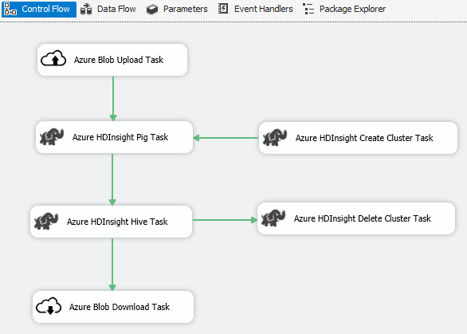
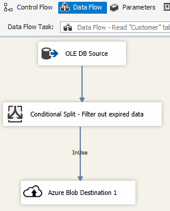
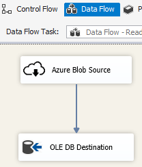
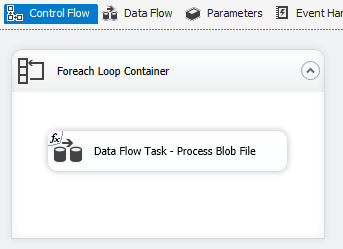

# Azure Feature Pack for Integration Services (SSIS)
  SQL Server Integration Services (SSIS) Feature Pack for Azure for SQL Server 2016 is an extension that provides the following components for SSIS to connect to Azure, transfer data between Azure and on-premises data sources, and process data stored in Azure.

 **Download** the [SSIS Feature Pack for Azure for SQL Server 2016](http://go.microsoft.com/fwlink/?LinkID=626967)

-   Connection Managers

    -   [Azure Storage Connection Manager](../../Topics/TopicNameNotContainA/Azure-Storage-Connection-Manager.md)

    -   [Azure Subscription Connection Manager](../../Topics/TopicNameNotContainA/Azure-Subscription-Connection-Manager.md)

-   Tasks

    -   [Azure Blob Upload Task](../../Topics/TopicNameNotContainA/Azure-Blob-Upload-Task.md)

    -   [Azure Blob Download Task](../../Topics/TopicNameNotContainA/Azure-Blob-Download-Task.md)

    -   [Azure HDInsight Hive Task](../../Topics/TopicNameNotContainA/Azure-HDInsight-Hive-Task.md)

    -   [Azure HDInsight Pig Task](../../Topics/TopicNameNotContainA/Azure-HDInsight-Pig-Task.md)

    -   [Azure HDInsight Create Cluster Task](../../Topics/TopicNameNotContainA/Azure-HDInsight-Create-Cluster-Task.md)

    -   [Azure HDInsight Delete Cluster Task](../../Topics/TopicNameNotContainA/Azure-HDInsight-Delete-Cluster-Task.md)

-   Data Flow Components

    -   [Azure Blob Source](../../Topics/TopicNameNotContainA/Azure-Blob-Source.md)

    -   [Azure Blob Destination](../../Topics/TopicNameNotContainA/Azure-Blob-Destination.md)

-   Azure Blob Enumerator. See [Enumerator = Foreach Azure Blob Enumerator](../../Topics/TopicNameNotContainA/Foreach-Loop-Editor--Collection-Page-.md#ForeachAzureBlob)

## Download the Feature Pack
 Download the SQL Server Integration Services (SSIS) Feature Pack for Azure for SQL Server 2016 [here](http://go.microsoft.com/fwlink/?LinkID=626967).

## Prerequisites
 You must install the following prerequisites before installing this feature pack.

-   SQL Server Integration Services

-   .Net Framework 4.5

## Scenario: Processing big data
 Use Azure Connector to complete following big data processing work:

1.  Use the Azure Blob Upload Task to upload input data to Azure Blob Storage.

2.  Use the Azure HDInsight Create Cluster Task to create an Azure HDInsight cluster. This step is optional if you want to use your own cluster.

3.  Use the Azure HDInsight Hive Task or Azure HDInsight Pig Task to invoke a Pig or Hive job on the Azure HDInsight cluster.

4.  Use the Azure HDInsight Delete Cluster Task to delete the HDInsight Cluster after use if you have created an on-demand HDInsight cluster in step #2.

5.  Use the Azure HDInsight Blob Download Task to download the Pig/Hive output data from the Azure Blob Storage.

 
## Scenario: Managing data in the cloud
 Use the Azure Blob Destination in an SSIS package to write output data to Azure Blob Storage, or use the Azure Blob Source to read data from an Azure Blob Storage.

 
 

 Use the Foreach Loop Container with the Azure Blob Enumerator to process data in multiple blob files.

  