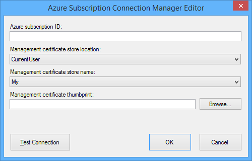
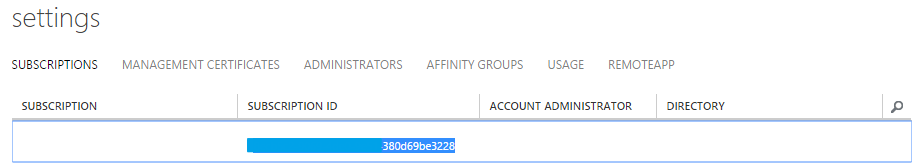
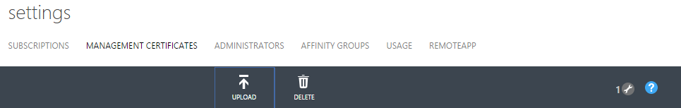

# Azure Subscription Connection Manager
  The **Azure Subscription connection manager** enables an SSIS package to connect to an Azure subscription by using the values you specify for the properties: Azure Subscription ID and Management Certificate.  
  
 The **Azure Subscription connection manager** is a component of the SQL Server Integration Services (SSIS) Feature Pack for Azure for SQL Server 2016. Download the Feature Pack [here](http://go.microsoft.com/fwlink/?LinkID=626967).  
  
1.  In the **Add SSIS Connection Manager** dialog box shown above, you select **Azure Subscription**, and click **Add**.  You should see the following **Azure Subscription Connection Manager Editor** dialog box.  
  
    
  
2.  Enter your Azure subscription ID, which uniquely identifies an Azure subscription, for the **Azure subscription ID**.  The value can be found on the [Azure Management Portal](https://manage.windowsazure.com) under **Settings** page:  
  
      
  
3.  Choose **Management certificate store location** and **Management certificate store name** from the drop-down lists.  
  
4.  Enter **Management certificate thumbprint** or click the **Browse…** to choose a certificate from the selected store. The certificate must be uploaded as a management certificate for the subscription. To do so, click **Upload** on the following page of the Azure Portal (see this [MSDN post](https://msdn.microsoft.com/library/azure/gg551722.aspx) for more detail).  
  
       
  
5.  Click **Test Connection** to test the connection.  
  
6.  Click **OK** to close the dialog box.  
  
  