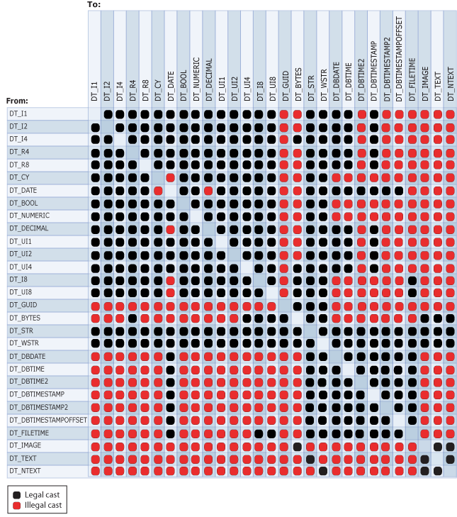

# Cast (SSIS Expression)
Explicitly converts an expression from one data type to a different data type. The cast operator can also function as a truncation operator.  
  
## Syntax  
  
```  
  
(type_spec) expression  
  
```  
  
## Arguments  
 *type_spec*  
 Is a valid [!INCLUDE[ssIS](../../Topics/TopicNameContainA/includes/ssIS_md.md)] data type.  
  
 *expression*  
 Is a valid expression.  
  
## Result Types  
 The data type of *type_spec*. For more information, see [Integration Services Data Types](../../Topics/TopicNameNotContainA/Integration-Services-Data-Types.md).  
  
## Remarks  
 The following diagram shows legal cast operations.  
  
   
  
 Casting to some data types requires parameters. The following table lists these data types and their parameters.  
  
|Data type|Parameter|Example|  
|---------------|---------------|-------------|  
|DT_STR|*charcount*<br /><br /> *codepage*|(DT_STR,30,1252) casts 30 bytes, or 30 single characters, to the DT_STR data type using the 1252 code page.|  
|DT_WSTR|*Charcount*|(DT_WSTR,20) casts 20 byte pairs, or 20 Unicode characters, to the DT_WSTR data type.|  
|DT_BYTES|*Bytecount*|(DT_BYTES,50) casts 50 bytes to the DT_BYTES data type.|  
|DT_DECIMAL|*Scale*|(DT_DECIMAL,2) casts a numeric value to the DT_DECIMAL data type using a scale of 2.|  
|DT_NUMERIC|*Precision*<br /><br /> *Scale*|(DT_NUMERIC,10,3) casts a numeric value to the DT_NUMERIC data type using a precision of 10 and a scale of 3.|  
|DT_TEXT|*Codepage*|(DT_TEXT,1252) casts a value to the DT_TEXT data type using the 1252 code page.|  
  
 When a string is cast to a DT_DATE, or vice versa, the locale of the transformation is used. However, the date is in the ISO format of YYYY-MM-DD, regardless of whether the locale preference uses the ISO format.  
  
> [!NOTE]  
>  To convert a string to a date data type other than DT_DATE, see [Integration Services Data Types](../../Topics/TopicNameNotContainA/Integration-Services-Data-Types.md).  
  
 If the code page is a multibyte character code page, the number of bytes and characters may differ. Casting from a DT_WSTR to a DT_STR with the same *charcount* value may cause truncation of the final characters in the converted string. If sufficient storage is available in the column of the destination table, set the value of the *charcount* parameter to reflect the number of bytes that the multibyte code page requires. For example, if you cast character data to a DT_STR data type using the 936 code page, you should set *charcount* to a value up to two times greater than the number of characters that you expect the data to contain; if you cast character data using the UTF-8 code page, you should set *charcount* to a value up to four times greater.  
  
 For more information about the structure of date data types, see [Integration Services Data Types](../../Topics/TopicNameNotContainA/Integration-Services-Data-Types.md).  
  
## SSIS Expression Examples  
 This example casts a numeric value to an integer.  
  
```  
(DT_I4) 3.57  
```  
  
 This example casts an integer to a character string using the 1252 code page.  
  
```  
(DT_STR,1,1252)5  
```  
  
 This example casts a three-character string to double-byte characters.  
  
```  
(DT_WSTR,3)"Cat"  
```  
  
 This example casts an integer to a decimal with a scale of two.  
  
```  
(DT_DECIMAl,2)500  
```  
  
 This example casts an integer to a numeric with a precision of seven and scale of three.  
  
```  
(DT_NUMERIC,7,3)4000  
```  
  
 This example casts values in the **FirstName** column, defined with an **nvarchar** data type and a length of 50, to a character string using the 1252 code page.  
  
```  
(DT_STR,50,1252)FirstName  
```  
  
 This example casts values in the **DateFirstPurchase** column of type DT_DBDATE, to a Unicode character string with a length of 20.  
  
```  
(DT_WSTR,20)DateFirstPurchase  
```  
  
 This example casts the string literal "True" to a Boolean.  
  
```  
(DT_BOOL)"True"  
```  
  
 This example casts a string literal to DT_DBDATE.  
  
```  
(DT_DBDATE) "1999-10-11"  
```  
  
 This example casts a string literal to the DT_DBTIME2 data type that uses 5 digits for fractional seconds. (The DT_DBTIME2 data type can have between 0 and 7 digits specified for fractional seconds.)  
  
```  
(DT_DBTIME2, 5) "16:34:52.12345"  
```  
  
 This example casts a string literal to the DT_DBTIMESTAMP2 data type that uses 4 digits for fractional seconds. (The DT_DBTIMESTAMP2 data type can have between 0 and 7 digits specified for fractional seconds.)  
  
```  
(DT_DBTIMESTAMP2, 4) "1999-10-11 16:34:52.1234"  
```  
  
 This example casts a string literal to the DT_DBTIMESTAMPOFFSET data type that uses 7 digits for fractional seconds. (The DT_DBTIMESTAMPOFFSET data typecan have between 0 and 7 digits specified for fractional seconds.)  
  
```  
(DT_DBTIMESTAMPOFFSET, 7) "1999-10-11 16:34:52.1234567 + 5:35"  
```  
  
## See Also  
 [Operator Precedence and Associativity](../../Topics/TopicNameNotContainA/Operator-Precedence-and-Associativity.md)   
 [Operators (SSIS Expression)](../../Topics/TopicNameNotContainA/Operators--SSIS-Expression-.md)   
 [Integration Services (SSIS) Expressions](../../Topics/TopicNameNotContainA/Integration-Services--SSIS--Expressions.md)   
 [Integration Services Data Types in Expressions](../../Topics/TopicNameNotContainA/Integration-Services-Data-Types-in-Expressions.md)