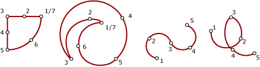

# CircularString
A **CircularString** is a collection of zero or more continuous circular arc segments. A circular arc segment is a curved segment defined by three points in a two-dimensional plane; the first point cannot be the same as the third point. If all three points of a circular arc segment are collinear, the arc segment is treated as a line segment.  
  
> [!IMPORTANT]  
>  For a detailed description and examples of the new spatial features introduced in [!INCLUDE[ssSQL11](../../Topics/TopicNameContainA/includes/ssSQL11_md.md)], including the **CircularString** subtype, download the white paper, [New Spatial Features in SQL Server 2012](http://go.microsoft.com/fwlink/?LinkId=226407).  
  
## CircularString instances  
 The drawing below shows valid **CircularString** instances:  
  
   
  
### Accepted instances  
 A **CircularString** instance is accepted if it is either empty or contains an odd number of points, n, where n > 1. The following **CircularString** instances are accepted.  
  
```  
DECLARE @g1 geometry = 'CIRCULARSTRING EMPTY';  
DECLARE @g2 geometry = 'CIRCULARSTRING(1 1, 2 0, -1 1)';  
DECLARE @g3 geometry = 'CIRCULARSTRING(1 1, 2 0, 2 0, 2 0, 1 1)';  
```  
  
 `@g3` shows that **CircularString** instance may be accepted, but not valid. The following CircularString instance declaration is not accepted. This declaration throws a `System.FormatException`.  
  
```  
DECLARE @g geometry = 'CIRCULARSTRING(1 1, 2 0, 2 0, 1 1)';  
```  
  
### Valid instances  
 A valid **CircularString** instance must be empty or have the following attributes:  
  
-   It must contain at least one circular arc segment (that is, have a minimum of three points).  
  
-   The last endpoint for each circular arc segment in the sequence, except for the last segment, must be the first endpoint for the next segment in the sequence.  
  
-   It must have an odd number of points.  
  
-   It cannot overlap itself over an interval.  
  
-   Although **CircularString** instances may contain line segments, these line segments must be defined by three collinear points.  
  
 The following example shows valid **CircularString** instances.  
  
```  
DECLARE @g1 geometry = 'CIRCULARSTRING EMPTY';  
DECLARE @g2 geometry = 'CIRCULARSTRING(1 1, 2 0, -1 1)';  
DECLARE @g3 geometry = 'CIRCULARSTRING(1 1, 2 0, 2 0, 1 1, 0 1)';  
DECLARE @g4 geometry = 'CIRCULARSTRING(1 1, 2 2, 2 2)';  
SELECT @g1.STIsValid(), @g2.STIsValid(), @g3.STIsValid(),@g4.STIsValid();  
```  
  
 A **CircularString** instance must contain at least two circular arc segments to define a complete circle. A **CircularString** instance cannot use a single circular arc segment (such as (1 1, 3 1, 1 1)) to define a complete circle. Use (1 1, 2 2, 3 1, 2 0, 1 1) to define the circle.  
  
 The following example shows CircularString instances that are not valid.  
  
```  
DECLARE @g1 geometry = 'CIRCULARSTRING(1 1, 2 0, 1 1)';  
DECLARE @g2 geometry = 'CIRCULARSTRING(0 0, 0 0, 0 0)';  
SELECT @g1.STIsValid(), @g2.STIsValid();  
```  
  
### Instances with collinear points  
 In the following cases a circular arc segment will be treated as a line segment:  
  
-   When all three points are collinear (for example, (1 3, 4 4, 7 5)).  
  
-   When the first and middle point are the same, but the third point is different (for example, (1 3, 1 3, 7 5)).  
  
-   When the middle and last point are the same, but the first point is different (for example, (1 3, 4 4, 4 4)).  
  
## Examples  
  
### A. Instantiating a Geometry Instance with an Empty CircularString  
 This example shows how to create an empty **CircularString** instance:  
  
```tsql  
DECLARE @g geometry;  
SET @g = geometry::Parse('CIRCULARSTRING EMPTY');  
```  
  
### B. Instantiating a Geometry Instance Using a CircularString with One Circular Arc Segment  
 The following example shows how to create a **CircularString** instance with a single circular arc segment (half-circle):  
  
```tsql  
DECLARE @g geometry;  
SET @g = geometry:: STGeomFromText('CIRCULARSTRING(2 0, 1 1, 0 0)', 0);  
SELECT @g.ToString();  
```  
  
### C. Instantiating a Geometry Instance Using a CircularString with Multiple Circular Arc Segments  
 The following example shows how to create a **CircularString** instance with more than one circular arc segment (full circle):  
  
```tsql  
DECLARE @g geometry;  
SET @g = geometry::Parse('CIRCULARSTRING(2 1, 1 2, 0 1, 1 0, 2 1)');  
SELECT 'Circumference = ' + CAST(@g.STLength() AS NVARCHAR(10));    
```  
  
 This produces the following output:  
  
```  
Circumference = 6.28319  
```  
  
 Compare the output when **LineString** is used instead of **CircularString**:  
  
```tsql  
DECLARE @g geometry;  
SET @g = geometry::STGeomFromText('LINESTRING(2 1, 1 2, 0 1, 1 0, 2 1)', 0);  
SELECT 'Perimeter = ' + CAST(@g.STLength() AS NVARCHAR(10));  
```  
  
 This produces the following output:  
  
```  
Perimeter = 5.65685  
```  
  
 Notice that the value for the **CircularString** example is close to 2∏, which is the actual circumference of the circle.  
  
### D. Declaring and Instantiating a Geometry Instance with a CircularString in the Same Statement  
 This snippet shows how to declare and instantiate a **geometry** instance with a **CircularString** in the same statement:  
  
```tsql  
DECLARE @g geometry = 'CIRCULARSTRING(0 0, 1 2.1082, 3 6.3246, 0 7, -3 6.3246, -1 2.1082, 0 0)';  
```  
  
### E. Instantiating a Geography Instance with a CircularString  
 The following example shows how to declare and instantiate a **geography** instance with a **CircularString**:  
  
```tsql  
DECLARE @g geography = 'CIRCULARSTRING(-122.358 47.653, -122.348 47.649, -122.348 47.658, -122.358 47.658, -122.358 47.653)';  
```  
  
### F. Instantiating a Geometry Instance with a CircularString that is a Straight Line  
 The following example shows how to create a **CircularString** instance that is a straight line:  
  
```tsql  
DECLARE @g geometry;  
SET @g = geometry::STGeomFromText('CIRCULARSTRING(0 0, 1 2, 2 4)', 0);  
```  
  
## See Also  
 [Spatial Data Types Overview](../../Topics/TopicNameNotContainA/Spatial-Data-Types-Overview.md)   
 [CompoundCurve](../../Topics/TopicNameNotContainA/CompoundCurve.md)   
 [MakeValid (geography Data Type)](assetId:///f67038e3-4f62-4465-994e-e95ac27d8ada)   
 [MakeValid (geometry Data Type)](assetId:///38673010-ab77-4ebb-9c4d-b26b79e3b7ea)   
 [STIsValid (geometry Data type)](assetId:///6da39bea-0f67-4660-98fc-d7214f9b2138)   
 [STIsValid (geography Data Type)](assetId:///1bfe787f-ddf0-4fc7-af6a-570a58faab23)   
 [STLength](assetId:///e34dc620-2a65-4248-b099-fff91830ab98)   
 [STStartPoint](assetId:///049917db-3f76-4053-8cd2-bc54158e89bc)   
 [STEndpoint](assetId:///61773c45-b568-4e0c-94da-1310c42de7f5)   
 [STPointN](assetId:///8f0bb3b7-5cd9-42c2-b9f8-f04628653bd0)   
 [STNumPoints](assetId:///a19520fc-7f91-4a2c-856f-4d8b99a7e496)   
 [STIsRing](assetId:///ea0063be-1c74-4cc4-ac6f-b65321ddfa54)   
 [STIsClosed](assetId:///14edbb22-df7b-4b8a-b16c-ac477a5d32c1)   
 [STPointOnSurface](assetId:///23b2b8eb-4176-49fb-ace0-92398928d60e)   
 [LineString](../../Topics/TopicNameNotContainA/LineString.md)