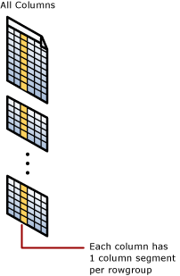

# Columnstore Indexes Guide
The *columnstore index* is the standard for storing and querying large data warehousing fact tables. It uses column-based data storage and query processing to achieve up to **10x query performance** gains in your data warehouse over traditional row-oriented storage, and up to **10x data compression** over the uncompressed data size. Beginning with [!INCLUDE[ssSQL15](../../Topics/TopicNameContainA/includes/ssSQL15_md.md)], columnstore indexes enable operational analytics, the ability to run performant real-time analytics on a transactional workload.  
  
 Jump to scenarios:  
  
-   [Columnstore Indexes for Data Warehousing](../../Topics/TopicNameNotContainA/Columnstore-Indexes-for-Data-Warehousing.md)  
  
-   [Get started with Columnstore for real time operational analytics](../../Topics/TopicNameNotContainA/Get-started-with-Columnstore-for-real-time-operational-analytics.md)  
  
## What is a columnstore index?  
 A *columnstore index* is a technology for storing, retrieving and managing data by using a columnar data format, called a columnstore.  
  
### Key terms and concepts  
 These are key terms and concepts are associated with columnstore indexes.  
  
 columnstore  
 A *columnstore* is data that is logically organized as a table with rows and columns, and physically stored in a column-wise data format.  
  
 rowstore  
 A *rowstore* is data that is logically organized as a table with rows and columns, and then physically stored in a row-wise data format. This has been the traditional way to store relational table data. In SQL Server, rowstore refers to table where the underlying data storage format is a heap, a clustered index, or a memory-optimized table.  
  
> [!NOTE]  
>  In discussions about columnstore indexes, we use the terms *rowstore* and *columnstore* to emphasize the format for the data storage.  
  
 rowgroup  
 A *row group* is a group of rows that are compressed into columnstore format at the same time. A rowgroup usually contains the maximum number of rows per rowgroup which is 1,048,576 rows.  
  
 For high performance and high compression rates, the columnstore index slices the table into groups of rows, called rowgroups, and then compresses each rowgroup in a column-wise manner. The number of rows in the rowgroup must be large enough to improve compression rates, and small enough to benefit from in-memory operations.  
  
 column segment  
 A *column segment* is a column of data from within the rowgroup.  
  
-   Each rowgroup contains one column segment for every column in the table.  
  
-   Each column segment is compressed together and stored on physical media.  
  
   
  
 clustered columnstore index  
 A *clustered columnstore index* is the physical storage for the entire table.  
  
   
  
 To reduce fragmentation of the column segments and improve performance, the columnstore index might store some data temporarily into a clustered index, which is called a deltastore, and a btree list of IDs for deleted rows. The deltastore operations are handled behind the scenes. To return the correct query results, the clustered columnstore index combines query results from both the columnstore and the deltastore.  
  
 deltastore  
 Used with clustered column store indexes only, a *deltastore* is a clustered index that improves columnstore compression and performance by storing rows until the number of rows reaches a threshold and are then moved into the columnstore.  
  
 During a large bulk load, most of the rows go directly to the columnstore without passing through the deltastore. Some rows at the end of the bulk load might be too few in number to meet the minimum size of a rowgroup which is 102,400 rows. When this happens, the final rows go to the deltastore instead of the columnstore. For small bulk loads with less than 102,400 rows, all of the rows go directly to the deltastore.  
  
 When the deltastore reaches the maximum number of rows, it becomes closed. A tuple-mover process checks for closed row groups. When it finds the closed rowgroup, it compresses it and stores it into the columnstore.  
  
 nonclustered columnstore index  
 A *nonclustered columnstore index* and a clustered columnstore index function the same. The difference is a nonclustered index is a secondary index created on a rowstore table, whereas a clustered columnstore index is the primary storage for the entire table.  
  
 The nonclustered index contains a copy of part or all of the rows and columns in the underlying table. The index is defined as one or more columns of the table, and has an optional condition that filters the rows.  
  
 A nonclustered columnstore index enables real-time operational analytics in which the OLTP workload uses the underlying clustered index, while analytics run concurrently on the columnstore index. For more information, see [Get started with Columnstore for real time operational analytics](../../Topics/TopicNameNotContainA/Get-started-with-Columnstore-for-real-time-operational-analytics.md).  
  
 batch execution  
 *Batch execution* is a query processing method in which queries process multiple rows together. Queries on columnstore indexes use batch mode execution which improves query performance typically 2-4x. Batch execution is closely integrated with, and optimized around, the columnstore storage format. Batch-mode execution is sometimes known as vector-based or vectorized execution.  
  
##   Why should I use a columnstore index?  
 A columnstore index can provide a very high level of data compression, typically 10x, to reduce your data warehouse storage cost significantly. Plus, for analytics they offer an order of magnitude better performance than a btree index. They are the preferred data storage format for data warehousing and analytics workloads. Starting with [!INCLUDE[ssSQL15](../../Topics/TopicNameContainA/includes/ssSQL15_md.md)], you can use columnstore indexes for real-time analytics on your operational workload.  
  
 Reasons why columnstore indexes are so fast:  
  
-   Columns store values from the same domain and commonly have similar values, which results in high compression rates. This minimizes or eliminates IO bottleneck in your system while reducing the memory footprint significantly.  
  
-   High compression rates improve query performance by using a smaller in-memory footprint. In turn, query performance can improve because [!INCLUDE[ssNoVersion](../../Topics/TopicNameContainA/includes/ssNoVersion_md.md)] can perform more query and data operations in-memory.  
  
-   Batch execution improves query performance, typically 2-4x, by processing multiple rows together.  
  
-   Queries often select only a few columns from a table, which reduces total I/O from the physical media.  
  
## When should I use a columnstore index?  
 Recommended use cases:  
  
-   Use a clustered columnstore index to store fact tables and large dimension tables for data warehousing workloads. This improves query performance and data compression by up to 10x. See [Columnstore Indexes for Data Warehousing](../../Topics/TopicNameNotContainA/Columnstore-Indexes-for-Data-Warehousing.md).  
  
-   Use a nonclustered columnstore index to perform analysis in real-time on an OLTP workload. See [Get started with Columnstore for real time operational analytics](../../Topics/TopicNameNotContainA/Get-started-with-Columnstore-for-real-time-operational-analytics.md).  
  
### How do I choose between a rowstore index and a columnstore index?  
 Rowstore indexes perform best on queries that seek into the data, searching for a particular value, or for queries on a small range of values. Use rowstore indexes with transactional workloads since they tend to require mostly table seeks instead of table scans.  
  
 Columnstore indexes give high performance gains for analytic queries that scan large amounts of data, especially on large tables.  Use columnstore indexes on data warehousing and analytics workloads, especially on fact tables, since they tend to require full table scans rather than table seeks.  
  
### Can I combine rowstore and columnstore on the same table?  
 Yes. Beginning with [!INCLUDE[ssSQL15](../../Topics/TopicNameContainA/includes/ssSQL15_md.md)], you can  create an updatable  nonclustered columnstore index on a rowstore table. The columnstore index stores a copy of the chosen columns so you do need extra space for this but it will be compressed on average by 10x. By doing this, you can run analytics on the columnstore index and transactions on the rowstore index at the same time. The column store is updated when data changes in the rowstore table, so both indexes are working against the same data.  
  
 Beginning with [!INCLUDE[ssSQL15](../../Topics/TopicNameContainA/includes/ssSQL15_md.md)], you can have one or more nonclustered rowstore indexes on a columnstore index. By doing this, you can perform efficient table seeks on the underlying columnstore. Other options become available too. For example, you can enforce a primary key constraint by using a UNIQUE constraint on the rowstore table. Since an non-unique value will fail to insert into the rowstore table, SQL Server cannot insert the value into the columnstore.  
  
## Metadata  
 All of the columns in a columnstore index are stored in the metadata as included columns. The columnstore index does not have key columns.  
  
-   [sys.indexes (Transact-SQL)](assetId:///066bd9ac-6554-4297-88fe-d740de1f94a8)  
  
-   [sys.index_columns (Transact-SQL)](assetId:///211471aa-558a-475c-9b94-5913c143ed12)  
  
-   [sys.partitions (Transact-SQL)](assetId:///1c19e1b1-c925-4dad-a652-581692f4ab5e)  
  
-   [sys.internal_partitions (Transact-SQL)](assetId:///0262df2b-5ba7-4715-b17b-3d9ce470a38e)  
  
-   [sys.column_store_segments (Transact-SQL)](assetId:///1253448c-2ec9-4900-ae9f-461d6b51b2ea)  
  
-   [sys.column_store_dictionaries (Transact-SQL)](assetId:///56efd563-2f72-4caf-94e3-8a182385c173)  
  
-   [sys.column_store_row_groups (Transact-SQL)](assetId:///76e7fef2-d1a4-4272-a2bb-5f5dcd84aedc)  
  
-   [sys.dm_db_column_store_row_group_operational_stats (Transact-SQL)](assetId:///31b71c68-50a0-4fd8-a7fe-2d2292be1163)  
  
-   [sys.dm_db_column_store_row_group_physical_stats (Transact-SQL)](assetId:///f4c81104-7fe4-408f-9779-8808172dfdd2)  
  
-   [sys.dm_db_column_store_object_pool (Transact-SQL)](assetId:///a8a58ca7-0a7d-4786-bfd9-e8894bd345dd)  
  
-   [sys.dm_db_column_store_row_group_operational_stats (Transact-SQL)](assetId:///31b71c68-50a0-4fd8-a7fe-2d2292be1163)  
  
-   [sys.dm_db_index_operational_stats (Transact-SQL)](assetId:///13adf2e5-2150-40a6-b346-e74a33ce29c6)  
  
-   [sys.dm_db_index_physical_stats (Transact-SQL)](assetId:///d294dd8e-82d5-4628-aa2d-e57702230613)  
  
## Related Tasks  
 All relational tables, unless you specify them as a clustered columnstore index, use rowstore as the underlying data format. CREATE TABLE creates a rowstore table unless you specify the WITH CLUSTERED COLUMNSTORE INDEX option.  
  
 When you create a table with the CREATE TABLE statement you can create the table as a columnstore by specifying the WITH CLUSTERED COLUMNSTORE INDEX option. If you already have a rowstore table and want to convert it to a columnstore, you can use the CREATE COLUMNSTORE INDEX statement. For examples, see.  
  
|Task|Reference Topics|Notes|  
|----------|----------------------|-----------|  
|Create a table as a columnstore.|[CREATE TABLE (Transact-SQL)](assetId:///1e068443-b9ea-486a-804f-ce7b6e048e8b)|Beginning with [!INCLUDE[ssSQL15](../../Topics/TopicNameContainA/includes/ssSQL15_md.md)], you can create the table as a clustered columnstore index. You do not have to first create a rowstore table and then convert it to columnstore.|  
|Create a memory table with a columnstore index.|[CREATE TABLE (Transact-SQL)](assetId:///1e068443-b9ea-486a-804f-ce7b6e048e8b)|Beginning with [!INCLUDE[ssSQL15](../../Topics/TopicNameContainA/includes/ssSQL15_md.md)], you can create a memory-optimized table with a columnstore index. The columnstore index can also be added after the table is created, using the ALTER TABLE ADD INDEX syntax.|  
|Convert a rowstore table to a columnstore.|[CREATE COLUMNSTORE INDEX (Transact-SQL)](assetId:///7e1793b3-5383-4e3d-8cef-027c0c8cb5b1)|Convert an existing heap or binary tree to a columnstore. Examples show how to handle existing indexes and also the name of the index when performing this conversion.|  
|Convert a columnstore table to a rowstore.|[CREATE COLUMNSTORE INDEX (Transact-SQL)](assetId:///7e1793b3-5383-4e3d-8cef-027c0c8cb5b1)|Usually this is not necessary, but there can be times when you need to perform this conversion. Examples show how to convert a columnstore to a heap or clustered index.|  
|Create a columnstore index on a rowstore table.|[CREATE COLUMNSTORE INDEX (Transact-SQL)](assetId:///7e1793b3-5383-4e3d-8cef-027c0c8cb5b1)|A rowstore table can have one columnstore index.  Beginning with [!INCLUDE[ssSQL15](../../Topics/TopicNameContainA/includes/ssSQL15_md.md)], the columnstore index can have a filtered condition. Examples show the basic syntax.|  
|Create performant indexes for operational analytics.|[Get started with Columnstore for real time operational analytics](../../Topics/TopicNameNotContainA/Get-started-with-Columnstore-for-real-time-operational-analytics.md)|Describes how to create complementary columnstore and btree indexes so that OLTP queries use btree indexes and analytics queries use columnstore indexes.|  
|Create performant columnstore indexes for data warehousing.|[Columnstore Indexes for Data Warehousing](../../Topics/TopicNameNotContainA/Columnstore-Indexes-for-Data-Warehousing.md)|Describes how to use btree indexes on columnstore tables to create performant data warehousing queries.|  
|Use a btree index to enforce a primary key constraint on a columnstore index.|[Columnstore Indexes for Data Warehousing](../../Topics/TopicNameNotContainA/Columnstore-Indexes-for-Data-Warehousing.md)|Shows how to combine btree and columnstore indexes to enforce primary key constraints on the columnstore index.|  
|Drop a columnstore index|[DROP INDEX (Transact-SQL)](assetId:///2b1464c8-934c-405f-8ef7-2949346b5372)|Dropping a columnstore index uses the standard DROP INDEX syntax that btree indexes use. Dropping a clustered columnstore index will convert the columnstore table to a heap.|  
|Delete a row from a columnstore index|[DELETE (Transact-SQL)](assetId:///ed6b2105-0f35-408f-ba51-e36ade7ad5b2)|Use [DELETE (Transact-SQL)](assetId:///ed6b2105-0f35-408f-ba51-e36ade7ad5b2) to delete a row.   **columnstore** row: [!INCLUDE[ssNoVersion](../../Topics/TopicNameContainA/includes/ssNoVersion_md.md)] marks the row as logically deleted but does not reclaim the physical storage for the row until the index is rebuilt.   **deltastore** row: [!INCLUDE[ssNoVersion](../../Topics/TopicNameContainA/includes/ssNoVersion_md.md)] logically and physically deletes the row.|  
|Update a row in the columnstore index|[UPDATE (Transact-SQL)](assetId:///40e63302-0c68-4593-af3e-6d190181fee7)|Use [UPDATE (Transact-SQL)](assetId:///40e63302-0c68-4593-af3e-6d190181fee7) to update a row.   **columnstore** row:  [!INCLUDE[ssNoVersion](../../Topics/TopicNameContainA/includes/ssNoVersion_md.md)] marks the row as logically deleted, and then inserts the updated row into the deltastore.   **deltastore** row: [!INCLUDE[ssNoVersion](../../Topics/TopicNameContainA/includes/ssNoVersion_md.md)] updates the row in the deltastore.|  
|Load data into a columnstore index|[Columnstore Indexes Data Loading](../../Topics/TopicNameNotContainA/Columnstore-Indexes-Data-Loading.md)||  
|Force all rows in the deltastore to go into the columnstore.|[ALTER INDEX (Transact-SQL)](assetId:///b796c829-ef3a-405c-a784-48286d4fb2b9) ... REBUILD   [Columnstore Indexes Defragmentation](../../Topics/TopicNameNotContainA/Columnstore-Indexes-Defragmentation.md)|ALTER INDEX with the REBUILD option forces all rows to go into the columnstore.|  
|Defragment a columnstore index|[ALTER INDEX (Transact-SQL)](assetId:///b796c829-ef3a-405c-a784-48286d4fb2b9)|ALTER INDEX … REORGANIZE  defragments columnstore indexes online.|  
|Merge tables with columnstore indexes.|[MERGE (Transact-SQL)](assetId:///c17996d6-56a6-482f-80d8-086a3423eecc)||  
  
## See Also  
 [Columnstore Indexes Data Loading](../../Topics/TopicNameNotContainA/Columnstore-Indexes-Data-Loading.md)   
 [Columnstore Indexes Versioned Feature Summary](../../Topics/TopicNameNotContainA/Columnstore-Indexes-Versioned-Feature-Summary.md)   
 [Columnstore Indexes Query Performance](../../Topics/TopicNameNotContainA/Columnstore-Indexes-Query-Performance.md)   
 [Get started with Columnstore for real time operational analytics](../../Topics/TopicNameNotContainA/Get-started-with-Columnstore-for-real-time-operational-analytics.md)   
 [Columnstore Indexes for Data Warehousing](../../Topics/TopicNameNotContainA/Columnstore-Indexes-for-Data-Warehousing.md)   
 [Columnstore Indexes Defragmentation](../../Topics/TopicNameNotContainA/Columnstore-Indexes-Defragmentation.md)