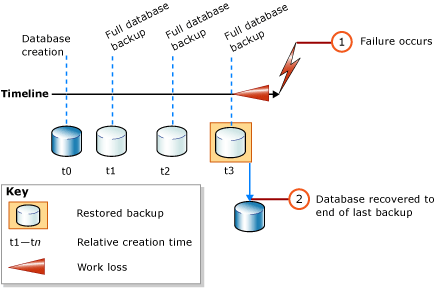
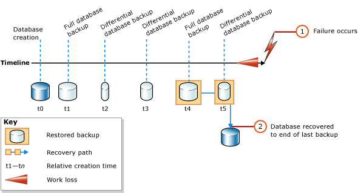

# Complete Database Restores (Simple Recovery Model)
  In a complete database restore, the goal is to restore the whole database. The whole database is offline for the duration of the restore. Before any part of the database can come online, all data is recovered to a consistent point in which all parts of the database are at the same point in time and no uncommitted transactions exist.  
  
 Under the simple recovery model, the database cannot be restored to a specific point in time within a specific backup.  
  
> [!IMPORTANT]  
>  We recommend that you do not attach or restore databases from unknown or untrusted sources. These databases could contain malicious code that might execute unintended [!INCLUDE[tsql](../../Topics/TopicNameContainA/includes/tsql_md.md)] code or cause errors by modifying the schema or the physical database structure. Before you use a database from an unknown or untrusted source, run [DBCC CHECKDB](../Topic/DBCC%20CHECKDB%20\(Transact-SQL\).md) on the database on a nonproduction server and also examine the code, such as stored procedures or other user-defined code, in the database.  
  
 **In this Topic:**  
  
-   [Overview of Database Restore Under the Simple Recovery Model](#Overview)  
  
-   [Related Tasks](#RelatedTasks)  
  
> [!NOTE]  
>  For information about support for backups from earlier versions of [!INCLUDE[ssNoVersion](../../Topics/TopicNameContainA/includes/ssNoVersion_md.md)], see the "Compatibility Support" section of [RESTORE &#40;Transact-SQL&#41;](../Topic/RESTORE%20\(Transact-SQL\).md).  
  
##  <a name="Overview"></a> Overview of Database Restore Under the Simple Recovery Model  
 A full database restore under the simple recovery model involves one or two [RESTORE](../Topic/RESTORE%20\(Transact-SQL\).md) statements, depending on whether you want to restore a differential database backup. If you are using only a full database backup, just restore the most recent backup, as shown in the following illustration.  
  
   
  
 If you are also using a differential database backup, restore the most recent full database backup without recovering the database, and then restore the most recent differential database backup and recover the database. The following illustration shows this process.  
  
   
  
> [!NOTE]  
>  If you plan to restore a database backup onto a different server instance, see [Copy Databases with Backup and Restore](../../Topics/TopicNameNotContainA/Copy-Databases-with-Backup-and-Restore.md).  
  
###  <a name="TsqlSyntax"></a> Basic Transact-SQL RESTORE Syntax  
 The basic [!INCLUDE[tsql](../../Topics/TopicNameContainA/includes/tsql_md.md)][RESTORE](../Topic/RESTORE%20\(Transact-SQL\).md) syntax for restoring a full database backup is:  
  
 RESTORE DATABASE *database_name* FROM *backup_device* [ WITH NORECOVERY ]  
  
> [!NOTE]  
>  Use WITH NORECOVERY if you plan to also restore a differential database backup.  
  
 The basic [RESTORE](../Topic/RESTORE%20\(Transact-SQL\).md) syntax for restoring a database backup is:  
  
 RESTORE DATABASE *database_name* FROM *backup_device* WITH RECOVERY  
  
###  <a name="Example"></a> Example (Transact-SQL)  
 The following example first shows how to use the [BACKUP](../Topic/BACKUP%20\(Transact-SQL\).md) statement to create a full database backup and a differential database backup of the [!INCLUDE[ssSampleDBobject](../../Topics/TopicNameContainA/includes/ssSampleDBobject_md.md)] database. The example then restores these backups in sequence. The database is restored to its state as of the time that the differential database backup finished.  
  
 The example shows the critical options in a restore sequence for the complete database restore scenario. A *restore sequence* consists of one or more restore operations that move data through one or more of the phases of restore. Syntax and details that are not relevant to this purpose are omitted. When you recover a database, we recommend explicitly specifying the RECOVERY option for clarity, even though it is the default.  
  
> [!NOTE]  
>  The example starts with an [ALTER DATABASE](../Topic/ALTER%20DATABASE%20\(Transact-SQL\).md) statement that sets the recovery model to `SIMPLE`.  
  
```  
USE master;  
--Make sure the database is using the simple recovery model.  
ALTER DATABASE AdventureWorks2012 SET RECOVERY SIMPLE;  
GO  
-- Back up the full AdventureWorks2012 database.  
BACKUP DATABASE AdventureWorks2012   
TO DISK = 'Z:\SQLServerBackups\AdventureWorks2012.bak'   
  WITH FORMAT;  
GO  
--Create a differential database backup.  
BACKUP DATABASE AdventureWorks2012   
TO DISK = 'Z:\SQLServerBackups\AdventureWorks2012.bak'  
   WITH DIFFERENTIAL;  
GO  
--Restore the full database backup (from backup set 1).  
RESTORE DATABASE AdventureWorks2012   
FROM DISK = 'Z:\SQLServerBackups\AdventureWorks2012.bak'   
   WITH FILE=1, NORECOVERY;  
--Restore the differential backup (from backup set 2).  
RESTORE DATABASE AdventureWorks2012   
FROM DISK = 'Z:\SQLServerBackups\AdventureWorks2012.bak'   
   WITH FILE=2, RECOVERY;  
GO  
```  
  
##  <a name="RelatedTasks"></a> Related Tasks  
 **To restore a full database backup**  
  
-   [Restore a Database Backup Under the Simple Recovery Model &#40;Transact-SQL&#41;](../../Topics/TopicNameContainA/Restore-a-Database-Backup-Under-the-Simple-Recovery-Model--Transact-SQL-.md)  
  
-   [Restore a Database Backup Using SSMS](../../Topics/TopicNameContainA/Restore-a-Database-Backup-Using-SSMS.md)  
  
-   [Restore a Database to a New Location &#40;SQL Server&#41;](../../Topics/TopicNameContainA/Restore-a-Database-to-a-New-Location--SQL-Server-.md)  
  
 **To restore a differential database backup**  
  
-   [Restore a Differential Database Backup &#40;SQL Server&#41;](../../Topics/TopicNameContainA/Restore-a-Differential-Database-Backup--SQL-Server-.md)  
  
 **To restore a backup by using SQL Server Management Objects (SMO)**  
  
-   [SqlRestore](assetId:///M:Microsoft.SqlServer.Management.Smo.Restore.SqlRestore(Microsoft.SqlServer.Management.Smo.Server))  
  
## See Also  
 [RESTORE &#40;Transact-SQL&#41;](../Topic/RESTORE%20\(Transact-SQL\).md)   
 [BACKUP &#40;Transact-SQL&#41;](../Topic/BACKUP%20\(Transact-SQL\).md)   
 [sp_addumpdevice &#40;Transact-SQL&#41;](../Topic/sp_addumpdevice%20\(Transact-SQL\).md)   
 [Full Database Backups &#40;SQL Server&#41;](../../Topics/TopicNameNotContainA/Full-Database-Backups--SQL-Server-.md)   
 [Differential Backups &#40;SQL Server&#41;](../../Topics/TopicNameNotContainA/Differential-Backups--SQL-Server-.md)   
 [Backup Overview &#40;SQL Server&#41;](../../Topics/TopicNameNotContainA/Backup-Overview--SQL-Server-.md)   
 [Restore and Recovery Overview &#40;SQL Server&#41;](../../Topics/TopicNameNotContainA/Restore-and-Recovery-Overview--SQL-Server-.md)  
  
  