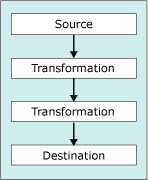

# Connect Components with Paths
You construct the data flow in a package on the design surface of the **Data Flow** tab in the [!INCLUDE[ssIS](../../Topics/TopicNameContainA/includes/ssIS_md.md)] Designer. If a data flow contains two data flow components, you can connect them by connecting the output of a source or transformation to the input of a transformation or destination. The connector between two data flow components is called a path.  
  
 The following diagram shows a simple data flow with a source component, two transformations, a destination component, and the paths that connect them.  
  
   
  
 After two components are connected, you can view the metadata of the data that moves through the path and the properties of the path in **Data Flow Path Editor**. For more information, see [Integration Services Paths](../../Topics/TopicNameNotContainA/Integration-Services-Paths.md).  
  
 You can also add data viewers to paths. A data viewer makes it possible to view data moving between data flow components when the package is run.  
  
### To connect components in a data flow  
  
-   [Connect Components in a Data Flow](../../Topics/TopicNameContainA/Connect-Components-in-a-Data-Flow.md)  
  
### To set path properties  
  
-   [Set the Properties of a Path by Using the Data Flow Path Editor](../../Topics/TopicNameContainA/Set-the-Properties-of-a-Path-by-Using-the-Data-Flow-Path-Editor.md)  
  
### To view path metadata  
  
-   [View Path Metadata in the Data Flow Path Editor](../../Topics/TopicNameNotContainA/View-Path-Metadata-in-the-Data-Flow-Path-Editor.md)  
  
### To view path metadata  
  
-   [Add a Data Viewer to a Data Flow](../../Topics/TopicNameContainA/Add-a-Data-Viewer-to-a-Data-Flow.md)  
  
## See Also  
 [Data Flow Task](../../Topics/TopicNameNotContainA/Data-Flow-Task.md)   
 [Data Flow](../../Topics/TopicNameNotContainA/Data-Flow.md)   
 [Transform Data with Transformations](../../Topics/TopicNameNotContainA/Transform-Data-with-Transformations.md)   
 [Error Handling in Data](../../Topics/TopicNameNotContainA/Error-Handling-in-Data.md)