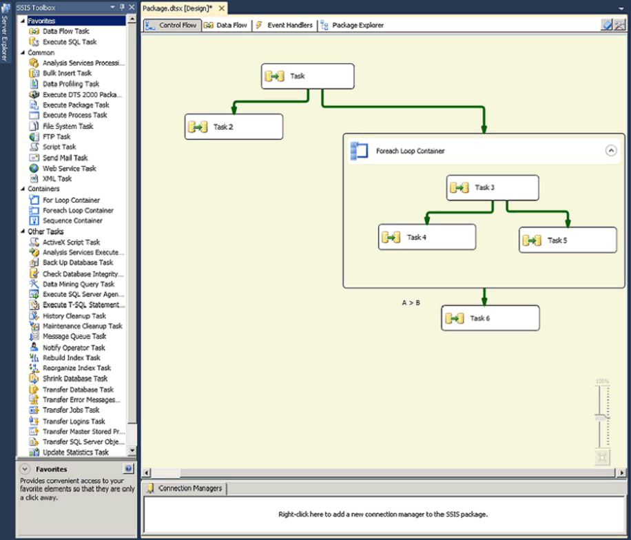

# Create Connection Managers
[!INCLUDE[ssISnoversion](../../Topics/TopicNameContainA/includes/ssISnoversion_md.md)] includes a variety of connection managers to suit the needs of tasks that connect to different types of servers and data sources. Connection managers are used by the data flow components that extract and load data in different types of data stores, and by the log providers that write logs to a server, [!INCLUDE[ssNoVersion](../../Topics/TopicNameContainA/includes/ssNoVersion_md.md)] table, or file. For example, a package with a Send Mail task uses an SMTP connection manager type to connect to a Simple Mail Transfer Protocol (SMTP) server. A package with an Execute SQL task can use an OLE DB connection manager to connect to a [!INCLUDE[ssNoVersion](../../Topics/TopicNameContainA/includes/ssNoVersion_md.md)] database. For more information, see [Integration Services (SSIS) Connections](../../Topics/TopicNameNotContainA/Integration-Services--SSIS--Connections.md).  
  
 To automatically create and configure connection managers when you create a new package, you can use the [!INCLUDE[ssNoVersion](../../Topics/TopicNameContainA/includes/ssNoVersion_md.md)] Import and Export Wizard. The wizard also helps you create and configure the sources and destinations that use the connection managers. For more information, see [Create Packages in SQL Server Data Tools](../../Topics/TopicNameNotContainA/Create-Packages-in-SQL-Server-Data-Tools.md).  
  
 To manually create a new connection manager and add it to an existing package, you use the **Connection Managers** area that appears on the **Control Flow**, **Data Flow**, and **Event Handlers** tabs of [!INCLUDE[ssIS](../../Topics/TopicNameContainA/includes/ssIS_md.md)] Designer. From the **Connection Manager** area, you choose the type of connection manager to create, and then set the properties of the connection manager by using a dialog box that [!INCLUDE[ssIS](../../Topics/TopicNameContainA/includes/ssIS_md.md)] Designer provides. For more information, see the section, "Using the Connection Managers Area," later in this topic.  
  
 After the connection manager is added to a package, you can use it in tasks, Foreach Loop containers, sources, transformations, and destinations. For more information, see [Integration Services Tasks](../../Topics/TopicNameNotContainA/Integration-Services-Tasks.md), [Foreach Loop Container](../../Topics/TopicNameNotContainA/Foreach-Loop-Container.md), and [Data Flow](../../Topics/TopicNameNotContainA/Data-Flow.md).  
  
## Using the Connection Managers Area  
 You can create connection managers while the **Control Flow**, **Data Flow**, or **Event Handlers** tab of [!INCLUDE[ssIS](../../Topics/TopicNameContainA/includes/ssIS_md.md)] Designer is active.  
  
 The following diagram shows the **Connection Managers** area on the **Control Flow** tab of [!INCLUDE[ssIS](../../Topics/TopicNameContainA/includes/ssIS_md.md)] Designer.  
  
   
  
#### To add, configure, or delete a connection manager in SSIS Designer  
  
-   [Add, Delete, or Share a Connection Manager in a Package](../../Topics/TopicNameContainA/Add--Delete--or-Share-a-Connection-Manager-in-a-Package.md)  
  
-   [Set the Properties of a Connection Manager](../../Topics/TopicNameContainA/Set-the-Properties-of-a-Connection-Manager.md)  
  
## 32-Bit and 64-Bit Providers for Connection Managers  
 Many of the providers that connection managers use are available in 32-bit and 64-bit versions. The [!INCLUDE[ssISnoversion](../../Topics/TopicNameContainA/includes/ssISnoversion_md.md)] design environment is a 32-bit environment and you see only 32-bit providers while you are designing a package. Therefore, you can only configure a connection manager to use a specific 64-bit provider if the 32-bit version of the same provider is also installed.  
  
 At run time, the correct version is used, and it does not matter that you specified the 32-bit version of the provider at design time. The 64-bit version of the provider can be run even if the package is run in [!INCLUDE[ssBIDevStudioFull](../../Topics/TopicNameContainA/includes/ssBIDevStudioFull_md.md)].  
  
 Both versions of the provider have the same ID. To specify whether the [!INCLUDE[ssISnoversion](../../Topics/TopicNameContainA/includes/ssISnoversion_md.md)] runtime uses an available 64-bit version of the provider, you set the **Run64BitRuntime** property of the [!INCLUDE[ssISnoversion](../../Topics/TopicNameContainA/includes/ssISnoversion_md.md)] project. If the **Run64BitRuntime** property is set to **true**, the runtime finds and uses the 64-bit provider; if **Run64BitRuntime** is **false**, the runtime finds and uses the 32-bit provider. For more information about properties you can set on [!INCLUDE[ssISnoversion](../../Topics/TopicNameContainA/includes/ssISnoversion_md.md)] projects, see [Integration Services (SSIS) and Studio Environments](../../Topics/TopicNameNotContainA/Integration-Services--SSIS--and-Studio-Environments.md).  
  
## See Also  
 [Control Flow](../../Topics/TopicNameNotContainA/Control-Flow.md)   
 [Data Flow](../../Topics/TopicNameNotContainA/Data-Flow.md)   
 [Integration Services (SSIS) Event Handlers](../../Topics/TopicNameNotContainA/Integration-Services--SSIS--Event-Handlers.md)