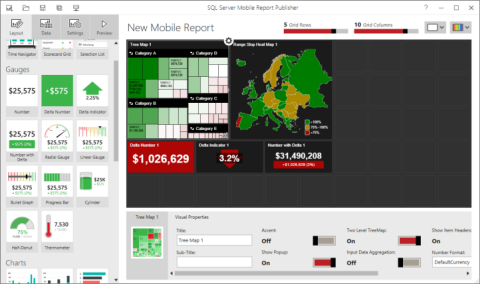

# Create mobile reports with SQL Server Mobile Report Publisher
Learn about [!INCLUDE[ssRSnoversion_md](../../Topics/TopicNameContainA/includes/ssRSnoversion_md.md)] mobile reports, optimized for mobile devices and connected to on-premises data, with an assortment of data visualizations. 
 
  

With [!INCLUDE[PRODUCT_NAME](../../Topics/TopicNameContainA/includes/SS_MobileReptPub_Long.md)], you can quickly create [!INCLUDE[ssRSnoversion_md](../../Topics/TopicNameContainA/includes/ssRSnoversion_md.md)] mobile reports, optimized for mobile devices and a variety of other form factors. Mobile reports feature an assortment of visualizations, from time, category, and comparison charts, to treemaps and custom maps. 

* Connect your mobile reports to a range of data sources, including on-premises SQL Server and Analysis Services data. 
* Lay out your mobile reports on a design surface with adjusting grid rows and columns, and flexible mobile report elements that scale well to any screen size. 
* Then save these mobile reports to a Reporting Service server, and view and interact with them in a browser or in the Power BI mobile app on iPads, iPhones, Android phones, and Windows 10 devices.
  
## Create [!INCLUDE[ssRSnoversion_md](../../Topics/TopicNameContainA/includes/ssRSnoversion_md.md)]  mobile reports  
  
These articles will help you get started.
-  Download [SQL Server Mobile Report Publisher](http://go.microsoft.com/fwlink/?LinkID=733527)  
-  [Create a Reporting Services mobile report](../../Topics/TopicNameContainA/Create-a-Reporting-Services-mobile-report.md)  
-  [End-to-end walkthrough: Create mobile reports and KPIs in SQL Server 2016 Reporting Services](http://christopherfinlan.com/2015/12/21/how-to-create-mobile-reports-and-kpis-in-sql-server-reporting-services-2016-an-end-to-end-walkthrough/) (Christopher Finlan's blog)  
- [Design first or data first](../../Topics/TopicNameNotContainA/Design-first-or-data-first-when-creating-in-Reporting-Services-mobile-reports.md)  
- [Data for Reporting Services mobile reports](../../Topics/TopicNameNotContainA/Data-for-Reporting-Services-mobile-reports.md)
- [How data refresh works in mobile reports and KPIs in Reporting Services](http://christopherfinlan.com/2016/02/10/so-refreshinghow-data-refresh-works-with-mobile-reports-and-kpis-in-reporting-services/) (Christopher Finlan's blog)  
- [Visualizations in mobile reports](../../Topics/TopicNameNotContainA/Add-visualizations-to-Reporting-Services-mobile-reports.md)
- [Gauges in mobile reports](Add%20gauges%20to%20mobile%20reports%20%7C%20Reporting%20Services.md)
- [Maps in mobile reports](../../Topics/TopicNameNotContainA/Maps-in-Reporting-Services-mobile-reports.md)
  
## SSRS mobile reports in the Power BI mobile apps

-  View [Reporting Services mobile reports and KPIs in the iPad app](https://powerbi.microsoft.com/documentation/powerbi-mobile-ipad-kpis-mobile-reports)  (Power BI for iOS)  
-  View [Reporting Services mobile reports and KPIs in the iPhone app](https://powerbi.microsoft.com/documentation/powerbi-mobile-iphone-kpis-mobile-reports) (Power BI for iOS)  
-  View [Reporting Services mobile reports and KPIs in the Power BI app for Android phones](https://powerbi.microsoft.com/documentation/powerbi-mobile-android-kpis-mobile-reports)
-  View [Reporting Services  mobile reports and KPIs in the Power BI app for Windows 10 devices](https://powerbi.microsoft.com/documentation/powerbi-mobile-android-kpis-mobile-reports)    

### See also  
  
-   [Create, Modify, and Delete Shared Data Sources (SSRS)](../../Topics/TopicNameNotContainA/Create--Modify--and-Delete-Shared-Data-Sources--SSRS-.md)  
-   [Manage Shared Datasets](../../Topics/TopicNameNotContainA/Manage-Shared-Datasets.md)  
-  [Working with KPIs in Reporting Services](../../Topics/TopicNameNotContainA/Working-with-KPIs-in-Reporting-Services.md)  
- [Enable a report server for Power BI mobile access](../../Topics/TopicNameContainA/Enable-a-report-server-for-Power-BI-Mobile-access.md)  

  
  
