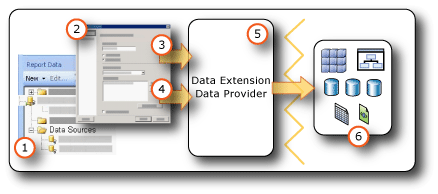

# Data Connections, Data Sources, and Connection Strings (Report Builder and SSRS)
  To include data in [!INCLUDE[ssRBnoversion](../../Topics/TopicNameContainA/includes/ssRBnoversion_md.md)] and  [!INCLUDE[ssRSnoversion](../../Topics/TopicNameContainA/includes/ssRSnoversion_md.md)] paginated reports, you must first create *data sources* and *datasets*. This topic explains the type of data sources, how to create data sources, and important information related to data source credentials. A data source includes the data source type, connection information, and the type of credentials to use. There are two types of data sources: embedded and shared. An embedded data source is defined in the report and used only by that report. A shared data source is defined independently from a report and can be used by multiple reports. For more information, see [Embedded and Shared Data Connections or Data Sources &#40;Report Builder and SSRS&#41;](../../Topics/TopicNameNotContainA/Embedded-and-Shared-Data-Connections-or-Data-Sources--Report-Builder-and-SSRS-.md) and [Embedded and Shared Datasets &#40;Report Builder and SSRS&#41;](../../Topics/TopicNameNotContainA/Embedded-and-Shared-Datasets--Report-Builder-and-SSRS-.md).  
  
||  
|-|  
|**[!INCLUDE[applies](../../Topics/TopicNameContainA/includes/applies_md.md)]**  [!INCLUDE[ssRBnoversion](../../Topics/TopicNameContainA/includes/ssRBnoversion_md.md)] &#124; [!INCLUDE[ssRSnoversion](../../Topics/TopicNameContainA/includes/ssRSnoversion_md.md)] Native mode &#124; [!INCLUDE[ssRSnoversion](../../Topics/TopicNameContainA/includes/ssRSnoversion_md.md)] SharePoint mode|  
  
> [!NOTE]  
>  [!INCLUDE[ssRBRDDup](../../Topics/TopicNameContainA/includes/ssRBRDDup_md.md)]  
  
 **In this topic:**  
  
-   [Embedded and shared data sources](#bkmk_data_sources)  
  
-   [Built-in data extensions](#bkmk_DataConnections)  
  
-   [Common connection string examples](#bkmk_connection_examples)  
  
-   [Special characters in a password](#bkmk_special_password_characters)  
  
-   [Expression-based Connection Strings](#bkmk_Expressions_in_connection_strings)  
  
##  <a name="bkmk_data_sources"></a> Embedded and shared data sources  
 Shared data sources are useful when you have data sources that you use often. It is recommended that you use shared data sources as much as possible. They make reports and report access easier to manage, and help to keep reports and the data sources they access more secure. If you need a shared data source, ask your system administrator to create one for you.  
  
 An embedded data source is a data connection that is saved in the report definition. Embedded data source connection information can be used only by the report in which it is embedded. To define and manage embedded data sources, use the **Data Source Properties** dialog box.  
  
 The difference between the embedded and shared data sources is in how they are created, stored, and managed.  
  
-   In Report Designer, create embedded or shared data sources as part of a [!INCLUDE[ssBIDevStudioFull](../../Topics/TopicNameContainA/includes/ssBIDevStudioFull_md.md)] project. You can control whether to use them locally for preview or to deploy them as part of the project to a report server or SharePoint site. You can use custom data extensions that have been installed on your computer and on the report server or SharePoint site where you deploy your reports.  
  
     System administrators can install and configure additional data processing extensions and .NET Framework data providers. For more information, see [Data Processing Extensions and .NET Framework Data Providers &#40;SSRS&#41;](../../Topics/TopicNameNotContainA/Data-Processing-Extensions-and-.NET-Framework-Data-Providers--SSRS-.md).  
  
     Developers can use the [Microsoft.ReportingServices.DataProcessing](assetId:///N:Microsoft.ReportingServices.DataProcessing) API to create data processing extensions to support additional types of data sources.  
  
-   In [!INCLUDE[ssRBnoversion](../../Topics/TopicNameContainA/includes/ssRBnoversion_md.md)], browse to a report server or SharePoint site and select shared data sources or create embedded data sources in the report. You cannot create a shared data source in [!INCLUDE[ssRBnoversion](../../Topics/TopicNameContainA/includes/ssRBnoversion_md.md)]. You cannot use custom data extensions in [!INCLUDE[ssRBnoversion](../../Topics/TopicNameContainA/includes/ssRBnoversion_md.md)].  
  
 The following table summarizes the differences between embedded and shared data sources.  
  
|Description|Embedded<br /><br /> Data Source|Shared<br /><br /> Data Source|  
|-----------------|------------------------------|----------------------------|  
|Data connection is embedded in the report definition.|||  
|Pointer to the data connection on the report server is embedded in the report definition.|||  
|Managed on the report server|||  
|Required for shared datasets|||  
|Required for components|||  
  
##  <a name="bkmk_DataConnections"></a> Built-in data extensions  
 Default data extensions in [!INCLUDE[ssRSnoversion](../../Topics/TopicNameContainA/includes/ssRSnoversion_md.md)] include the following types of data connections:  
  
-   Microsoft SQL Server  
  
-   Microsoft SQL Server Analysis Services  
  
-   Microsoft SharePoint List  
  
-   [!INCLUDE[ssSDSFull](../../Topics/TopicNameContainA/includes/ssSDSfull_md.md)]  
  
-   Microsoft SQL Server Parallel Data Warehouse  
  
-   OLE DB  
  
-   Oracle  
  
-   SAP NetWeaver BI  
  
-   Hyperion Essbase  
  
-   Teradata  
  
-   XML  
  
-   ODBC  
  
-   Microsoft BI Semantic Model for Power View: On a SharePoint site that has been configured for a [!INCLUDE[ssGemini](../../Topics/TopicNameContainA/includes/ssGemini_md.md)] gallery and [!INCLUDE[ssCrescent](../../Topics/TopicNameContainA/includes/ssCrescent_md.md)], this data source type is available. This data source type is used only for [!INCLUDE[ssCrescent](../../Topics/TopicNameContainA/includes/ssCrescent_md.md)] presentations. For more information, see [Building the Perfect BI Semantic Tabular Models for Power View](http://technet.microsoft.com/video/building-the-perfect-bi-semantic-tabular-models-for-power-view.aspx).  
  
 For a full list of data sources and versions [!INCLUDE[ssRSnoversion](../../Topics/TopicNameContainA/includes/ssRSnoversion_md.md)] supports, see [Data Sources Supported by Reporting Services &#40;SSRS&#41;](../../Topics/TopicNameNotContainA/Data-Sources-Supported-by-Reporting-Services--SSRS-.md).  
  
## Data in [!INCLUDE[ssRBnoversion](../../Topics/TopicNameContainA/includes/ssRBnoversion_md.md)]  
   
  
1.  **Data sources in the Report Data pane** A data source appears in the Report Data pane after you create an embedded data source or add a shared data source.  
  
2.  **Connection Dialog Box** Use the Connection Dialog Box to build a connection string or to paste a connection string.  
  
3.  **Data connection information** The connection string is passed to the data extension.  
  
4.  **Credentials** Credentials are managed separately from the connection string.  
  
5.  **Data Extension/Data Provider** Connecting to the data can be through multiple data access layers.  
  
6.  **External data sources** Retrieve data from relational databases, multidimensional data bases, SharePoint lists, Web services, or report models.  
  
##  <a name="bkmk_connection_examples"></a> Common connection string examples  
 Connection strings are the text representation of connection properties for a data provider. The following table lists examples of connections strings for various data connection types.  
  
|**Data source**|**Example**|**Description**|  
|---------------------|-----------------|---------------------|  
|SQL Server database on the local server|`data source="(local)";initial catalog=AdventureWorks`|Set data source type to **Microsoft SQL Server**. For more information, see [SQL Server Connection Type &#40;SSRS&#41;](../../Topics/TopicNameNotContainA/SQL-Server-Connection-Type--SSRS-.md).|  
|SQL Server database on the local server|`data source="(local)";initial catalog=AdventureWorks`|Set data source type to **Microsoft SQL Server**.|  
|SQL Server Instance<br /><br /> database|`Data Source=localhost\MSSQL13.<InstanceName>; Initial Catalog=AdventureWorks`|Set data source type to **Microsoft SQL Server**.|  
|SQL Server Express database|`Data Source=localhost\MSSQL13.SQLEXPRESS; Initial Catalog=AdventureWorks`|Set data source type to **Microsoft SQL Server**.|  
|[!INCLUDE[ssSDS](../../Topics/TopicNameContainA/includes/ssSDS_md.md)] in the cloud|`Data Source=<host>;Initial Catalog=AdventureWorks; Encrypt=True`|Set data source type to **Windows Azure SQL Database**. For more information, see [SQL Azure Connection Type &#40;SSRS&#41;](../../Topics/TopicNameNotContainA/SQL-Azure-Connection-Type--SSRS-.md).|  
|SQL Server Parallel Data Warehouse|`HOST=<IP address>;database= AdventureWorks; port=<port>`|Set data source type to **Microsoft SQL Server Parallel Data Warehouse**. For more information, see [SQL Server Parallel Data Warehouse Connection Type &#40;SSRS&#41;](../../Topics/TopicNameNotContainA/SQL-Server-Parallel-Data-Warehouse-Connection-Type--SSRS-.md).|  
|Analysis Services database on the local server|`data source=localhost;initial catalog=Adventure Works DW`|Set data source type to **Microsoft SQL Server Analysis Services**. For more information, see [Analysis Services Connection Type for MDX &#40;SSRS&#41;](../../Topics/TopicNameNotContainA/Analysis-Services-Connection-Type-for-MDX--SSRS-.md) or [Analysis Services Connection Type for DMX &#40;SSRS&#41;](../../Topics/TopicNameNotContainA/Analysis-Services-Connection-Type-for-DMX--SSRS-.md).|  
|Analysis Services tabular model database with Sales perspective|`Data source=<servername>;initial catalog= Adventure Works DW;cube='Sales’`|Set data source type to **Microsoft SQL Server Analysis Services**. Specify perspective name in cube= setting. For more information, see [Perspectives &#40;SSAS Tabular&#41;](../../Topics/TopicNameNotContainA/Perspectives--SSAS-Tabular-.md).|  
|Report model data source on a report server configured in native mode|`Server=http://myreportservername/reportserver; datasource=/models/Adventure Works`|Specify the report server or document library URL and the path to the published model in the report server folder or document library folder namespace. For more information, see [Report Model Connection &#40;SSRS&#41;](../../Topics/TopicNameNotContainA/Report-Model-Connection--SSRS-.md).|  
|Report model data source on a report server configured in SharePoint integrated mode|`Server=http://server; datasource=http://server/site/documents/models/Adventure Works.smdl`|Specify the report server or document library URL and the path to the published model in the report server folder or document library folder namespace.|  
|[!INCLUDE[ssNoVersion](../../Topics/TopicNameContainA/includes/ssNoVersion_md.md)] 2000 [!INCLUDE[ssASnoversion](../../Topics/TopicNameContainA/includes/ssASnoversion_md.md)] server|`provider=MSOLAP.2;data source=<remote server name>;initial catalog=FoodMart 2000`|Set the data source type to **OLE DB Provider for OLAP Services 8.0**.<br /><br /> You can achieve a faster connection to [!INCLUDE[ssNoVersion](../../Topics/TopicNameContainA/includes/ssNoVersion_md.md)] 2000 [!INCLUDE[ssASnoversion](../../Topics/TopicNameContainA/includes/ssASnoversion_md.md)] data sources if you set the **ConnectTo** property to **8.0**. To set this property, use the **Connection Properties** dialog box, **Advanced Properties** tab.|  
|Oracle server|`data source=myserver`|Set the data source type to **Oracle**. The Oracle client tools must be installed on the Report Designer computer and on the report server. For more information, see [Oracle Connection Type &#40;SSRS&#41;](../../Topics/TopicNameNotContainA/Oracle-Connection-Type--SSRS-.md).|  
|SAP NetWeaver BI data source|`DataSource=http://mySAPNetWeaverBIServer:8000/sap/bw/xml/soap/xmla`|Set the data source type to **SAP NetWeaver BI**. For more information, see [SAP NetWeaver BI Connection Type &#40;SSRS&#41;](../../Topics/TopicNameNotContainA/SAP-NetWeaver-BI-Connection-Type--SSRS-.md).|  
|Hyperion Essbase data source|`Data Source=http://localhost:13080/aps/XMLA; Initial Catalog=Sample`|Set the data source type to **Hyperion Essbase**. For more information, see [Hyperion Essbase Connection Type &#40;SSRS&#41;](../../Topics/TopicNameNotContainA/Hyperion-Essbase-Connection-Type--SSRS-.md).|  
|Teradata data source|`data source=`<NNN\>.<NNN\>.<NNN\>.<NNN\>`;`|Set the data source type to **Teradata**. The connection string is an Internet Protocol (IP) address in the form of four fields, where each field can be from one to three digits. For more information, see [Teradata Connection Type &#40;SSRS&#41;](../../Topics/TopicNameNotContainA/Teradata-Connection-Type--SSRS-.md).|  
|Teradata data source|`Database=` *<database name\>* `; data source=` *<NN*N*>.<NNN\>.<NNN\>.<N*NN*>*`;Use X Views=False;Restrict to Default Database=True`|Set the data source type to **Teradata**, similar to the previous example. Only use the default database that is specified in the Database tag, and do not automatically discover data relationships.|  
|XML data source, Web service|`data source=http://adventure-works.com/results.aspx`|Set the data source type to **XML**. The connection string is a URL for a web service that supports Web Services Definition Language (WSDL). For more information, see [XML Connection Type &#40;SSRS&#41;](../../Topics/TopicNameNotContainA/XML-Connection-Type--SSRS-.md).|  
|XML data source, XML document|`http://localhost/XML/Customers.xml`|Set the data source type to **XML**. The connection string is a URL to the XML document.|  
|XML data source, embedded XML document|*Empty*|Set the data source type to **XML**. The XML data is embedded in the report definition.|  
|SharePoint List|`data source=http://MySharePointWeb/MySharePointSite/`|Set data source type to **SharePoint List**.|  
  
 If you fail to connect to a report server using **localhost**, check that the network protocol for TCP/IP protocol is enabled. For more information, see [Configure Client Protocols](../../Topics/TopicNameNotContainA/Configure-Client-Protocols.md).  
  
 For more information about the configurations needed to connect to these data source types, see the specific data connection topic under [Add Data from External Data Sources &#40;SSRS&#41;](../../Topics/TopicNameNotContainA/Add-Data-from-External-Data-Sources--SSRS-.md) or [Data Sources Supported by Reporting Services &#40;SSRS&#41;](../../Topics/TopicNameNotContainA/Data-Sources-Supported-by-Reporting-Services--SSRS-.md).  
  
##  <a name="bkmk_special_password_characters"></a> Special characters in a password  
 If you configure your ODBC or SQL data source to prompt for a password or to include the password in the connection string, and a user enters the password with special characters like punctuation marks, some underlying data source drivers cannot validate the special characters. When you process the report, the message "Not a valid password" may indicate this problem. If changing the password is impractical, you can work with your database administrator to store the appropriate credentials on the server as part of a system ODBC data source name (DSN). For more information, see "OdbcConnection.ConnectionString" in the [!INCLUDE[dnprdnshort](../../Topics/TopicNameContainA/includes/dnprdnshort_md.md)] SDK documentation.  
  
##  <a name="bkmk_Expressions_in_connection_strings"></a> Expression-based Connection Strings  
 Expression-based connection strings are evaluated at run time. For example, you can specify the data source as a parameter, include the parameter reference in the connection string, and allow the user to choose a data source for the report. For example, suppose a multinational firm has data servers in several countries. With an expression-based connection string, a user who is running a sales report can select a data source for a particular country before running the report.  
  
 The following example illustrates the use of a data source expression in a [!INCLUDE[ssNoVersion](../../Topics/TopicNameContainA/includes/ssNoVersion_md.md)] connection string. The example assumes you have created a report parameter named `ServerName`:  
  
```  
="data source=" & Parameters!ServerName.Value & ";initial catalog=AdventureWorks"  
```  
  
 Data source expressions are processed at run time or when a report is previewed. The expression must be written in [!INCLUDE[vbprvb](../../Topics/TopicNameContainA/includes/vbprvb_md.md)]. Use the following guidelines when defining a data source expression:  
  
-   Design the report using a static connection string. A static connection string refers to a connection string that is not set through an expression (for example, when you follow the steps for creating a report-specific or shared data source, you are defining a static connection string). Using a static connection string allows you to connect to the data source in Report Designer so that you can get the query results you need to create the report.  
  
-   When defining the data source connection, do not use a shared data source. You cannot use a data source expression in a shared data source. You must define an embedded data source for the report.  
  
-   Specify credentials separately from the connection string. You can use stored credentials, prompted credentials, or integrated security.  
  
-   Add a report parameter to specify a data source. For parameter values, you can either provide a static list of available values (in this case, the available values should be data sources you can use with the report) or define a query that retrieves a list of data sources at run time.  
  
-   Be sure that the list of data sources shares the same database schema. All report design begins with schema information. If there is a mismatch between the schema used to define the report and the actual schema used by the report at run time, the report might not run.  
  
-   Before publishing the report, replace the static connection string with an expression. Wait until you are finished designing the report before you replace the static connection string with an expression. Once you use an expression, you cannot execute the query in Report Designer. Furthermore, the field list in the Report Data pane and the Parameters list will not update automatically.  
  
## See Also  
 [Create, Modify, and Delete Shared Data Sources &#40;SSRS&#41;](../../Topics/TopicNameNotContainA/Create--Modify--and-Delete-Shared-Data-Sources--SSRS-.md)   
 [Create and Modify Embedded Data Sources](../../Topics/TopicNameNotContainA/Create-and-Modify-Embedded-Data-Sources.md)   
 [Set Deployment Properties &#40;Reporting Services&#41;](../../Topics/TopicNameNotContainA/Set-Deployment-Properties--Reporting-Services-.md)   
 [Specify Credential and Connection Information for Report Data Sources](../../Topics/TopicNameNotContainA/Specify-Credential-and-Connection-Information-for-Report-Data-Sources.md)  
  
  