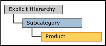
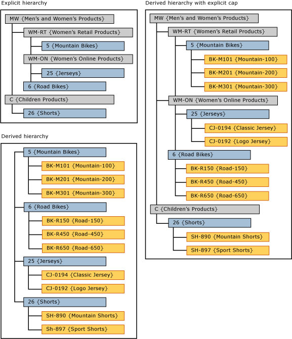

# Derived Hierarchies with Explicit Caps (Master Data Services)
In [!INCLUDE[ssMDSshort](../../Topics/TopicNameContainA/includes/ssMDSshort_md.md)], when the levels from an explicit hierarchy are used as the top levels of a derived hierarchy, this is called a derived hierarchy with an explicit cap.  
  
 The explicit hierarchy must be based on the same entity as the entity at the top of the derived hierarchy.  
  
 In the [!INCLUDE[ssMDSmdm](../../Topics/TopicNameContainA/includes/ssMDSmdm_md.md)] user interface (UI), you create this type of hierarchy by dragging an explicit hierarchy to the top of a derived hierarchy.  
  
   
  
## Derived Hierarchy with Explicit Cap Example  
 In this example, the members in the explicit hierarchy are from the Subcategory entity. In the derived hierarchy, the top-level members are also from the Subcategory entity.  
  
   
  
 By using the explicit hierarchy at the top of a derived hierarchy, the derived hierarchy becomes ragged.  
  
## Rules  
  
-   You cannot have more than one explicit hierarchy in a derived hierarchy with explicit cap.  
  
-   You can use the same explicit hierarchy as a cap for multiple derived hierarchies.  
  
-   You cannot assign hierarchy member permissions to derived hierarchies with explicit caps. If you assign permissions to either the explicit hierarchy or the derived hierarchy individually, the permissions affect both hierarchies.  
  
## Related Tasks  
  
|Task Description|Topic|  
|----------------------|-----------|  
|Create a derived hierarchy.|[Create a Derived Hierarchy (Master Data Services)](../../Topics/TopicNameContainA/Create-a-Derived-Hierarchy--Master-Data-Services-.md)|  
|Create an explicit hierarchy.|[Create an Explicit Hierarchy (Master Data Services)](../../Topics/TopicNameNotContainA/Create-an-Explicit-Hierarchy--Master-Data-Services-.md)|  
|Delete an existing derived hierarchy.|[Delete a Derived Hierarchy (Master Data Services)](../../Topics/TopicNameContainA/Delete-a-Derived-Hierarchy--Master-Data-Services-.md)|  
|||  
  
## Related Content  
  
-   [Derived Hierarchies (Master Data Services)](../../Topics/TopicNameNotContainA/Derived-Hierarchies--Master-Data-Services-.md)  
  
-   [Explicit Hierarchies (Master Data Services)](../../Topics/TopicNameNotContainA/Explicit-Hierarchies--Master-Data-Services-.md)