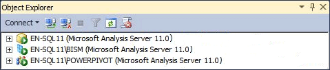

# Determine the Server Mode of an Analysis Services Instance
Analysis Services can be installed in one of three server modes: Multidimensional and Data Mining (default), [!INCLUDE[ssGemini](../../Topics/TopicNameContainA/includes/ssGemini_md.md)] for SharePoint, and Tabular. The server mode of an Analysis Services instance is determined during setup when you choose options for installing the server.  
  
 The server mode determines the type of solution that you create and deploy. If you did not install the server software and you want to know in which mode the server was installed, you can use the information in this topic to determine the mode. For more information about feature availability in a specific mode, see [Comparing Tabular and Multidimensional Solutions (SSAS)](../../Topics/TopicNameNotContainA/Comparing-Tabular-and-Multidimensional-Solutions--SSAS-.md).  
  
 If you do not want to use the server mode that you installed, you must uninstall and then reinstall the software, choosing the mode that you prefer. Alternatively, you can install an additional instance of Analysis Services on the same computer so that you have multiple instances running different modes.  
  
## Server Icons in Object Explorer  
 The easiest way to determine server mode is to connect to the server in SQL Server Management Studio and note the icon next to the server name in Object Explorer. The following illustration shows three instances of Analysis Services deployed in Multidimensional, Tabular, and [!INCLUDE[ssGemini](../../Topics/TopicNameContainA/includes/ssGemini_md.md)] modes:  
  
   
  
## Viewing DeploymentMode Property in MSMDSRV.INI File  
 Alternatively, you can check the **DeploymentMode** property in the msmdsrv.ini file that is included in every Analysis Services instance. The value of this property identifies the server mode. Valid values are 0 (Multidimensional), 1 (SharePoint), or 2 (Tabular). You must be an [!INCLUDE[ssASnoversion](../../Topics/TopicNameContainA/includes/ssASnoversion_md.md)] administrator (that is, a member of the Server role) to open the msmdsrv.ini file. This file contains structured XML. You can use Notepad or another text editor to view the file.  
  
> [!CAUTION]  
>  Do not change the value of the **DeploymentMode** property. Changing the property manually after the server is installed is not supported.  
  
## About the DeploymentMode Property  
 **DeploymentMode** property determines the operational context of an Analysis Services server instance. This property is referred to as ‘server mode’ in dialog boxes, messages, and documentation. This property is initialized by Setup based on how you install Analysis Services. This property should be considered internal only, always using the value specified by Setup.  
  
 Valid values for this property include the following:  
  
|Value|Description|  
|-----------|-----------------|  
|0|This is the default value. It specifies multidimensional mode, used to service multidimensional databases that use MOLAP, HOLAP, and ROLAP storage, as well as data mining models.|  
|1|Specifies Analysis Services instances that were installed as part of a [!INCLUDE[ssGemini](../../Topics/TopicNameContainA/includes/ssGemini_md.md)] for SharePoint deployment. Do not change the deployment mode property of Analysis Services instance that is part of a [!INCLUDE[ssGemini](../../Topics/TopicNameContainA/includes/ssGemini_md.md)] for SharePoint installation. [!INCLUDE[ssGemini](../../Topics/TopicNameContainA/includes/ssGemini_md.md)] data will no longer run on the server if you change the mode.|  
|2|Specifies Tabular mode used for hosting tabular model databases that use in-memory storage or DirectQuery storage.|  
  
 Each mode is exclusive of the other. A server that is configured for tabular mode cannot run Analysis Services databases that contain cubes and dimensions. If the underlying computer hardware can support it, you can install multiple instances of Analysis Services on the same computer and configure each instance to use a different deployment mode. Remember that Analysis Services is a resource intensive application. Deploying multiple instances on the same system is recommended only for high-end servers.  
  
## See Also  
 [Install Analysis Services](../../Topics/TopicNameNotContainA/Install-Analysis-Services.md)   
 [Install Analysis Services in Multidimensional and Data Mining Mode](../../Topics/TopicNameNotContainA/Install-Analysis-Services-in-Multidimensional-and-Data-Mining-Mode.md)   
 [Power Pivot for SharePoint 2010 Installation](assetId:///8d47dde7-c941-4280-a934-e2fe3f9a938f)   
 [Connect to Analysis Services](../../Topics/TopicNameNotContainA/Connect-to-Analysis-Services.md)   
 [Tabular Model Solutions (SSAS Tabular)](../../Topics/TopicNameNotContainA/Tabular-Model-Solutions--SSAS-Tabular-.md)   
 [Multidimensional Model Solutions (SSAS)](../../Topics/TopicNameNotContainA/Multidimensional-Model-Solutions--SSAS-.md)   
 [Mining Models (Analysis Services - Data Mining)](../../Topics/TopicNameNotContainA/Mining-Models--Analysis-Services---Data-Mining-.md)