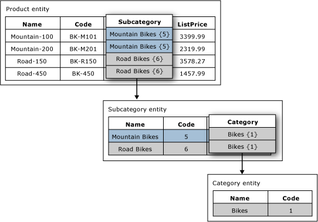

# Domain-Based Attributes (Master Data Services)
In [!INCLUDE[ssMDSshort](../../Topics/TopicNameContainA/includes/ssMDSshort_md.md)], a domain-based attribute is an attribute with values that are populated by members from another entity. You can think of a domain-based attribute as a constrained list; domain-based attributes prevent users from entering attribute values that are not valid. To select an attribute value, the user must pick from a list.  
  
## Domain-Based Attribute Example  
 In the following image, the Product entity has a domain-based attribute called Subcategory. The Subcategory attribute is populated by values from the Subcategory entity.  
  
 The Subcategory entity has a domain-based attribute called Category. The Category attribute is populated by values from the Category entity.  
  
   
  
## Use Same Entity for Multiple Domain-Based Attributes  
 You can use the same entity as a domain-based attribute of multiple entities. For example, you can create an entity called YesNoIndicator with the members: Yes, No, and Maybe. You can create a domain-based attribute named InStock and use the YesNoIndicator entity as the source. You can also create another domain-based attribute named Approved and use the YesNoIndicator entity as a source. Any time you want users to choose from a list of the YesNoIndicator entity's members, you can use the entity as a domain-based attribute.  
  
## Domain-Based Attributes Form Derived Hierarchies  
 Domain-based attribute relationships are the basis for derived hierarchies. For more information, see [Derived Hierarchies (Master Data Services)](../../Topics/TopicNameNotContainA/Derived-Hierarchies--Master-Data-Services-.md).  
  
## Related Tasks  
  
|Task Description|Topic|  
|----------------------|-----------|  
|Create a new domain-based attribute that is sourced from an existing entity.|[Create a Domain-Based Attribute (Master Data Services)](../../Topics/TopicNameContainA/Create-a-Domain-Based-Attribute--Master-Data-Services-.md)|  
|Create a new entity.|[Create an Entity (Master Data Services)](../../Topics/TopicNameNotContainA/Create-an-Entity--Master-Data-Services-.md)|  
  
## Related Content  
  
-   [Derived Hierarchies (Master Data Services)](../../Topics/TopicNameNotContainA/Derived-Hierarchies--Master-Data-Services-.md)  
  
-   [Attributes (Master Data Services)](../../Topics/TopicNameNotContainA/Attributes--Master-Data-Services-.md)  
  
-   [Entities (Master Data Services)](../../Topics/TopicNameNotContainA/Entities--Master-Data-Services-.md)