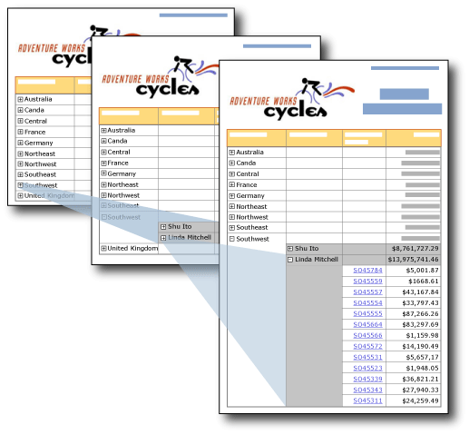

# Drilldown Action (Report Builder and SSRS)
B providing plus and minus icons on a text box, you can enable users to hide and display items interactively. This is called a *drilldown* action. For a table or matrix, you can show or hide static rows and columns, or rows and columns that are associated with groups.  
  
   
  
 In this illustration, the user clicks the plus signs (+) in the report to show detail data.  
  
 For example, you can initially hide all the rows except the outer group summary row for a table with row groups. For each inner group (including the details group), add an expand/collapse icon to the grouping cell of the containing group. When the report is rendered, the user can click the text box to expand and collapse the detail data. For more information, see [Tables (Report Builder  and SSRS)](../../Topics/TopicNameNotContainA/Tables--Report-Builder--and-SSRS-.md).  
  
 To allow users to expand or collapse an item, you set the visibility properties for that item.  
  
> [!NOTE]  
>  When you create a report with a drilldown action, the visibility information must be set on the group, column, or row that you want to hide, not just a single text box in the row or column. In addition, the text box that you use for the toggle must be in a containing scope that controls the item that you want to show or hide.  
>   
>  For example, to hide a row associated with a nested group, the text box must be in a row associated with the parent group or higher in the containment hierarchy.  
>   
>  For information on setting visibility information on the group, column or row, see [Add an Expand or Collapse Action to an Item (Report Builder and SSRS)](../../Topics/TopicNameNotContainA/Add-an-Expand-or-Collapse-Action-to-an-Item--Report-Builder-and-SSRS-.md)  
  
 For more information about hiding report items, see [Hide an Item (Report Builder and SSRS)](../../Topics/TopicNameNotContainA/Hide-an-Item--Report-Builder-and-SSRS-.md).  
  
> [!NOTE]  
>  [!INCLUDE[ssRBRDDup](../../Topics/TopicNameContainA/includes/ssRBRDDup_md.md)]  
  
## Comparing Drilldown and Drillthrough Reports  
 In a drilldown report, a user clicks a plus or minus button to expand or collapse a section of a report to show detail data in place. In a drillthrough report, the user clicks a link for a summary value, and this opens a separate, related report to show detail data. The detail data is only retrieved when the detail report runs. Drillthrough reports typically require fewer resources than drilldown reports. For more information, see [Drillthrough, Drilldown, Subreports, and Nested Data Regions (Report Builder and SSRS)](../../Topics/TopicNameNotContainA/Drillthrough--Drilldown--Subreports--and-Nested-Data-Regions--Report-Builder-and-SSRS-.md).  
  
## Rendering Extension Support for Hidden Report Items  
 The show-and-hide toggle on report items is supported only by rendering extensions that support user interactivity, such as the HTML rendering extension that is used when you run a report in Report Builder and in Report Manager, for example. Other rendering extensions display hidden items. The following list describes support for report items with conditional visibility:  
  
-   In HTML, if items are hidden, they are not visible in the HTML source.  
  
-   The XML rendering extension displays all report items, regardless of whether they are hidden.  
  
-   The Excel rendering extension displays and expands hidden rows and columns for a table, matrix, or list. All rows and columns are visible.  
  
 For more information, see [Rendering Behaviors (Report Builder  and SSRS)](../../Topics/TopicNameNotContainA/Rendering-Behaviors--Report-Builder--and-SSRS-.md).  
  
## See Also  
 [Drillthrough, Drilldown, Subreports, and Nested Data Regions (Report Builder and SSRS)](../../Topics/TopicNameNotContainA/Drillthrough--Drilldown--Subreports--and-Nested-Data-Regions--Report-Builder-and-SSRS-.md)   
 [Interactive Sort, Document Maps, and Links (Report Builder and SSRS)](../../Topics/TopicNameNotContainA/Interactive-Sort--Document-Maps--and-Links--Report-Builder-and-SSRS-.md)   
 [Expression Examples (Report Builder and SSRS)](../../Topics/TopicNameNotContainA/Expression-Examples--Report-Builder-and-SSRS-.md)