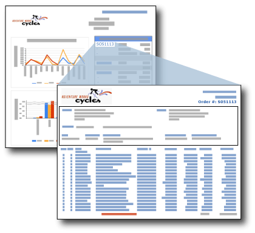

# Drillthrough Reports (Report Builder and SSRS)
A drillthrough report is a report that a user opens by clicking a link within another report. Drillthrough reports commonly contain details about an item that is contained in an original summary report. For example, in this illustration, the sales summary report lists sales orders and totals. When a user clicks an order number in the summary list, another report opens that contains details about the order.  
  
   
  
 The data in the drillthrough report is not retrieved until the user clicks the link in the main report that opens the drillthrough report. If the data for the main report and the drillthrough report must be retrieved at the same time, consider using a subreport. For more information, see [Subreports (Report Builder and SSRS)](../../Topics/TopicNameNotContainA/Subreports--Report-Builder-and-SSRS-.md).  
  
> [!NOTE]  
>  When you are working in Report Builder, you must be connected to a report server to view the drillthrough report that opens when you click the drillthrough link in the main report.  
  
 To get started quickly with drillthrough reports, see [Tutorial: Creating Drillthrough and Main Reports (Report Builder)](assetId:///7168c8d3-cef5-4c4a-a0bf-fff1ac5b8b71). Drillthrough report is also featured in two business intelligence solutions, [BI Reporting: Reports and Subscriptions Scenario](http://technet.microsoft.com/bi/ff769487.aspx) and [Corporate Dashboards: Sales Solution](http://technet.microsoft.com/bi/ff643005.aspx)  
  
> [!NOTE]  
>  [!INCLUDE[ssRBRDDup](../../Topics/TopicNameContainA/includes/ssRBRDDup_md.md)]  
  
## Parameters in Drillthrough Reports  
 A drillthrough report typically contains parameters that are passed to it by the summary report. In the sales summary report example, the summary report includes the field [OrderNumber] in a text box in a table cell. The drillthrough report contains a parameter that takes the order number as a value. When you set the drillthrough report link on the text box for [OrderNumber], you also set the parameter for the target report to [OrderNumber]. When the user clicks the order number in the summary report, the target detail report opens and displays the information for that order number. To view instructions about customizing drillthrough reports based on parameter values, see [Report Parameters (Report Builder and Report Designer)](../../Topics/TopicNameNotContainA/Report-Parameters--Report-Builder-and-Report-Designer-.md) and the [InScope Function (Report Builder and SSRS)](../../Topics/TopicNameNotContainA/InScope-Function--Report-Builder-and-SSRS-.md).  
  
## Designing the Drillthrough Report  
 To create a drillthrough report, you must design the drillthrough report first, before you create the drillthrough action in the main report.  
  
 A drillthrough report can be any report. Typically, the drillthrough report accepts one or more parameters to specify the data to show, based on the link from the main report. For example, if the link from the main report was defined for a sales order, then the sales order number is passed to the drillthrough report.  
  
## Creating a Drillthrough Action in the Main Report  
 You can add drillthrough links to text boxes (including text in the cells of a table or matrix), images, charts, gauges, and any other report item that has an Action property page. For more information, see [Add a Drillthrough Action on a Report (Report Builder and SSRS)](../../Topics/TopicNameContainA/Add-a-Drillthrough-Action-on-a-Report--Report-Builder-and-SSRS-.md).  
  
 You can create the drillthrough action in the main report as a report action or a URL action. For a report action, the drillthrough report must exist on the same report server as the main report. For a URL action, the report must exist at the fully qualified URL location. The way that you specify a report might differ for a report server or a SharePoint site that is integrated with a report server If the report server is configured in SharePoint integrated mode, only URL actions are supported.  
  
 For more information, see [Add a Drillthrough Action on a Report (Report Builder and SSRS)](../../Topics/TopicNameContainA/Add-a-Drillthrough-Action-on-a-Report--Report-Builder-and-SSRS-.md) and [Specifying Paths to External Items (Report Builder and SSRS)](../../Topics/TopicNameNotContainA/Specifying-Paths-to-External-Items--Report-Builder-and-SSRS-.md).  
  
## Viewing a Drillthrough Report  
 To view a summary report with drillthrough links after it is published, you must ensure that the drillthrough reports reside on the same report server as the summary report. In all cases, the user must have permissions on the drillthrough report to view it.  
  
## See Also  
 [Drillthrough, Drilldown, Subreports, and Nested Data Regions (Report Builder and SSRS)](../../Topics/TopicNameNotContainA/Drillthrough--Drilldown--Subreports--and-Nested-Data-Regions--Report-Builder-and-SSRS-.md)