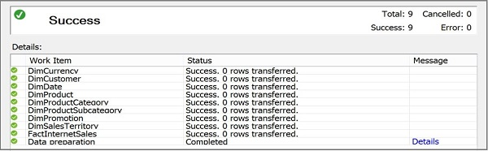
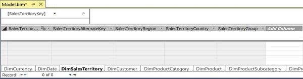

# External data access and security for processing and queries in DirectQuery models (SSAS - Tabular)
DirectQuery mode uses data that is stored in a relational database.  Any DAX or MDX queries on the data are translated by [!INCLUDE[ssASnoversion](../../Topics/TopicNameContainA/includes/ssASnoversion_md.md)] into equivalent SQL statements issued against the RDBMS.  
  
 The model can use a single relational data source (SQL Server, Oracle, or Teradata). Data from other sources, including copy-pasted data, is not allowed in DirectQuery models.  If the data you need for modeling is not available from one source, consider use of Integration Services or other data warehousing tools to import the data into a database that serves as the DirectQuery data source. See [Data Sources Supported (SSAS Tabular)](../../Topics/TopicNameNotContainA/Data-Sources-Supported--SSAS-Tabular-.md) for version information.  
  
## Processing a DirectQuery model  
 After you enable DirectQuery mode, processing operations become largely unnecessary. Depending on the state of the model, you might need to run Import to gather table metadata, but otherwise importing or processing data on a DirectQuery model returns zero rows from the external data source.  
  
   
  
 By default, a DirectQuery model is empty of data.  This is the expected behavior. In SQL Server 2016, there is no cached data unless you explicitly add it later via a sample data view. If you switched from in-memory to DirectQuery, any data that previously existed in the model is flushed from cache, leaving just the metadata behind.  
  
   
  
 Working without data can be a challenge. You can mitigate this by specifying a sample data view that returns a small data subset. A sample data view is based on SQL query that you write. Key advantages of using sample data views is that can create multiple queries that return results for different  scenarios. For example, you might create different queries filtered by year, region, or product category.  See [Add  sample data to a DirectQuery model in Design Mode](../../Topics/TopicNameContainA/Add--sample-data-to-a-DirectQuery-model-in-Design-Mode.md) for steps.  
  
##   Security in DirectQuery Mode  
 During model authoring, you specify the permissions that are used to retrieve the source data. This will often be your own credentials, or an account used for development. However, when you switch the model to use DirectQuery mode, the security context is more complex:  
  
-   Consider whether users have the necessary level of access to the data in the relational data store.  
  
-   Users who view the same model or report might see different data, depending on the user’s security context.  
  
-   If your report model requires security, you have several options:  
  
    -   [!INCLUDE[ssASnoversion](../../Topics/TopicNameContainA/includes/ssASnoversion_md.md)] roles.  See [Roles (SSAS Tabular)](../../Topics/TopicNameNotContainA/Roles--SSAS-Tabular-.md).  
  
    -   Row-level permissions on the data source. Security in the relational data source is used to control access to tables, and column-level security is not supported. Therefore, if users in one region do not have permission to view sales figures from different regions, a report that includes a measure based on the Sales table would return blanks or an error.  
  
    -   Row-level permissions in the model, via DAX, applicable to Tabular models at compatibility level 1200 only.  See [Implement Dynamic Security by Using Row Filters](https://msdn.microsoft.com/library/hh479759.aspx).