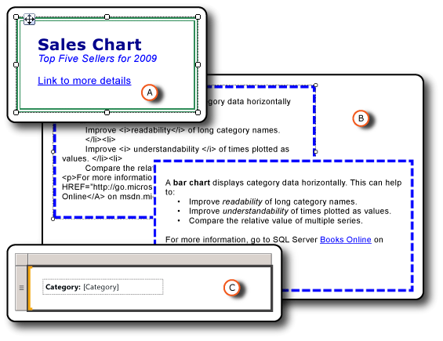

# Formatting Report Items (Report Builder and SSRS)
Formatting the items in your report makes the report look more attractive and enhances its readability. You can format the text boxes and individual items within text boxes, the images, the expressions, and the data while in report design mode.  
  
   
  
 A. Text box with a double-line border and a variety of formatting styles, including a link.  
  
 B. Text box with a dashed border and raw HTML and rendered HTML.  
  
 C. Text box in with a text label and a placeholder.  
  
 You can change formatting options by selecting the item that you want to format and then opening the item's Properties dialog box. For example, if you want to format the contents of an entire text box or a selected word within the text box, right-click the item and select **Text Box Properties**. Then, you can apply the formatting styles that you want.  
  
 To quickly get started, see [Tutorial: Formatting Text (Report Builder)](assetId:///67d8513e-8a70-464b-b87f-e91d010cfd82).  
  
> [!NOTE]  
>  [!INCLUDE[ssRBRDDup](../../Topics/TopicNameContainA/includes/ssRBRDDup_md.md)]  
  
## In This Section  
 [Formatting Text and Placeholders (Report Builder and SSRS)](../../Topics/TopicNameNotContainA/Formatting-Text-and-Placeholders--Report-Builder-and-SSRS-.md)  
 Describes how to format text and customize format options for different blocks of text within a text box.  
  
 [Importing HTML into a Report (Report Builder and SSRS)](../../Topics/TopicNameContainA/Importing-HTML-into-a-Report--Report-Builder-and-SSRS-.md)  
 Describes how to insert and use HTML in a report.  
  
 [Formatting Numbers and Dates (Report Builder and SSRS)](../../Topics/TopicNameNotContainA/Formatting-Numbers-and-Dates--Report-Builder-and-SSRS-.md)  
 Describes how to use standard and custom formatting strings that are supported by [!INCLUDE[ssRSnoversion](../../Topics/TopicNameContainA/includes/ssRSnoversion_md.md)].  
  
 [Formatting Lines, Colors, and Images (Report Builder and SSRS)](../../Topics/TopicNameNotContainA/Formatting-Lines--Colors--and-Images--Report-Builder-and-SSRS-.md)  
 Describes how to format lines, gridlines, colors, and images within report items and data regions.  
  
 [Set the Locale for a Report or Text Box (Reporting Services)](../../Topics/TopicNameContainA/Set-the-Locale-for-a-Report-or-Text-Box--Reporting-Services-.md)  
 Describes how to change the setting for data display formats that differ by language and region, such as date, currency, and number values.  
  
## See Also  
 [Formatting a Chart (Report Builder and SSRS)](../../Topics/TopicNameContainA/Formatting-a-Chart--Report-Builder-and-SSRS-.md)