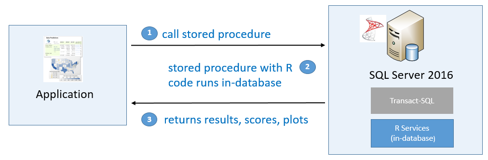
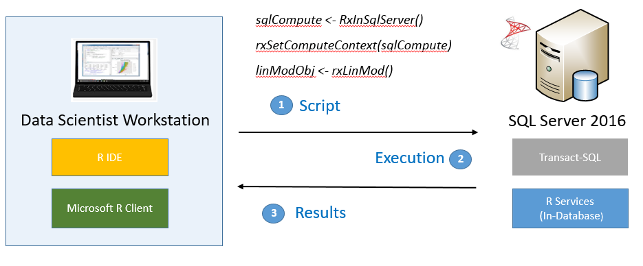

# Getting Started with SQL Server R Services
[!INCLUDE[rsql_productname](../../Topics/TopicNameContainA/includes/rsql_productname_md.md)] helps you integrate the popular open source R language with other business applications.  
  
 To get started, you need to understand how it works, decide how you want to use R, and determine where you'll install it.  
  
## What is SQL Server R Services?  
 R Services (In-Database) includes these components:  
  
-   **Enhanced R packages and providers**  
  
     Packages such as **RevoScaleR** provide the ability to execute R functions in the context of a remote server for better performance and scalability. These packages also include functions to make working with SQL Server data easier in R.  
  
-   **Extensions that support integration of R script with [!INCLUDE[tsql](../../Topics/TopicNameContainA/includes/tsql_md.md)]**  
  
     This is a new feature in the [!INCLUDE[ssCurrent](../../Topics/TopicNameContainA/includes/ssCurrent_md.md)] database engine that lets you call the R runtime using [!INCLUDE[tsql](../../Topics/TopicNameContainA/includes/tsql_md.md)] and execute R code on the server. In future releases, this architecture can support additional languages, such as Python or JSON.  
  
 The server components can be installed on any Windows computer and include all the enhanced R packages and connectivity tools to enable remote compute context and scalable, parallelizable solutions. You can develop solutions on a separate workstation and deploy them to the server to get the benefits of high-performance analytics.  
  
> [!NOTE]  
>  Need to create a server for R jobs that doesn't use  [!INCLUDE[ssNoVersion](../../Topics/TopicNameContainA/includes/ssNoVersion_md.md)]? Try [R Server (Standalone)](../../Topics/TopicNameNotContainA/R-Server--Standalone-.md).  
  
## Benefits of  Using SQL Server R Services  
 R is the world’s most powerful programming language for statistical computing, machine learning, and graphics, and is supported by a thriving global community of users, developers, and contributors.  
  
 Traditionally, using R in an enterprise setting presents certain challenges, especially as the volume of data rises, or when you need to deploy solutions to production environments. [!INCLUDE[rsql_productname](../../Topics/TopicNameContainA/includes/rsql_productname_md.md)] solves the problems of deployment and operationalization of R code. By using [!INCLUDE[ssNoVersion](../../Topics/TopicNameContainA/includes/ssNoVersion_md.md)] you can also reap the benefits of tighter integration with the [!INCLUDE[msCoName](../../Topics/TopicNameContainA/includes/msCoName_md.md)] business intelligence products.  
  
 R Services (In-Database) supports these key analytics scenarios:  
  
-   **Using [!INCLUDE[ssNoVersion](../../Topics/TopicNameContainA/includes/ssNoVersion_md.md)] to operationalize R solutions**  
  
     With the in-database server, you can invoke R scripts by embedding them in system stored procedures and have the computations execute in-database. This is useful when you want to score against a predictive model in production. You can also execute R scripts and return plots and predictions and embed them in your applications.  
  
       
  
-   **Enabling more powerful data exploration and predictive modeling**  
  
     The data scientist can use any client workstation and any R development tool to build R solutions. If the solution uses the RevoScaleR package APIs, computations can be performed *in-database* on the [!INCLUDE[ssNoVersion](../../Topics/TopicNameContainA/includes/ssNoVersion_md.md)] computer, eliminating wasteful data movement.  
  
       
  
## How Do I Get It?  
 The process for setup has changed, beginning with [!INCLUDE[ssCurrent](../../Topics/TopicNameContainA/includes/ssCurrent_md.md)] RC2. You do not need to download additional components or run a script to configure the server; moreover, you can perform setup of both server and client components using the [!INCLUDE[ssNoVersion](../../Topics/TopicNameContainA/includes/ssNoVersion_md.md)] Setup Wizard. To get started with the latest version, see [Troubleshooting R Services Setup](../../Topics/TopicNameNotContainA/Troubleshooting-R-Services-Setup.md).  
  
-   **Install [!INCLUDE[ssCurrent](../../Topics/TopicNameContainA/includes/ssCurrent_md.md)] and enable R Services (In-Database)** (new install)  
  
    1.  For a new installation, see [Set up SQL Server R Services (In-Database)](../../Topics/TopicNameNotContainA/Set-up-SQL-Server-R-Services--In-Database-.md).  
  
         You must uninstall previous versions of the R components before attempting to install RC2 or RC3. If you have trouble with uninstallation, see [Upgrade and Installation FAQ (SQL Server R Services)](../../Topics/TopicNameNotContainA/Upgrade-and-Installation-FAQ--SQL-Server-R-Services-.md).  
  
-   **Set up a client workstation**  
  
    1.  Run [!INCLUDE[ssNoVersion](../../Topics/TopicNameContainA/includes/ssNoVersion_md.md)] setup and install the client tools as described in this topic: [Set Up  a Data Science Client](../../Topics/TopicNameContainA/Set-Up--a-Data-Science-Client.md)  
  
         This package provides the enhanced R packages and connectivity tools that you need to work with either the in-database R server or the standalone R server.  
  
        > [!TIP]  
        >  Before  installing client tools,  determine the version of R Services (In-Database) that is installed on the server you will be connecting to when you deploy your R solutions. You'll need to install a compatible version of the Microsoft R tools on your data science client.  
        >   
        >  You'll also need to uninstall any previous installations of R, including previous releases of [!INCLUDE[rsql_productname](../../Topics/TopicNameContainA/includes/rsql_productname_md.md)] tools and Revolution Analytics tools. If other R packages based on an open source distribution of R 3.2.2 are installed on the computer, you can leave the packages.  
  
## How to Run R Code using SQL Server R Services  
 After installation is complete, you can run R code on [!INCLUDE[ssNoVersion](../../Topics/TopicNameContainA/includes/ssNoVersion_md.md)] by embedding R in [!INCLUDE[tsql](../../Topics/TopicNameContainA/includes/tsql_md.md)] stored procedures, or writing ad hoc R scripts that work with [!INCLUDE[ssNoVersion](../../Topics/TopicNameContainA/includes/ssNoVersion_md.md)] data.  
  
-   See how to call R from a [!INCLUDE[tsql](../../Topics/TopicNameContainA/includes/tsql_md.md)] statement and returns results in [!INCLUDE[ssManStudioFull](../../Topics/TopicNameContainA/includes/ssManStudioFull_md.md)]  
  
     [Using R Code in Transact-SQL (SQL Server R Services)](assetId:///4e6fe30d-a105-4d5b-bc05-5e5204753847)  
  
-   Use  RStudio, [!INCLUDE[rsql_rtvs](../../Topics/TopicNameContainA/includes/rsql_rtvs_md.md)], or any R tool to develop and test R solutions.  
  
     [Data Science Deep Dive: Using the RevoScaleR Packages](assetId:///c2efb3f2-cad5-4188-b889-15d68b742ef5)  
  
-   Create  R models using a dedicated data science development client, and deploy your completed R code to [!INCLUDE[ssNoVersion](../../Topics/TopicNameContainA/includes/ssNoVersion_md.md)] for prediction.  
  
     [Data Science End-to-End Walkthrough](assetId:///edd76ae9-4125-45a8-bf42-47a85b9d9a32)  
  
-   Embed working R script in [!INCLUDE[tsql](../../Topics/TopicNameContainA/includes/tsql_md.md)] stored procedures so that you can call models for prediction, retrain models, or get predictions from applications.  
  
     [In-Database Advanced Analytics for SQL Developers (Tutorial)](assetId:///c18cb249-2146-41b7-8821-3a20c5d7a690)  
  
-   Use [!INCLUDE[ssCurrent](../../Topics/TopicNameContainA/includes/ssCurrent_md.md)] and related business intelligence tools in the [!INCLUDE[ssNoVersion](../../Topics/TopicNameContainA/includes/ssNoVersion_md.md)] stack to automate machine learning processes. Data preparation and reporting can be automated using [!INCLUDE[ssISnoversion](../../Topics/TopicNameContainA/includes/ssISnoversion_md.md)]; display R plots along with other reports using [!INCLUDE[ssRSnoversion](../../Topics/TopicNameContainA/includes/ssRSnoversion_md.md)] or Power View.  
  
 For more samples, including solution templates and sample R code, see [SQL Server R Services Tutorials](assetId:///5ccc75f6-6703-47d9-b879-9a740569b45e).  
  
## See Also  
 [SQL Server R Services](../../Topics/TopicNameNotContainA/SQL-Server-R-Services.md)   
 [Getting Started with Microsoft R Server (Standalone)](../../Topics/TopicNameNotContainA/Getting-Started-with-Microsoft-R-Server--Standalone-.md)