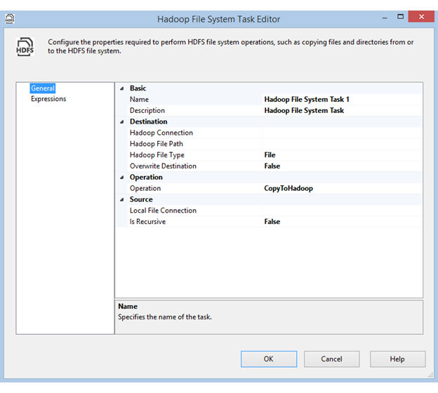

# Hadoop File System Task
The Hadoop File System Task enables an SSIS package to copy files from, to, or within a Hadoop cluster.  
  
 To add a Hadoop File System Task, drag and drop it to the designer. Then double-click on the task, or right-click and click **Edit**, to open the **Hadoop File System Task Editor** dialog box.  
  
   
  
## Options  
 Configure the following options in the **Hadoop File System Task Editor** dialog box.  
  
|Field|Description|  
|-----------|-----------------|  
|**Hadoop Connection**|Specify an existing Hadoop Connection Manager or create a new one. This connection manager indicates  where the destination files are hosted.|  
|**Hadoop File Path**|Specify the file or directory path on HDFS.|  
|**Hadoop File Type**|Specify whether the HDFS file system object is a file or directory.|  
|**Overwrite Destination**|Specify whether to overwrite the target file if it already exists.|  
|**Operation**|Specify the operation. Available operations are **CopyToHDFS**, **CopyFromHDFS**, and **CopyWithinHDFS**.|  
|**Local File Connection**|Specify an existing File Connection Manager or create a new one. This connection manager indicates where the source files are hosted.|  
|**Is Recursive**|Specify whether to copy all subfolders recursively.|  
  
## See Also  
 [Hadoop Connection Manager](../../Topics/TopicNameNotContainA/Hadoop-Connection-Manager.md)   
 [File Connection Manager](../../Topics/TopicNameNotContainA/File-Connection-Manager.md)