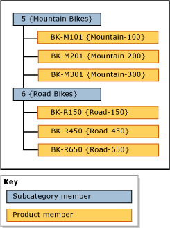

# Hierarchies (Master Data Services)
In [!INCLUDE[ssMDSshort](../../Topics/TopicNameContainA/includes/ssMDSshort_md.md)], a hierarchy is a tree structure that you can use to:  
  
-   Group similar members for organizational purposes.  
  
-   Consolidate and summarize members for reporting and analysis.  
  
## What Hierarchies Contain  
 Each hierarchy contains members from one or more entities. When a member is added, changed, or deleted, all hierarchies are updated. This ensures that the data is accurate in all hierarchies. Hierarchies also help ensure that each member is counted once and only once.  
  
 If you want to create a grouping of a subset of members, consider using a collection. For more information, see [Collections (Master Data Services)](../../Topics/TopicNameNotContainA/Collections--Master-Data-Services-.md).  
  
## Kinds of Hierarchies  
 You can create multiple hierarchies to view and organize your members in different ways. You can create:  
  
-   Ragged hierarchies from a single entity, which are called explicit hierarchies. For more information, see [Explicit Hierarchies (Master Data Services)](../../Topics/TopicNameNotContainA/Explicit-Hierarchies--Master-Data-Services-.md).  
  
-   Level-based hierarchies from multiple entities, based on the existing relationships between entities and their attributes, which are called derived hierarchies. For more information, see [Derived Hierarchies (Master Data Services)](../../Topics/TopicNameNotContainA/Derived-Hierarchies--Master-Data-Services-.md).  
  
> [!NOTE]  
>  All members in a hierarchy must be within the same model.  
  
## Hierarchies Are Not Taxonomies  
 A hierarchy is different from a taxonomy. A taxonomy organizes members by multiple attributes at the same time, while a hierarchy organizes members by one attribute at a time. A taxonomy can include the same member multiple times, while a hierarchy includes a member only once.  
  
 For example, the same bike can be included in a taxonomy twice: once because it's red, and once because it's a size 38. In a hierarchy, the bike is included only once, so you must decide whether to show it in relation to its color or its size.  
  
## Hierarchy Example  
 In the following example, product members are grouped by subcategory members.  
  
   
  
## Related Tasks  
  
|Task Description|Topic|  
|----------------------|-----------|  
|Create a explicit hierarchy.|[Create an Explicit Hierarchy (Master Data Services)](../../Topics/TopicNameNotContainA/Create-an-Explicit-Hierarchy--Master-Data-Services-.md)|  
|Create a derived hierarchy.|[Create a Derived Hierarchy (Master Data Services)](../../Topics/TopicNameContainA/Create-a-Derived-Hierarchy--Master-Data-Services-.md)|  
|Hide or delete levels in an existing derived hierarchy.|[Hide or Delete Levels in a Derived Hierarchy (Master Data Services)](../../Topics/TopicNameContainA/Hide-or-Delete-Levels-in-a-Derived-Hierarchy--Master-Data-Services-.md)|  
  
## Related Content  
  
-   [Explicit Hierarchies (Master Data Services)](../../Topics/TopicNameNotContainA/Explicit-Hierarchies--Master-Data-Services-.md)  
  
-   [Derived Hierarchies (Master Data Services)](../../Topics/TopicNameNotContainA/Derived-Hierarchies--Master-Data-Services-.md)  
  
-   [Recursive Hierarchies (Master Data Services)](../../Topics/TopicNameNotContainA/Recursive-Hierarchies--Master-Data-Services-.md)  
  
-   [Derived Hierarchies with Explicit Caps (Master Data Services)](../../Topics/TopicNameNotContainA/Derived-Hierarchies-with-Explicit-Caps--Master-Data-Services-.md)  
  
-   [Collections (Master Data Services)](../../Topics/TopicNameNotContainA/Collections--Master-Data-Services-.md)