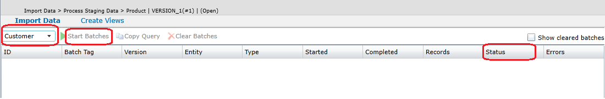

# Import Data from Tables (Master Data Services)
You can add data and make data changes to a model in [!INCLUDE[ssMDSshort](../../Topics/TopicNameContainA/includes/ssMDSshort_md.md)], in bulk.  
  
 **Prerequisites**  
  
-   You must have permission to insert data into the stg.<name\>_Leaf, the stg.<name\>_Consolidated, stg.<name\>_Relationship table in the [!INCLUDE[ssMDSshort](../../Topics/TopicNameContainA/includes/ssMDSshort_md.md)] database.  
  
-   You must have permissions to execute either the stg.udp_<name\>_Leaf, stg.udp\_<name\>_Consolidated, or the stg.udp\_<name\>_Relationship stored procedure in the [!INCLUDE[ssMDSshort](../../Topics/TopicNameContainA/includes/ssMDSshort_md.md)] database.  
  
-   The model must not have a status of **Committed**.  
  
 **To add, update, and delete data in the [!INCLUDE[ssMDSshort](../../Topics/TopicNameContainA/includes/ssMDSshort_md.md)] database**  
  
1.  Prepare the members for import into the appropriate staging table in the [!INCLUDE[ssMDSshort](../../Topics/TopicNameContainA/includes/ssMDSshort_md.md)] database, including providing values for the required fields. For an overview of staging tables, see [Overview: Importing Data from Tables (Master Data Services)](../Topic/Overview:%20Importing%20Data%20from%20Tables%20\(Master%20Data%20Services\).md)  
  
    -   For leaf members the table is stg.<name\>_Leaf, where <name\> refers to the corresponding entity. For information about the required fields, see [Leaf Member Staging Table (Master Data Services)](../../Topics/TopicNameNotContainA/Leaf-Member-Staging-Table--Master-Data-Services-.md)  
  
    -   For consolidated members, the table is stg.<name\>_Consolidated. For information about the required fields, see [Consolidated Member Staging Table (Master Data Services)](../../Topics/TopicNameNotContainA/Consolidated-Member-Staging-Table--Master-Data-Services-.md).  
  
    -   For moving the location of members in explicit hierarchies, the table is stg.<name\>_Relationship. For information about the required fields, see [Relationship Staging Table (Master Data Services)](../../Topics/TopicNameNotContainA/Relationship-Staging-Table--Master-Data-Services-.md).  
  
         For an overview on moving members in explicit hierarchies, see [Overview: Importing Data from Tables (Master Data Services)](../Topic/Overview:%20Importing%20Data%20from%20Tables%20\(Master%20Data%20Services\).md).  
  
    -   Use the **ImportType** field value to specify that you're creating new members, deactivating members, or deleting members. For more information about the values, see [Leaf Member Staging Table (Master Data Services)](../../Topics/TopicNameNotContainA/Leaf-Member-Staging-Table--Master-Data-Services-.md) and [Consolidated Member Staging Table (Master Data Services)](../../Topics/TopicNameNotContainA/Consolidated-Member-Staging-Table--Master-Data-Services-.md).  
  
         For an overview of deactivating and deleting members, see [Overview: Importing Data from Tables (Master Data Services)](../Topic/Overview:%20Importing%20Data%20from%20Tables%20(Master%20Data%20Services).md).  
  
2.  Open [!INCLUDE[ssManStudioFull](../../Topics/TopicNameContainA/includes/ssManStudioFull_md.md)] and connect to the Database Engine instance for your [!INCLUDE[ssMDSshort](../../Topics/TopicNameContainA/includes/ssMDSshort_md.md)] database.  
  
     For more information, see [SQL Server Management Studio](assetId:///66a6b7b1-de6a-4161-82bd-98ded486947b).  
  
3.  Import data into the staging tables by using the [!INCLUDE[ssNoVersion](../../Topics/TopicNameContainA/includes/ssNoVersion_md.md)] Import and Export wizard.  
  
     For more information, see [SQL Server Import and Export Wizard](../../Topics/TopicNameNotContainA/SQL-Server-Import-and-Export-Wizard.md).  
  
4.  Load the data from the staging tables to the [!INCLUDE[ssMDSshort](../../Topics/TopicNameContainA/includes/ssMDSshort_md.md)] tables, by doing one of the following  
  
    -   Run the staging stored procedure that corresponds to the staging table that you want to move data to.  
  
         For an overview of staging stored procedures and staging tables, see [Overview: Importing Data from Tables (Master Data Services)](../Topic/Overview:%20Importing%20Data%20from%20Tables%20\(Master%20Data%20Services\).md). For more information about parameters for staging stored procedures, and a code example, see [Staging Stored Procedure (Master Data Services)](../../Topics/TopicNameNotContainA/Staging-Stored-Procedure--Master-Data-Services-.md).  
  
    -   Use the **Integration Management** functional area of Master Data Management.  
  
         On the **Staging Batches** page, select the model to which you're adding data to, in the drop-down list, and then click **Start Batches**. The status of the batch processing is indicated in the **Status** field. For more information about the statuses, see [Import Statuses (Master Data Services)](../../Topics/TopicNameNotContainA/Import-Statuses--Master-Data-Services-.md).  
  
           
  
         The staging process  is started at intervals determined by the **Staging batch interval** setting in [!INCLUDE[ssMDScfgmgr](../../Topics/TopicNameContainA/includes/ssMDScfgmgr_md.md)]. For more information, see [System Settings (Master Data Services)](../../Topics/TopicNameNotContainA/System-Settings--Master-Data-Services-.md).  
  
5.  View errors that occurred during staging. For more information, see [View Errors that Occur During Staging (Master Data Services)](../../Topics/TopicNameNotContainA/View-Errors-that-Occur-During-Staging--Master-Data-Services-.md) and [Staging Process Errors (Master Data Services)](../../Topics/TopicNameNotContainA/Staging-Process-Errors--Master-Data-Services-.md).  
  
6.  Validate the data against business rules.  
  
     In Master Data Manager, navigate to the **Explorer** functional area for your model, and then apply business rules to validate the data. For more information , see [Validate Specific Members against Business Rules (Master Data Services)](../../Topics/TopicNameNotContainA/Validate-Specific-Members-against-Business-Rules--Master-Data-Services-.md). You can also use a stored procedure to validate the data. For more information, see [Validation Stored Procedure (Master Data Services)](../../Topics/TopicNameNotContainA/Validation-Stored-Procedure--Master-Data-Services-.md).  
  
     When you load data by from the staging tables, the data is not automatically validated against business rules. For more information on what validation is and when it occurs, see [Validation (Master Data Services)](../../Topics/TopicNameNotContainA/Validation--Master-Data-Services-.md).