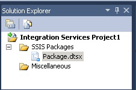

# Integration Services (SSIS) Projects
[!INCLUDE[ssNoVersion](../../Topics/TopicNameContainA/includes/ssNoVersion_md.md)] provides [!INCLUDE[ssBIDevStudioFull](../../Topics/TopicNameContainA/includes/ssBIDevStudioFull_md.md)] for the development of [!INCLUDE[ssISnoversion](../../Topics/TopicNameContainA/includes/ssISnoversion_md.md)] packages.  
  
 When you deploy packages to a [!INCLUDE[msCoName](../../Topics/TopicNameContainA/includes/msCoName_md.md)] [!INCLUDE[ssNoVersion](../../Topics/TopicNameContainA/includes/ssNoVersion_md.md)] database or the [!INCLUDE[ssIS](../../Topics/TopicNameContainA/includes/ssIS_md.md)] Package Store, you use the [!INCLUDE[ssISnoversion](../../Topics/TopicNameContainA/includes/ssISnoversion_md.md)] service to manage the packages. The [!INCLUDE[ssISnoversion](../../Topics/TopicNameContainA/includes/ssISnoversion_md.md)] service is available only in [!INCLUDE[ssManStudioFull](../../Topics/TopicNameContainA/includes/ssManStudioFull_md.md)]. For more information about the service, see [Integration Services Service (SSIS Service)](../../Topics/TopicNameNotContainA/Integration-Services-Service--SSIS-Service-.md). For more information about package deployment, see [Legacy Package Deployment (SSIS)](../../Topics/TopicNameNotContainA/Legacy-Package-Deployment--SSIS-.md).  
  
 When you deploy [!INCLUDE[ssISnoversion](../../Topics/TopicNameContainA/includes/ssISnoversion_md.md)] projects to the [!INCLUDE[ssISnoversion](../../Topics/TopicNameContainA/includes/ssISnoversion_md.md)] server, you use Transact-SQL views and stored procedures in [!INCLUDE[ssManStudioFull](../../Topics/TopicNameContainA/includes/ssManStudioFull_md.md)] to manage the projects. For more information about project deployment, see [Deployment of Projects and Packages](../../Topics/TopicNameNotContainA/Deployment-of-Projects-and-Packages.md). For more information about the [!INCLUDE[ssISnoversion](../../Topics/TopicNameContainA/includes/ssISnoversion_md.md)] server, see [Integration Services (SSIS) Server](../../Topics/TopicNameNotContainA/Integration-Services--SSIS--Server.md).  
  
 For an overview of [!INCLUDE[ssBIDevStudioFull](../../Topics/TopicNameContainA/includes/ssBIDevStudioFull_md.md)] and [!INCLUDE[ssManStudioFull](../../Topics/TopicNameContainA/includes/ssManStudioFull_md.md)], see [Integration Services (SSIS) and Studio Environments](../../Topics/TopicNameNotContainA/Integration-Services--SSIS--and-Studio-Environments.md).  
  
## Integration Services Projects contain packages  
 A project is a container in which you develop [!INCLUDE[ssISnoversion](../../Topics/TopicNameContainA/includes/ssISnoversion_md.md)] packages.  
  
 In [!INCLUDE[ssBIDevStudioFull](../../Topics/TopicNameContainA/includes/ssBIDevStudioFull_md.md)], an [!INCLUDE[ssISnoversion](../../Topics/TopicNameContainA/includes/ssISnoversion_md.md)] project stores and groups the files that are related to the package. For example, a project includes the files that are required to create a specific extract, transfer, and load (ETL) solution.  
  
 Before you create an [!INCLUDE[ssISnoversion](../../Topics/TopicNameContainA/includes/ssISnoversion_md.md)] project, you should become familiar with the basic contents of this kind of project. After you understand what a project contains, you can begin creating and working with an [!INCLUDE[ssISnoversion](../../Topics/TopicNameContainA/includes/ssISnoversion_md.md)] project.  
  
## Folders in Integration Services Projects  
 The following diagram shows the folders in an [!INCLUDE[ssISnoversion](../../Topics/TopicNameContainA/includes/ssISnoversion_md.md)] project in [!INCLUDE[ssBIDevStudioFull](../../Topics/TopicNameContainA/includes/ssBIDevStudioFull_md.md)].  
  
   
  
 The following table describes the folders that appear in an [!INCLUDE[ssISnoversion](../../Topics/TopicNameContainA/includes/ssISnoversion_md.md)] project.  
  
|Folder|Description|  
|------------|-----------------|  
|[!INCLUDE[ssIS](../../Topics/TopicNameContainA/includes/ssIS_md.md)] Packages|Contains packages. For more information, see [Integration Services (SSIS) Packages](../../Topics/TopicNameNotContainA/Integration-Services--SSIS--Packages.md).|  
|Miscellaneous|Contains files other than package files.|  
  
## Files in Integration Services Projects  
 When you add a new or an existing [!INCLUDE[ssISnoversion](../../Topics/TopicNameContainA/includes/ssISnoversion_md.md)] project to a solution, [!INCLUDE[ssBIDevStudioFull](../../Topics/TopicNameContainA/includes/ssBIDevStudioFull_md.md)] creates project files that have the extensions .dtproj and .dtproj.user and .database.  
  
-   The *.dtproj file contains information about project configurations and items such as packages.  
  
-   The *.dtproj.user file contains information about your preferences for working with the project.  
  
-   The *.database file contains information that [!INCLUDE[ssBIDevStudioFull](../../Topics/TopicNameContainA/includes/ssBIDevStudioFull_md.md)] requires to open the [!INCLUDE[ssISnoversion](../../Topics/TopicNameContainA/includes/ssISnoversion_md.md)] project.  
  
## Version targeting in Integration Services Projects  
 In [!INCLUDE[ssBIDevStudioFull](../../Topics/TopicNameContainA/includes/ssBIDevStudioFull_md.md)], you can create, maintain, and run packages that target SQL Server 2016, SQL Server 2014, or SQL Server 2012.  
  
 In Solution Explorer, right-click on an Integration Services project and select **Properties** to open the property pages for the project. On the **General** tab of **Configuration Properties**, select the **TargetServerVersion** property,  and then choose SQL Server 2016, SQL Server 2014, or SQL Server 2012.  
  
   
  
## Solutions contain projects  
 A solution is a container that groups and manages the projects that you use when you develop end-to-end business solutions. A solution lets you handle multiple projects as one unit and to bring together one or more related projects that contribute to a business solution.  
  
 Solutions can include different types of projects. If you want to use [!INCLUDE[ssIS](../../Topics/TopicNameContainA/includes/ssIS_md.md)] Designer to create an [!INCLUDE[ssISnoversion](../../Topics/TopicNameContainA/includes/ssISnoversion_md.md)] package, you work in an [!INCLUDE[ssISnoversion](../../Topics/TopicNameContainA/includes/ssISnoversion_md.md)] project in a solution provided by [!INCLUDE[ssBIDevStudioFull](../../Topics/TopicNameContainA/includes/ssBIDevStudioFull_md.md)].  
  
 When you create a new solution, [!INCLUDE[ssBIDevStudioFull](../../Topics/TopicNameContainA/includes/ssBIDevStudioFull_md.md)] adds a Solution folder to Solution Explorer, and creates files that have the extensions, .sln and .suo:  
  
-   The *.sln file contains information about the solution configuration and lists the projects in the solution.  
  
-   The *.suo file contains information about your preferences for working with the solution.  
  
 While [!INCLUDE[ssBIDevStudioFull](../../Topics/TopicNameContainA/includes/ssBIDevStudioFull_md.md)] automatically creates a solution when you create a new project, you can also create a blank solution, and then add projects later.  
  
> [!NOTE]  
>  By default, when you create a new [!INCLUDE[ssISnoversion](../../Topics/TopicNameContainA/includes/ssISnoversion_md.md)] project in [!INCLUDE[ssBIDevStudioFull](../../Topics/TopicNameContainA/includes/ssBIDevStudioFull_md.md)], the solution is not shown in the **Project Explorer** pane. To change this default behavior, on the **Tools** menus, click **Options**. In the **Options** dialog box, expand **Projects and Solutions**, and then click **General**. On the **General** page, select **Always show solution**.  
  
## Related Tasks  
 [Add or Remove an Integration Services Project in a Solution](../../Topics/TopicNameContainA/Add-or-Remove-an-Integration-Services-Project-in-a-Solution.md)  
  
 [Create a New Integration Services Project](../../Topics/TopicNameContainA/Create-a-New-Integration-Services-Project.md)  
  
 [Add an Item to an Integration Services Project](../../Topics/TopicNameNotContainA/Add-an-Item-to-an-Integration-Services-Project.md)  
  
 [Copy Project Items](../../Topics/TopicNameNotContainA/Copy-Project-Items.md)  
  
## Related Content  
 [Development of an Integration Services Project](../../Topics/TopicNameNotContainA/Development-of-an-Integration-Services-Project.md)