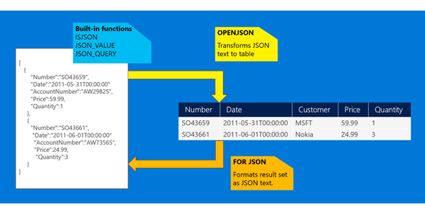

# JSON Data (SQL Server)
JSON is a popular textual data format used for exchanging data in  modern web and mobile applications. JSON is  also used for storing unstructured data in log files or NoSQL databases like Microsoft Azure DocumentDB. Many REST web services return results formatted as JSON text or accept data formatted as JSON. Most Azure services such as Azure Search, Azure Storage, and Azure DocumentDb have REST endpoints that return or consume JSON. JSON is also the main format for exchanging data between web pages and web servers using AJAX calls.  
  
 Here is one example of JSON text:  
  
```json  
[   
   { "name": "John", "skills":["SQL","C#","Azure"] },  
   { "name": "Jane", "surname": "Doe" }  
]  
```  
  
 SQL Server provides built-in functions and operators that let you do the following things.  
  
-   Parse JSON text and read or modify values.  
  
-   Transform arrays of JSON objects into table format.  
  
-   Use any Transact SQL query on the converted JSON objects.  
  
-   Format the results of Transact-SQL queries in JSON format.  
  
   
  
 Here are the key capabilities that SQL Server provides.  
  
 **Extract values from JSON text and use them in queries.** If you have JSON text that's stored in database tables, you can use built-in functions to read or modify values in the JSON text.  
  
-   Use the **JSON_VALUE** function to extract a scalar value from a JSON string  
  
-   Use **JSON_QUERY** to extract an object or an array  
  
-   Use the **ISJSON** function to test whether a string contains valid JSON.  
  
 In the following example, the query that uses both relational and JSON data (stored in the jsonCol column) from a table:  
  
```tsql  
  
SELECT Name, Surname,	  
	JSON_VALUE(jsonCol, '$.info.address.PostCode') as PostCode,  
	JSON_VALUE(jsonCol, '$.info.address."Address Line 1"') +  ' ' + JSON_VALUE(jsonCol, '$.info.address."Address Line 2"') AS Address,  
	JSON_QUERY(jsonCol, '$.info.skills') as Skills  
FROM PeopleCollection  
WHERE ISJSON(jsonCol) > 0   
  AND JSON_VALUE(jsonCol, '$.info.address.town') = 'Belgrade'  
  AND Status = 'Active'  
ORDER BY JSON_VALUE(@jsonInfo, '$.info.address.PostCode')  
  
```  
  
 Applications and tools see no difference between the values taken from scalar table columns and the values taken from JSON columns. You can use values from JSON text in any part of a Transact-SQL query (including WHERE, ORDER BY, GROUP BY clauses, window aggregates, and so on). JSON functions use JavaScript-like syntax for referencing values inside JSON text. For more info, see [Validate, Query, and Change JSON Data with Built-in Functions (SQL Server)](../../Topics/TopicNameNotContainA/Validate--Query--and-Change-JSON-Data-with-Built-in-Functions--SQL-Server-.md), [JSON_VALUE (Transact-SQL)](assetId:///cd016e14-11eb-4eaf-bf05-c7cfcc820a10), and [JSON_QUERY (Transact-SQL)](assetId:///1ab0d90f-19b6-4988-ab4f-22fdf28b7c79).  
  
 **Change JSON values.** If you need to modify parts of JSON text, you can use the **JSON_MODIFY** function to update the value of a property in a JSON string and return the updated JSON string. The following example updates the value of a property in a variable that contains JSON.  
  
```tsql  
SET @jsonInfo = JSON_MODIFY(@jsonInfo, '$.info.address[0].town', 'London')  
```  
  
 **Convert JSON collections to a rowset.** You don't need a custom query language to query JSON in SQL Server. To query JSON data, you can use standard T-SQL. If you need to create some query or report on JSON data, you can easily convert JSON data to rows and columns by calling the **OPENJSON** rowset function. Use the **OPENJSON** function to import JSON data into SQL Server, or to convert JSON data into rows and columns. For more info, see [Convert JSON Data to Rows and Columns with OPENJSON (SQL Server)](../../Topics/TopicNameNotContainA/Convert-JSON-Data-to-Rows-and-Columns-with-OPENJSON--SQL-Server-.md).  
  
 The following example calls **OPENJSON** that transforms array of objects stored in **@json** variable to a rowset that can be queried using standard SQL SELECT statement:  
  
```tsql  
SET @json =  
N'[  
      { "id" : 2,"info": { "name": "John", "surame": "Smith" }, "age": 25 },  
      { "id" : 5,"info": { "name": "Jane", "surame": "Smith" }, "dob": "2005-11-04T12:00:00" }  
]'  
  
SELECT *  
FROM OPENJSON(@json)  
 WITH (id int 'strict $.id',  
       firstName nvarchar(50) '$.info.name', lastName nvarchar(50) '$.info.surname',  
       age int, dateOfBirth datetime2 '$.dob')  
  
```  
  
 **Results**  
  
|id|firstName|lastName|age|dateOfBirth|  
|--------|---------------|--------------|---------|-----------------|  
|2|John|Smith|25||  
|5|Jane|Smith||2005-11-04T12:00:00|  
  
 **OPENJSON** transforms the array of JSON objects into a table, in which each object is represented as one row, and key/value pairs are returned as cells. **OPENJSON** converts JSON values to specified types. **OPENJSON** can handle both flat key/value pairs and nested, hierarchically organized objects. You don't have to return all the fields contained in the JSON text. **OPENJSON** returns NULL values if JSON values don't exist. You can optionally specify a path after the type specification to reference  a nested property or to reference a property by a different name. The optional **strict** prefix in the path specifies that values for the specified properties must exist in the JSON text. For more info, see  [Convert JSON Data to Rows and Columns with OPENJSON (SQL Server)](../../Topics/TopicNameNotContainA/Convert-JSON-Data-to-Rows-and-Columns-with-OPENJSON--SQL-Server-.md) and [OPENJSON (Transact-SQL)](assetId:///233d0877-046b-4dcc-b5da-adeb22f78531).  
  
 **Convert SQL Server data to JSON or export JSON.** Format SQL Server data or the results of SQL queries as JSON by adding the **FOR JSON** clause to a **SELECT** statement. Use FOR JSON to delegate the formatting of JSON output from your client applications to SQL Server. For more info, see [Format Query Results as JSON with FOR JSON (SQL Server)](../../Topics/TopicNameNotContainA/Format-Query-Results-as-JSON-with-FOR-JSON--SQL-Server-.md).  
  
 The following example uses PATH mode with the FOR JSON clause.  
  
```tsql  
SELECT id, firstName AS "info.name", lastName AS "info.surname", age, dateOfBirth as dob  
FROM People  
FOR JSON PATH  
```  
  
 The   
    **FOR JSON** clause formats SQL results as JSON text that can be provided to any app that understands JSON. The PATH option uses dot-separated aliases in the SELECT clause to nest objects in the query results.  
  
 **Results**  
  
```json  
[  
      { "id" : 2,"info": { "name": "John", "surame": "Smith" }, "age": 25 },  
      { "id" : 5,"info": { "name": "Jane", "surame": "Smith" }, "dob": "2005-11-04T12:00:00" }  
]  
```  
  
 For more info, see [Format Query Results as JSON with FOR JSON (SQL Server)](../../Topics/TopicNameNotContainA/Format-Query-Results-as-JSON-with-FOR-JSON--SQL-Server-.md) and [FOR Clause (Transact-SQL)](assetId:///08a6f084-8f73-4f2a-bae4-3c7513dc99b9).  
  
## Use cases  
 SQL Server provides a hybrid model for storing and processing both relational and JSON data using standard Transact-SQL language. It enables you to organize collections of your JSON documents per tables, establish relationships between them, combine strongly-typed scalar columns stored in tables with flexible key/value pairs stored in JSON columns, and query both scalar and JSON values in one or multiple tables using full Transact-SQL. JSON text is typically stored in varchar or nvarchar columns and is indexed as plain text. Any SQL Server feature or component that supports text supports JSON, so there are almost no constraints on interaction between JSON and other SQL Server features. You can store JSON in In-memory or Temporal tables, you can apply Row-Level Security predicates on JSON text, and so on. If you have pure JSON workloads where you want to use a query language that's customized for the processing of JSON documents, consider Microsoft Azure [DocumentDB](https://azure.microsoft.com/services/documentdb/).  
  
 Here are some use cases that show how you can use the built-in JSON support in [!INCLUDE[ssNoVersion](../../Topics/TopicNameContainA/includes/ssNoVersion_md.md)].  
  
## Return data from a SQL Server table formatted as JSON  
 If you have a web service that takes data from the database layer and returns it in JSON format, or JavaScript frameworks or libraries that accept data formatted as JSON, you can format results directly in a SQL query. Instead of writing code or including a library to convert tabular query results and then serialize objects to JSON format, you can use FOR JSON to delegate the JSON formatting to SQL Server.  
  
 For example, you might want to generate JSON output that's compliant with the OData specification. The web service expects a request and response in the following format.  
  
-   Request: `/Northwind/Northwind.svc/Products(1)?$select=ProductID,ProductName`  
  
-   Response: `{"@odata.context":"http://services.odata.org/V4/Northwind/Northwind.svc/$metadata#Products(ProductID,ProductName)/$entity","ProductID":1,"ProductName":"Chai"}`  
  
 This OData URL represents a request for the ProductID and ProductName columns for the product with id 1. You can use FOR JSON to format the output as expected in SQL Server.  
  
```tsql  
SELECT 'http://services.odata.org/V4/Northwind/Northwind.svc/$metadata#Products(ProductID,ProductName)/$entity' AS '@odata.context',   
ProductID, Name as ProductName   
FROM Production.Product  
WHERE ProductID = 1  
FOR JSON AUTO  
  
```  
  
 The  result of this query is JSON text that is fully compliant with OData spec. Formatting and escaping are handled by SQL Server. SQL Server can format query results in any format such as OData JSON or GeoJSON - see [Returning spatial data in GeoJSON format](https://blogs.msdn.microsoft.com/sqlserverstorageengine/2016/01/05/returning-spatial-data-in-geojson-format-part-1)  
  
## Analyze JSON data with SQL queries  
 If you have to filter or aggregate JSON data for reporting purposes, you can use OPENJSON to transform JSON to relational format. Then use standard [!INCLUDE[tsql](../../Topics/TopicNameContainA/includes/tsql_md.md)] and built-in functions to prepare the reports.  
  
```tsql  
SELECT Tab.Id, SalesOrderJsonData.Customer, SalesOrderJsonData.Date  
FROM   SalesOrderRecord AS Tab  
         CROSS APPLY  
	OPENJSON (Tab.json, N'$.Orders.OrdersArray')  
          WITH (  
             Number   varchar(200) N'$.Order.Number',   
             Date     datetime     N'$.Order.Date',  
             Customer varchar(200) N'$.AccountNumber',   
             Quantity int          N'$.Item.Quantity'  
          )  
 AS SalesOrderJsonData  
WHERE JSON_VALUE(Tab.json, '$.Status') = N'Closed'  
ORDER BY JSON_VALUE(Tab.json, '$.Group'), Tab.DateModified  
  
```  
  
 Both standard table columns and values from JSON text can be used in the same query. You can add indexes on JSON_VALUE(Tab.json, '$.Status') expression to improve performance of query.  
  
## Import JSON data into SQL Server tables  
 If you have to load JSON data from an external service into SQL Server, you can use OPENJSON to import the data into SQL Server instead of parsing the data in the application layer.  
  
```tsql  
INSERT INTO SalesReport  
SELECT SalesOrderJsonData.*  
FROM OPENJSON (@jsonVariable, N'$.Orders.OrdersArray')  
          WITH (  
             Number   varchar(200) N'$.Order.Number',   
             Date     datetime     N'$.Order.Date',  
             Customer varchar(200) N'$.AccountNumber',   
             Quantity int          N'$.Item.Quantity'  
          )  
 AS SalesOrderJsonData;  
  
```  
  
 The content of the JSON variable can be provided by some external REST service, sent as a parameter from some client-side JavaScript framework, or loaded from external files. You can easily insert, update or merge results from JSON text into a SQL Server table. For more info about this scenario, see [Importing JSON data in SQL Server](https://blogs.msdn.microsoft.com/sqlserverstorageengine/2015/09/22/openjson-the-easiest-way-to-import-json-text-into-table/), [Upsert JSON documents in SQL Server 2016](https://blogs.msdn.microsoft.com/sqlserverstorageengine/2016/03/03/upsert-json-documents-in-sql-server-2016), and [Loading GeoJSON data into SQL Server 2016](https://blogs.msdn.microsoft.com/sqlserverstorageengine/2016/01/05/loading-geojson-data-into-sql-server/).  
  
## Loading JSON files into SQL Server  
 Information stored in files can be formatted as standard JSON or Line-Delimited JSON. SQL Server can import the contents of JSON files, parse it using the OPENJSON or JSON_VALUE functions, and load it into tables.  
  
 If your JSON files are stored in local files, shared network drives, or Azure File Storage location that can be accessed by SQL Server, you can use bulk import to load your JSON data into SQL Server. For more info about this scenario, see [Importing JSON files into SQL Server using OPENROWSET (BULK)](http://blogs.msdn.com/b/sqlserverstorageengine/archive/2015/10/07/importing-json-files-into-sql-server-using-openrowset-bulk.aspx).  
  
 If your line-delimited JSON files are stored in Azure Blob Storage or the Hadoop file system, you can use Polybase to load JSON text, parse it in Transact-SQL code, and load it into tables.  
  
## Test drive built-in JSON support  
 **Test drive built-in JSON support with the AdventureWorks sample database.** To get the AdventureWorks sample database, download at least the database file and the samples and scripts file from [here](https://www.microsoft.com/en-us/download/details.aspx?id=49502). After you restore the sample database to an instance of SQL Server 2016, unzip the samples file and open the "JSON Sample Queries procedures views and indexes.sql" file from the JSON folder. Run the scripts in this file to reformat some existing data as JSON data, run sample queries and reports over the JSON data, index the JSON data, and import and export JSON.  
  
 Here's what you can do with the scripts included in the file.  
  
1.  Denormalize the existing schema to create columns of JSON data.  
  
    1.  Store information from SalesReasons, SalesOrderDetails, SalesPerson, Customer, and other tables that contain information related to sales order into JSON columns in the SalesOrder_json table.  
  
    2.  Store information from EmailAddresses/PersonPhone tables into the Person_json table as arrays of JSON objects.  
  
2.  Create procedures and views that query JSON data.  
  
3.  Index JSON data – create indexes on JSON properties and full-text indexes.  
  
4.  Import and export JSON – create and run procedures that export the content of the Person and the SalesOrder tables as JSON results, and import and update the Person and the SalesOrder tables using JSON input.  
  
5.  Run query examples – run some queries that call the stored procedures and views created in steps 2 and 4.  
  
6.  Clean up scripts – don't run this part if you want to keep the stored procedures and views created in steps 2 and 4.  
  
## Learn more about built-in JSON support  
  
### Topics in this section  
 [Format Query Results as JSON with FOR JSON (SQL Server)](../../Topics/TopicNameNotContainA/Format-Query-Results-as-JSON-with-FOR-JSON--SQL-Server-.md)  
 Use the FOR JSON clause to delegate the formatting of JSON output from your client applications to SQL Server.  
  
 [Convert JSON Data to Rows and Columns with OPENJSON (SQL Server)](../../Topics/TopicNameNotContainA/Convert-JSON-Data-to-Rows-and-Columns-with-OPENJSON--SQL-Server-.md)  
 Use OPENJSON to import JSON data into SQL Server, or to convert JSON data into relational format for an app or service that can't currently consume JSON directly, such as SQL Server Integration Services.  
  
 [Validate, Query, and Change JSON Data with Built-in Functions (SQL Server)](../../Topics/TopicNameNotContainA/Validate--Query--and-Change-JSON-Data-with-Built-in-Functions--SQL-Server-.md)  
 Use these built-in functions to validate JSON text and to extract a scalar value, an object, or an array.  
  
 [JSON Path Expressions (SQL Server)](../../Topics/TopicNameNotContainA/JSON-Path-Expressions--SQL-Server-.md)  
 Use a path expression to specify the JSON text that you want to use.  
  
 [Index JSON data](../../Topics/TopicNameNotContainA/Index-JSON-data.md)  
 Use computed columns to create collation-aware indexes over properties in JSON documents.  
  
 [Frequently Asked Questions about JSON in SQL Server](../../Topics/TopicNameNotContainA/Frequently-Asked-Questions-about-JSON-in-SQL-Server.md)  
 Find answers to some common questions about the built-in JSON support in SQL Server.  
  
### Microsoft blog posts  
  
-   [Blog posts by Microsoft Program Manager Jovan Popovic](http://blogs.msdn.com/b/sqlserverstorageengine/archive/tags/json/)  
  
### Reference topics  
  
-   [FOR Clause (Transact-SQL)](assetId:///08a6f084-8f73-4f2a-bae4-3c7513dc99b9) (FOR JSON)  
  
-   [OPENJSON (Transact-SQL)](assetId:///233d0877-046b-4dcc-b5da-adeb22f78531)  
  
-   [JSON Functions (Transact-SQL)](assetId:///ec97d451-06af-44a3-8304-305d410cfc8e)  
  
    -   [ISJSON (Transact-SQL)](assetId:///c836f3d3-3e17-44ae-92bf-f341918896c3)  
  
    -   [JSON_VALUE (Transact-SQL)](assetId:///cd016e14-11eb-4eaf-bf05-c7cfcc820a10)  
  
    -   [JSON_QUERY (Transact-SQL)](assetId:///1ab0d90f-19b6-4988-ab4f-22fdf28b7c79)  
  
    -   [JSON_MODIFY (Transact-SQL)](assetId:///96bc8255-a037-4907-aec4-1a9c30814651)