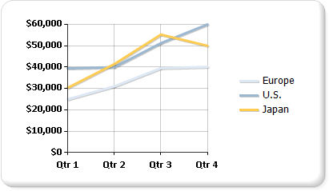

# Line Charts (Report Builder and SSRS)
A line chart displays a series as a set of points connected by a single line. Line charts are used to representing large amounts of data that occur over a continuous period of time. For more information about how to add data to a line chart, see [Charts (Report Builder and SSRS)](../../Topics/TopicNameNotContainA/Charts--Report-Builder-and-SSRS-.md).  
  
 The following illustration shows a line chart that contains three series.  
  
   
  
> [!NOTE]  
>  [!INCLUDE[ssRBRDDup](../../Topics/TopicNameContainA/includes/ssRBRDDup_md.md)]  
  
## Variations  
  
-   **Smooth line**. A line chart that uses a curved line instead of a regular line.  
  
-   **Stepped line**. A line chart that uses a stepped line instead of a regular line. The stepped line connects points by using a line that makes it look like steps on a ladder or staircase.  
  
-   **Sparkline charts**. Variations of the line chart that show only the line series in the cell of a table or matrix. For more information, see [Sparklines and Data Bars (Report Builder and SSRS)](../../Topics/TopicNameNotContainA/Sparklines-and-Data-Bars--Report-Builder-and-SSRS-.md).  
  
## Data Considerations for Line Charts  
  
-   To improve the visual impact of the default line chart, consider changing the width of the series border to 3, and adding a shadow offset of 1. This will create a much bolder line chart. You will need to revert these properties to their original values if you change the chart type from Line to another type.  
  
-   If your dataset includes empty values, the line chart will add empty points, in the form of placeholder lines, in order to maintain continuity on the chart. If you would rather not see these lines, consider displaying your dataset using a non-contiguous chart type such as a bar or column chart.  
  
-   A line chart requires at least two points to draw a line.  If your dataset has only one data point, the line chart will display as a single data point marker.  
  
-   A series that is drawn as a line will not take up much space within a chart area.  For this reason, line charts are frequently combined with other chart types such as column charts. However, you cannot combine a line chart with bar, polar, pie or shape chart types.  
  
## See Also  
 [Bar Charts (Report Builder and SSRS)](../../Topics/TopicNameNotContainA/Bar-Charts--Report-Builder-and-SSRS-.md)   
 [Column Charts (Report Builder and SSRS)](../../Topics/TopicNameNotContainA/Column-Charts--Report-Builder-and-SSRS-.md)   
 [Charts (Report Builder and SSRS)](../../Topics/TopicNameNotContainA/Charts--Report-Builder-and-SSRS-.md)   
 [Chart Types (Report Builder and SSRS)](../../Topics/TopicNameNotContainA/Chart-Types--Report-Builder-and-SSRS-.md)   
 [Area Charts (Report Builder and SSRS)](../../Topics/TopicNameNotContainA/Area-Charts--Report-Builder-and-SSRS-.md)   
 [Empty and Null Data Points in Charts (Report Builder and SSRS)](../../Topics/TopicNameNotContainA/Empty-and-Null-Data-Points-in-Charts--Report-Builder-and-SSRS-.md)   
 [Charts (Report Builder and SSRS)](../../Topics/TopicNameNotContainA/Charts--Report-Builder-and-SSRS-.md)