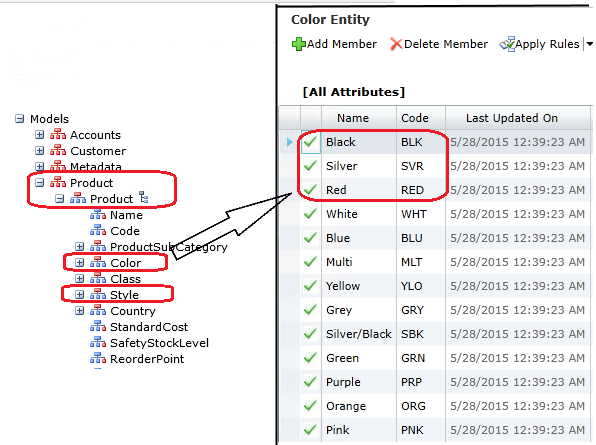
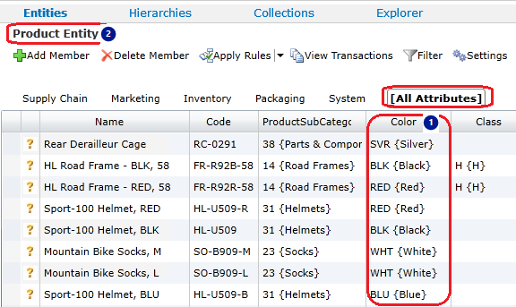
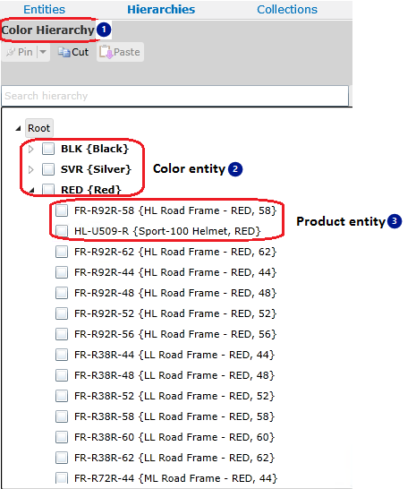

# Master Data Services Overview (MDS)
This article describes the building blocks of [!INCLUDE[ssMDSshort](../../Topics/TopicNameContainA/includes/ssMDSshort_md.md)]. For information about the new features  in [!INCLUDE[ssCurrent](../../Topics/TopicNameContainA/includes/ssCurrent_md.md)], see [What's New in Master Data Services (MDS)](../../Topics/TopicNameNotContainA/What-s-New-in-Master-Data-Services--MDS-.md)  
  
 **To  install [!INCLUDE[ssMDSshort](../../Topics/TopicNameContainA/includes/ssMDSshort_md.md)], set up the database and Website, and deploy the sample models, see**  [Get Started with Master Data Services (SQL Server 2016)](../../Topics/TopicNameNotContainA/Get-Started-with-Master-Data-Services--SQL-Server-2016-.md).  
  
 In [!INCLUDE[ssMDSshort](../../Topics/TopicNameContainA/includes/ssMDSshort_md.md)], the model is the highest level container in the structure of your master data. You create a model to manage groups of similar data, for example to manage online product data. A model contains one or more entities, and entities contain members that are the data records. An entity is similar to a table.  
  
 For example, your online product model may contain entities such as product, color, and style. The  color entity may contain  members for the colors red, silver, and black.  
  
   
  
 Models also contain attributes that are defined within entities. An attribute contains values that help describe the entity members. There are free-form attributes and domain-based attributes.  A domain-based attribute contains values that are populated by members from an entity and can be used as attribute values for other entities.  
  
 For example, the product entity might have free-form attributes for cost and weight. And, there is a domain-based attribute for color  that contains values that are populated by the color entity members. This  master list of colors is used as attribute values for the Product entity .  
  
   
  
 Derived hierarchies come from the relationships between entities in a model. These are domain-based attribute relationships. In the product model for example, you can have a color derived hierarchy  that comes from the relationship between the color  and product  entities.  
  
   
  
 Once you've defined  a basic structure for your data, you can start adding data records (members) by using the import feature. You load data into staging tables,  validate the data using business rules, and load the data into  MDS tables.  You can also use business rules to set attribute values.  
  
 The following table outlines the key [!INCLUDE[ssMDSshort](../../Topics/TopicNameContainA/includes/ssMDSshort_md.md)] tasks. Unless otherwise noted, all of the following procedures require you to be a model administrator. For more information, see [Administrators (Master Data Services)](../../Topics/TopicNameNotContainA/Administrators--Master-Data-Services-.md).  
  
> [!NOTE]  
>  You might want to complete the following tasks in a test environment and use the sample data provided when you install [!INCLUDE[ssMDSshort](../../Topics/TopicNameContainA/includes/ssMDSshort_md.md)]. For more information, see [Deploying Models (Master Data Services)](../../Topics/TopicNameNotContainA/Deploying-Models--Master-Data-Services-.md).  
  
|Action|Details|Related Topics|  
|------------|-------------|--------------------|  
|Create a model|When you create a model, it is considered VERSION_1.|[Models (Master Data Services)](../../Topics/TopicNameNotContainA/Models--Master-Data-Services-.md)   [Create a Model (Master Data Services)](../../Topics/TopicNameContainA/Create-a-Model--Master-Data-Services-.md)|  
|Create entities|Create as many entities as you need to contain your members.|[Entities (Master Data Services)](../../Topics/TopicNameNotContainA/Entities--Master-Data-Services-.md)   [Create an Entity (Master Data Services)](../../Topics/TopicNameNotContainA/Create-an-Entity--Master-Data-Services-.md)|  
|Create entities to use as domain-based attributes|To create a domain-based attribute, first create the entity to populate the attribute value list.|[Domain-Based Attributes (Master Data Services)](../../Topics/TopicNameNotContainA/Domain-Based-Attributes--Master-Data-Services-.md)   [Create a Domain-Based Attribute (Master Data Services)](../../Topics/TopicNameContainA/Create-a-Domain-Based-Attribute--Master-Data-Services-.md)|  
|Create attributes for your entities|Create attributes to describe members. A Name and Code attribute are automatically included in each entity and cannot be removed. You might want to create other free-form attributes to contain text, dates, numbers, or files.|[Attributes (Master Data Services)](../../Topics/TopicNameNotContainA/Attributes--Master-Data-Services-.md)   [Create a Text Attribute (Master Data Services)](../../Topics/TopicNameContainA/Create-a-Text-Attribute--Master-Data-Services-.md)   [Create a Numeric Attribute (Master Data Services)](../../Topics/TopicNameContainA/Create-a-Numeric-Attribute--Master-Data-Services-.md)   [Create a Date Attribute (Master Data Services)](../../Topics/TopicNameContainA/Create-a-Date-Attribute--Master-Data-Services-.md)   [Create a Link Attribute (Master Data Services)](../../Topics/TopicNameContainA/Create-a-Link-Attribute--Master-Data-Services-.md)   [Create a File Attribute (Master Data Services)](../../Topics/TopicNameContainA/Create-a-File-Attribute--Master-Data-Services-.md)|  
|Create attribute groups|If you have more than four or five attributes for an entity, you might want to create attribute groups. These groups are the tabs that are displayed above the grid in **Explorer** and they help ease navigation by grouping attributes together on individual tabs.|[Attribute Groups (Master Data Services)](../../Topics/TopicNameNotContainA/Attribute-Groups--Master-Data-Services-.md)   [Create an Attribute Group (Master Data Services)](../../Topics/TopicNameNotContainA/Create-an-Attribute-Group--Master-Data-Services-.md)|  
|Import members for your supporting entities|Import the data for your supporting entities by using the staging process. For the Product model, this might mean importing colors or sizes. You can also create members manually.      Note: Users can create members in [!INCLUDE[ssMDSmdm](../../Topics/TopicNameContainA/includes/ssMDSmdm_md.md)] if they have a minimum of **Update** permission to an entity's leaf model object and access to the **Explorer** functional area.|[Overview: Importing Data from Tables (Master Data Services)](../Topic/Overview:%20Importing%20Data%20from%20Tables%20\(Master%20Data%20Services\).md)   [Create a Leaf Member (Master Data Services)](../../Topics/TopicNameContainA/Create-a-Leaf-Member--Master-Data-Services-.md)|  
|Create business rules to ensure data quality|Create and publish business rules to ensure the accuracy of your data. You can use business rules to:   Set default attribute values.   Change attribute values.   Send email notifications when data doesn't pass business rule validation.|[Business Rules (Master Data Services)](../../Topics/TopicNameNotContainA/Business-Rules--Master-Data-Services-.md)   [Create and Publish a Business Rule (Master Data Services)](../../Topics/TopicNameContainA/Create-and-Publish-a-Business-Rule--Master-Data-Services-.md)   [Notifications (Master Data Services)](../../Topics/TopicNameNotContainA/Notifications--Master-Data-Services-.md)   [Configure Email Notifications (Master Data Services)](../../Topics/TopicNameNotContainA/Configure-Email-Notifications--Master-Data-Services-.md)   [Configure Business Rules to Send Notifications (Master Data Services)](../../Topics/TopicNameNotContainA/Configure-Business-Rules-to-Send-Notifications--Master-Data-Services-.md)|  
|Import members for your primary entities and apply business rules|Import the members for your primary entities by using the staging process. When done, validate the version, which applies business rules to all members in the model version.   You can then work to correct any business rule validation issues.|[Validation (Master Data Services)](../../Topics/TopicNameNotContainA/Validation--Master-Data-Services-.md)   [Validate a Version against Business Rules (Master Data Services)](../../Topics/TopicNameContainA/Validate-a-Version-against-Business-Rules--Master-Data-Services-.md)   [Validation Stored Procedure (Master Data Services)](../../Topics/TopicNameNotContainA/Validation-Stored-Procedure--Master-Data-Services-.md)|  
|Create derived hierarchies|Derived hierarchies can be updated as your business needs change and ensure that all members are accounted for at the appropriate level.|[Derived Hierarchies (Master Data Services)](../../Topics/TopicNameNotContainA/Derived-Hierarchies--Master-Data-Services-.md)   [Create a Derived Hierarchy (Master Data Services)](../../Topics/TopicNameContainA/Create-a-Derived-Hierarchy--Master-Data-Services-.md)|  
|If needed, create explicit hierarchies|If you want to create hierarchies that are not level-based and that include members from a single entity, you can create explicit hierarchies.|[Explicit Hierarchies (Master Data Services)](../../Topics/TopicNameNotContainA/Explicit-Hierarchies--Master-Data-Services-.md)   [Create an Explicit Hierarchy (Master Data Services)](../../Topics/TopicNameNotContainA/Create-an-Explicit-Hierarchy--Master-Data-Services-.md)|  
|If needed, create collections|If you want to view different groupings of members for reporting or analysis and do not need a complete hierarchy, create a collection.      Note: Users can create collections in [!INCLUDE[ssMDSmdm](../../Topics/TopicNameContainA/includes/ssMDSmdm_md.md)] if they have a minimum of **Update** permission to the collection model object and access to the **Explorer** functional area.|[Collections (Master Data Services)](../../Topics/TopicNameNotContainA/Collections--Master-Data-Services-.md)   [Create a Collection (Master Data Services)](../../Topics/TopicNameContainA/Create-a-Collection--Master-Data-Services-.md)|  
|Create user-defined metadata|To describe your model objects, add user-defined metadata to your model. The metadata might include the owner of an object or the source the data comes from.|[User-Defined Metadata (Master Data Services)](assetId:///ac1aabe3-d8d4-4d7a-8954-50ee3c185d81)|  
|Lock a version of your model and assign a version flag|Lock a version of your model to prevent changes to the members, except by administrators. When the version's data has validated successfully against business rules, you can commit the version, which prevents changes to members by all users.   Create and assign a version flag to the model. Flags help users and subscribing systems identify which version of a model to use.|[Versions (Master Data Services)](../../Topics/TopicNameNotContainA/Versions--Master-Data-Services-.md)   [Lock a Version (Master Data Services)](../../Topics/TopicNameContainA/Lock-a-Version--Master-Data-Services-.md)   [Create a Version Flag (Master Data Services)](../../Topics/TopicNameContainA/Create-a-Version-Flag--Master-Data-Services-.md)|  
|Create subscription views|For your subscribing systems to consume your master data, create subscription views, which create standard views in the [!INCLUDE[ssMDSshort](../../Topics/TopicNameContainA/includes/ssMDSshort_md.md)] database.|[Overview: Exporting Data (Master Data Services)](../Topic/Overview:%20Exporting%20Data%20\(Master%20Data%20Services\).md)   [Create a Subscription View to Export Data (Master Data Services)](../../Topics/TopicNameContainA/Create-a-Subscription-View-to-Export-Data--Master-Data-Services-.md)|  
|Configure user and group permissions|You cannot copy user and group permissions from a test to a production environment. However, you can use your test environment to determine the security you want to use eventually in production.|[Security (Master Data Services)](../../Topics/TopicNameNotContainA/Security--Master-Data-Services-.md)   [Add a Group (Master Data Services)](../../Topics/TopicNameContainA/Add-a-Group--Master-Data-Services-.md)   [Add a User (Master Data Services)](../../Topics/TopicNameContainA/Add-a-User--Master-Data-Services-.md)|  
  
 When ready, you can deploy your model, with or without its data, to your production environment. For more information, see [Deploying Models (Master Data Services)](../../Topics/TopicNameNotContainA/Deploying-Models--Master-Data-Services-.md).