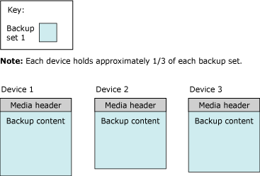
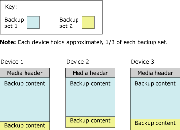

# Media Sets, Media Families, and Backup Sets (SQL Server)
  This topic introduces the basic backup-media terminology of [!INCLUDE[ssNoVersion](../../Topics/TopicNameContainA/includes/ssNoVersion_md.md)] backup and restore and is intended for readers who are new to [!INCLUDE[ssNoVersion](../../Topics/TopicNameContainA/includes/ssNoVersion_md.md)]. This topic describes the format that [!INCLUDE[ssNoVersion](../../Topics/TopicNameContainA/includes/ssNoVersion_md.md)] uses for backup media, the correspondence between backup media and backup devices, the organization of backups on backup media, and several considerations for media sets and media families. The topic also describes the steps initializing or formatting backup media before you use it for the first time or replace an old media set with a new media set, how to overwrite old backup sets in a media set, and how to append new backup sets to a media set.  
  
> [!NOTE]  
>  For more information on SQL Server backup to the Windows Azure Blob storage service,, see, [SQL Server Backup and Restore with Microsoft Azure Blob Storage Service](../../Topics/TopicNameNotContainA/SQL-Server-Backup-and-Restore-with-Microsoft-Azure-Blob-Storage-Service.md).  
  
 **In this Topic:**  
  
-   [Terms and Definitions](#TermsAndDefinitions)  
  
-   [Overview of Media Sets, Media Families, and Backup Sets](#OvMediaSetsFamiliesBackupSets)  
  
-   [Using Media Sets and Families](#ConsiderationsForMediaSetFamilies)  
  
-   [Related Tasks](#RelatedTasks)  
  
##  <a name="TermsAndDefinitions"></a> Terms and Definitions  
 media set  
 An ordered collection of backup media, tapes or disk files, to which one or more backup operations have written using a fixed type and number of backup devices.  
  
 media family  
 Backups created on a single nonmirrored device or a set of mirrored devices in a media set  
  
 backup set  
 The backup content that is added to a media set by a successful backup operation.  
  
 [&#91;Top&#93;](#Top)  
  
##  <a name="OvMediaSetsFamiliesBackupSets"></a> Overview of Media Sets, Media Families, and Backup Sets  
 The backups on a set of one or more backup media compose a single media set. A *media set* is an ordered collection of *backup media*, tapes or disk files, or Windows Azure Blobs, to which one or more backup operations have written using a fixed type and number of backup devices. A given media set uses tape drives, or disk drives or Windows Azure blobs, but not a combination of two or more. For example, the backup devices associated with a media set might be three tape drives named `\\.\TAPE0`, `\\.\TAPE1`, and `\\.\TAPE2`. That media set contains only tapes, starting with a minimum of three tapes (one per drive). The type and number of backup devices are established when a media set is created, and they cannot be changed. However, if necessary, between backup and restore operations a given device can be replaced with a device of the same type.  
  
 A media set is created on the backup media during a backup operation by formatting the backup media. For more information, see [Creating a New Media Set](#CreatingMediaSet), later in this topic. After formatting, each file or tape contains a media header for the media set and is ready to receive backup content. With the header in place, the backup operation proceeds to back up the specified data to the backup media on all of the backup devices specified for the operation.  
  
> [!NOTE]  
>  Media sets can be mirrored to protect against a damaged media volume (a tape or disk file). For more information, see [Mirrored Backup Media Sets &#40;SQL Server&#41;](../../Topics/TopicNameNotContainA/Mirrored-Backup-Media-Sets--SQL-Server-.md).  
  
 [!INCLUDE[ssEnterpriseEd10](../../Topics/TopicNameContainA/includes/ssEnterpriseEd10_md.md)] and later supports compressing backups. Compressed and uncompressed backups cannot occur together in a media set. Any edition of [!INCLUDE[ssKatmai](../../Topics/TopicNameContainA/includes/ssKatmai_md.md)] or later can read compressed backups. For more information, see [Backup Compression &#40;SQL Server&#41;](../../Topics/TopicNameNotContainA/Backup-Compression--SQL-Server-.md).  
  
 [&#91;Top&#93;](#Top)  
  
### Media Families  
 Backups created on a single nonmirrored device or a set of mirrored devices in a media set constitute a *media family*. The number of backup devices used for the media set determines the number of media families in a media set. For example, if a media set uses two nonmirrored backup devices, the media set contains two media families.  
  
> [!NOTE]  
>  In a mirrored media set, each media family is mirrored. For example, if six backup devices are used to format a media set, where two mirrors are used, there are three media families, each containing two equivalent copies of backup data. For more information about mirrored media sets, see [Mirrored Backup Media Sets &#40;SQL Server&#41;](../../Topics/TopicNameNotContainA/Mirrored-Backup-Media-Sets--SQL-Server-.md).  
  
 Each tape or disk in a media family is assigned a *media sequence number*. The media sequence number of a disk is always 1. In a tape media family, the sequence number of the initial tape is 1, the sequence number of the second tape is 2, and so forth. For more information, see [Using Media Sets and Families](#ConsiderationsForMediaSetFamilies).  
  
#### The Media Header  
 Every volume of backup media (disk file or tape) contains a media header that is created when by the first backup operation that uses the tape (or disk). That header remains intact until the media is reformatted.  
  
 The media header contains all of the information required to identify the media (disk file or tape) and its place within the media family to which it belongs. This information includes:  
  
-   The name of the media.  
  
     The media name is optionally, but we recommend consistently using media names that clearly identify your media. A media name is assigned by whoever formats the media.  
  
-   The unique identification number of the media set.  
  
-   The number of media families in the media set.  
  
-   The sequence number of the media family containing this media.  
  
-   The unique identification number for the media family.  
  
-   The sequence number of this media in the media family. For a disk file, this value is always 1.  
  
-   Whether the media description contains an MTF media label or a media description.  
  
    > [!NOTE]  
    >  All media that is used for a backup or restore operation use a standard backup format called [!INCLUDE[msCoName](../../Topics/TopicNameContainA/includes/msCoName_md.md)] Tape Format (MTF). MTF allows users to specify a tape label that contains a MTF-specific description. [!INCLUDE[ssNoVersion](../../Topics/TopicNameContainA/includes/ssNoVersion_md.md)] preserves any MTF media label written by another application but does not write MTF media labels.  
  
-   The [!INCLUDE[msCoName](../../Topics/TopicNameContainA/includes/msCoName_md.md)] Tape Format media label or the media description (in free-form text).  
  
-   The name of the backup software that wrote the label.  
  
-   The unique vendor identification number of the software vendor that formatted the media.  
  
-   The date and time the label was written.  
  
-   The number of mirrors in the set (1-4); 1 indicates an unmirrored device.  
  
 [!INCLUDE[ssCurrent](../../Topics/TopicNameContainA/includes/ssCurrent_md.md)] can process media formatted by earlier versions of [!INCLUDE[ssNoVersion](../../Topics/TopicNameContainA/includes/ssNoVersion_md.md)].  
  
### Backup Sets  
 A successful backup operation adds a single *backup set* to the media set. The backup set is described in terms of the media set to which the backup belongs. If the backup media consists of only one media family, that family contains the entire backup set. If the backup media consists of multiple media families, the backup set is distributed among them. On each medium, the backup set contains a header that describes the backup set.  
  
 The following example shows a [!INCLUDE[tsql](../../Topics/TopicNameContainA/includes/tsql_md.md)] statement that creates a media set called `MyAdvWorks_MediaSet_1` for the [!INCLUDE[ssSampleDBobject](../../Topics/TopicNameContainA/includes/ssSampleDBobject_md.md)] database using three tape drives as backup devices:  
  
```  
BACKUP DATABASE AdventureWorks2012  
TO TAPE = '\\.\tape0', TAPE = '\\.\tape1', TAPE = '\\.\tape2'  
WITH   
   FORMAT,  
   MEDIANAME = 'MyAdvWorks_MediaSet_1'  
```  
  
 If successful, this backup operation results in a new media set containing a new media header and one backup set spread across three tapes. The following figure illustrates these results:  
  
   
  
 Typically, after a media set is created, subsequent backup operations, one after another, append their backup sets to the media set. All of the media used by a backup set make up the media set, regardless of the number of media or backup devices involved. Backup sets are sequentially numbered by their position in the media set, allowing you to specify which backup set to restore.  
  
 Every backup operation to a media set must write to the same number and type of backup devices. With multiple devices, as with the first backup set, the content of every subsequent backup set is distributed among the backup media on all of the devices. To continue the above example, a second backup operation (a differential backup) appends information to the same media set:  
  
```  
BACKUP DATABASE AdventureWorks2012  
TO TAPE = '\\.\tape0', TAPE = '\\.\tape1', TAPE = '\\.\tape2'  
WITH   
   NOINIT,  
   MEDIANAME = 'AdventureWorksMediaSet1',  
   DIFFERENTIAL  
```  
  
> [!NOTE]  
>  The NOINIT option is the default, but is included for clarity.  
  
 If the second backup operation succeeds, it writes a second backup set to the media set, with the following distribution of backup content:  
  
   
  
 When you are restoring backups, you can use you the FILE option to specify which backups you want to use. The following example shows the use of FILE **=***backup_set_file_number* clauses when restoring a full database backup of the [!INCLUDE[ssSampleDBobject](../../Topics/TopicNameContainA/includes/ssSampleDBobject_md.md)] database followed by a differential database backup on the same media set. The media set uses three backup tapes, which are on tape drives `\\.\tape0`, `tape1`, and `tape2`.  
  
```  
RESTORE DATABASE AdventureWorks2012 FROM TAPE = '\\.\tape0', TAPE = '\\.\tape1', TAPE = '\\.\tape2'  
   WITH   
   MEDIANAME = 'AdventureWorksMediaSet1',  
   FILE=1,   
   NORECOVERY;  
RESTORE DATABASE AdventureWorks2012 FROM TAPE = '\\.\tape0', TAPE = '\\.\tape1', TAPE = '\\.\tape2'   
   WITH   
   MEDIANAME = 'AdventureWorksMediaSet1',  
   FILE=2,   
   RECOVERY;  
GO  
```  
  
 For information about the history tables that store information about media sets and their media families and backup sets, see [Backup History and Header Information &#40;SQL Server&#41;](../../Topics/TopicNameNotContainA/Backup-History-and-Header-Information--SQL-Server-.md).  
  
 The number of backup media in a media set depends on several factors:  
  
-   Number of backup devices  
  
-   Type of backup devices  
  
-   Number of backup sets  
  
##  <a name="ConsiderationsForMediaSetFamilies"></a> Using Media Sets and Families  
 This section discusses several considerations for using media sets and media families.  
  
 **In This Section**  
  
-   [Creating a New Media Set](#CreatingMediaSet)  
  
-   [Backing Up to an Existing Media Set](#UseExistingMediaSet)  
  
-   [Sequence Numbers](#SequenceNumbers)  
  
-   [Using Multiple Devices](#MultipleDevices)  
  
 [&#91;Top&#93;](#Top)  
  
###  <a name="CreatingMediaSet"></a> Creating a New Media Set  
 To create a new media set, you must format the backup media (one or more tapes or disk files). The formatting process changes the backup media as follows:  
  
1.  Deletes the old header (if any), effectively deleting the previous contents of the backup media.  
  
     Formatting a tape device deletes all previous contents of the currently mounted tape. Formatting a disk affects only the file that you specify for the backup operation  
  
2.  Writes a new media header on the backup media (tape or disk file) on each of the backup devices.  
  
 [&#91;Top&#93;](#Top)  
  
###  <a name="UseExistingMediaSet"></a> Backing Up to an Existing Media Set  
 When you are backing up to an existing media set, you have the following two options:  
  
-   Append to the existing backup set.  
  
     To make the best possible use of the available space, new backup sets typically are appended to existing media set. Appending to the backup preserves any prior backups. For more information, see [Appending to Existing Backup Sets](#Appending), later in this section.  
  
    > [!NOTE]  
    >  Appending, which is the default behavior of the BACKUP, can be explicitly specified by using the NOINIT option.  
  
-   Overwrite all existing backup sets with the current backup, leaving the current media header in place.  
  
     [!INCLUDE[ssNoVersion](../../Topics/TopicNameContainA/includes/ssNoVersion_md.md)] backup has safeguards to prevent you from accidentally overwriting media. However, backup can automatically overwrite backup sets that have reached a predefined expiration date.  
  
     For tape headers, leaving the header in place can make sense. For more information, see [Overwriting Backup Sets](#Overwriting), later in this section.  
  
    > [!NOTE]  
    >  Overwriting existing backup sets is specified by using the INIT option of the BACKUP statement.  
  
####  <a name="Appending"></a> Appending to Existing Backup Sets  
 Backups performed at different times from the same or different databases can be stored on the same media. By appending another backup set to existing media, the previous contents of the media remain intact, and the new backup is written after the end of the last backup on the media.  
  
 By default, [!INCLUDE[ssNoVersion](../../Topics/TopicNameContainA/includes/ssNoVersion_md.md)] always appends new backups to media. Appending can occur only at the end of the media. For example, if a media volume contains five backup sets, it is not possible to skip the first three backup sets to overwrite the fourth backup set with a new backup set.  
  
 If you use BACKUP WITH NOREWIND for a tape backup, the tape will be left open at the end of the operation. This allows you to append further backups to the tape without rewinding the tape and then scanning forward again to find the last backup set. You can find the list of open tape drives in the **sys.dm_io_backup_tapes** dynamic management view; for more information, see [sys.dm_io_backup_tapes &#40;Transact-SQL&#41;](../Topic/sys.dm_io_backup_tapes%20\(Transact-SQL\).md).  
  
 Microsoft Windows backups and [!INCLUDE[ssNoVersion](../../Topics/TopicNameContainA/includes/ssNoVersion_md.md)] backups can share the same media, but they are not interoperable. [!INCLUDE[ssNoVersion](../../Topics/TopicNameContainA/includes/ssNoVersion_md.md)] backup cannot back up Windows data.  
  
> [!IMPORTANT]  
>  [!INCLUDE[ssEnterpriseEd10](../../Topics/TopicNameContainA/includes/ssEnterpriseEd10_md.md)] and later supports compressing backups. Compressed and uncompressed backups cannot occur together in a media set. Any edition of [!INCLUDE[ssKatmai](../../Topics/TopicNameContainA/includes/ssKatmai_md.md)] or later versions can read compressed backups. For more information, see [Backup Compression &#40;SQL Server&#41;](../../Topics/TopicNameNotContainA/Backup-Compression--SQL-Server-.md).  
  
 [&#91;Top&#93;](#Top)  
  
####  <a name="Overwriting"></a> Overwriting Backup Sets  
 Overwriting of existing backup sets is specified by using the INIT option of the BACKUP statement. This option overwrites all the backup sets on the media and preserve the media header, if any. If no media header exists, one is created.  
  
 For tape headers, leaving the header in place can make sense. For disk backup media, only the files used by the backup devices specified in the backup operation are overwritten; other files on the disk are unaffected. When overwriting backups, any existing media header is preserved, and the new backup is created as the first backup on the backup device. If there is no existing media header, a valid media header with an associated media name and media description is written automatically. If the existing media header is invalid, the backup operation terminates. If the media is empty, the new media header is generated with the given MEDIANAME, MEDIAPASSWORD, and MEDIADESCRIPTION, if any.  
  
> [!IMPORTANT]  
>  Beginning with [!INCLUDE[ssSQL11](../../Topics/TopicNameContainA/includes/ssSQL11_md.md)], the MEDIAPASSWORD option is discontinued for creating backups. However, you can still restore backups created with passwords.  
  
 Backup media is not overwritten if either of the following conditions exists:  
  
-   The existing backups on the media have not expired. (If SKIP is specified, expiration is not checked.)  
  
     The expiration date specifies the date that the backup expires and can be overwritten by another backup. You can specify the expiration date when a backup is created. By default, the expiration date is determined by the **media retention** option set with **sp_configure**. For more information, see [sp_configure &#40;Transact-SQL&#41;](../Topic/sp_configure%20\(Transact-SQL\).md).  
  
-   The media name, if provided, does not match the name on the backup media.  
  
     The media name is a descriptive name used for easy identification of the media.  
  
 If you are sure you want to overwrite the existing media (for example, if you know that the backups on the tape are no longer needed), you can explicitly skip these checks.  
  
 If the backup media is password protected by Microsoft Windows, Microsoft SQL Server does not write to the media. To overwrite media that is password protected, you must reinitialize the media.  
  
 [&#91;Top&#93;](#Top)  
  
###  <a name="SequenceNumbers"></a> Sequence Numbers  
 The correct order is important for multiple media families within a media set or multiple backup media within a media family. Therefore, backup assigns sequence numbers in the following ways:  
  
-   Sequential media families within a media set  
  
     Within a media set, the media families are numbered sequentially according to their position in the media set. The media-family number is recorded in the **family_sequence_number** column of the **backupmediafamily** table.  
  
-   Physical media within a media family  
  
     A media sequence number indicates the order of the physical media within a media family. The sequence number is 1 for the initial backup media. This is tagged with 1; the second (the first continuation tape) is tagged with 2; and so on. When the backup set is restored, the media sequence numbers make sure that the operator restoring the backup mounts the correct media in the correct order.  
  
###  <a name="MultipleDevices"></a> Multiple Devices  
 When you use multiple tape drives or disk files, the following considerations apply:  
  
-   For backup:  
  
     The complete media set that is created by a backup operation must be used by all subsequent backup operations. For example, if a media set was created by using two tape backup devices, all subsequent backup operations that involve the same media set must use two backup devices.  
  
-   For restore:  
  
     For any restore from disk backups and for any online restore, all the all media families must be concurrently mounted. For an offline restore from tape backups, you can process the media families from fewer backup devices. Each media family must be processed completely before starting to process another media family. Media families are always processed in parallel, unless they are being restored with a single device.  
  
##  <a name="RelatedTasks"></a> Related Tasks  
 **To create a new media set**  
  
-   [Create a Full Database Backup &#40;SQL Server&#41;](../../Topics/TopicNameContainA/Create-a-Full-Database-Backup--SQL-Server-.md) (**Back up to a new media set, and erase all existing backup sets** option)  
  
-   [BACKUP &#40;Transact-SQL&#41;](../Topic/BACKUP%20\(Transact-SQL\).md) (FORMAT option)  
  
-   [FormatMedia](assetId:///P:Microsoft.SqlServer.Management.Smo.Backup.FormatMedia)  
  
 **To append a new backup to existing media**  
  
-   [Create a Full Database Backup &#40;SQL Server&#41;](../../Topics/TopicNameContainA/Create-a-Full-Database-Backup--SQL-Server-.md) (**Append to the existing backup set** option)  
  
-   [BACKUP &#40;Transact-SQL&#41;](../Topic/BACKUP%20\(Transact-SQL\).md) (NOINIT option)  
  
 **To overwrite existing backup sets**  
  
-   [Create a Full Database Backup &#40;SQL Server&#41;](../../Topics/TopicNameContainA/Create-a-Full-Database-Backup--SQL-Server-.md) (**Overwrite all existing backup sets** option)  
  
-   [BACKUP &#40;Transact-SQL&#41;](../Topic/BACKUP%20\(Transact-SQL\).md) (INIT option)  
  
 **To set the expiration date**  
  
-   [Set the Expiration Date on a Backup &#40;SQL Server&#41;](../../Topics/TopicNameContainA/Set-the-Expiration-Date-on-a-Backup--SQL-Server-.md)  
  
 **To view the media sequence and family sequence numbers**  
  
-   [View the Properties and Contents of a Logical Backup Device &#40;SQL Server&#41;](../../Topics/TopicNameContainA/View-the-Properties-and-Contents-of-a-Logical-Backup-Device--SQL-Server-.md)  
  
-   [backupmediafamily &#40;Transact-SQL&#41;](../Topic/backupmediafamily%20\(Transact-SQL\).md) (**family_sequence_number** column)  
  
 **To view the backup sets on a particular backup device**  
  
-   [View the Data and Log Files in a Backup Set &#40;SQL Server&#41;](../../Topics/TopicNameContainA/View-the-Data-and-Log-Files-in-a-Backup-Set--SQL-Server-.md)  
  
-   [View the Properties and Contents of a Logical Backup Device &#40;SQL Server&#41;](../../Topics/TopicNameContainA/View-the-Properties-and-Contents-of-a-Logical-Backup-Device--SQL-Server-.md)  
  
-   [RESTORE HEADERONLY &#40;Transact-SQL&#41;](../Topic/RESTORE%20HEADERONLY%20\(Transact-SQL\).md)  
  
 **To read the media header of the media on a backup device**  
  
-   [RESTORE LABELONLY &#40;Transact-SQL&#41;](../Topic/RESTORE%20LABELONLY%20\(Transact-SQL\).md)  
  
 [&#91;Top&#93;](#Top)  
  
## See Also  
 [Back Up and Restore of SQL Server Databases](../../Topics/TopicNameNotContainA/Back-Up-and-Restore-of-SQL-Server-Databases.md)   
 [Possible Media Errors During Backup and Restore &#40;SQL Server&#41;](../../Topics/TopicNameNotContainA/Possible-Media-Errors-During-Backup-and-Restore--SQL-Server-.md)   
 [Backup History and Header Information &#40;SQL Server&#41;](../../Topics/TopicNameNotContainA/Backup-History-and-Header-Information--SQL-Server-.md)   
 [Mirrored Backup Media Sets &#40;SQL Server&#41;](../../Topics/TopicNameNotContainA/Mirrored-Backup-Media-Sets--SQL-Server-.md)   
 [BACKUP &#40;Transact-SQL&#41;](../Topic/BACKUP%20\(Transact-SQL\).md)   
 [RESTORE &#40;Transact-SQL&#41;](../Topic/RESTORE%20\(Transact-SQL\).md)   
 [RESTORE REWINDONLY &#40;Transact-SQL&#41;](../Topic/RESTORE%20REWINDONLY%20\(Transact-SQL\).md)   
 [sp_configure &#40;Transact-SQL&#41;](../Topic/sp_configure%20\(Transact-SQL\).md)  
  
  