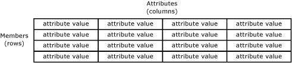
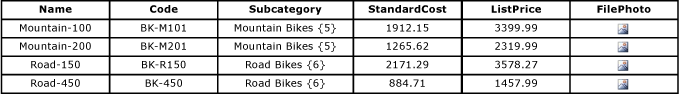

# Members (Master Data Services)
In [!INCLUDE[ssMDSshort](../../Topics/TopicNameContainA/includes/ssMDSshort_md.md)], members are the physical master data. For example, a member can be a Road-150 bike in a Product entity or a specific customer in a Customer entity.  
  
## How Members Relate to Other Model Objects  
 You can think of members as rows in a table. Related members are contained in an entity, and each member is defined by attribute values.  
  
 In this example, the table represents an entity, the rows in the table represent members, and the columns in the table represent attributes. Each cell represents an attribute value for a specific member.  
  
   
  
## Member Types  
 There are three types of members: leaf members, consolidated members, and collection members.  
  
 Leaf members are the default members in an entity.  
  
-   In derived hierarchies, leaf members are the only type of member. Leaf members from one entity are used as parents of leaf members from another entity.  
  
-   In explicit hierarchies, leaf members are the lowest level and cannot have children.  
  
 Consolidated members exist only when explicit hierarchies and collections are enabled for the entity.  
  
-   Derived hierarchies do not contain consolidated members.  
  
-   In explicit hierarchies, consolidated members can be parents of other members within the hierarchy, or they can be children.  
  
## Use Hierarchies and Collections to Organize Members  
 Hierarchies and collections can be used to group members for reporting or analysis. For more information, see [Hierarchies (Master Data Services)](../../Topics/TopicNameNotContainA/Hierarchies--Master-Data-Services-.md) and [Collections (Master Data Services)](../../Topics/TopicNameNotContainA/Collections--Master-Data-Services-.md).  
  
## Member Example  
 In the following example, each member is made up of a Name, Code, Subcategory, StandardCost, ListPrice, and FilePhoto attribute value.  
  
   
  
## Related Tasks  
  
|Task Description|Topic|  
|----------------------|-----------|  
|Create a new leaf member.|[Create a Leaf Member (Master Data Services)](../../Topics/TopicNameContainA/Create-a-Leaf-Member--Master-Data-Services-.md)|  
|Create a new consolidated member.|[Create a Consolidated Member (Master Data Services)](../../Topics/TopicNameContainA/Create-a-Consolidated-Member--Master-Data-Services-.md)|  
|Delete an existing member or collection.|[Delete a Member or Collection (Master Data Services)](../../Topics/TopicNameContainA/Delete-a-Member-or-Collection--Master-Data-Services-.md)|  
|Reactivate a deleted member or collection.|[Reactivate a Member or Collection (Master Data Services)](../../Topics/TopicNameContainA/Reactivate-a-Member-or-Collection--Master-Data-Services-.md)|  
|Update the attribute values of a member.|[Change the Attribute Type (MDS Add-in for Excel)](../../Topics/TopicNameNotContainA/Change-the-Attribute-Type--MDS-Add-in-for-Excel-.md)|  
|Move members within a hierarchy.|[Move Members within a Hierarchy (Master Data Services)](assetId:///049c9a15-89c1-478c-8438-028fffc9e187)|  
|Fix merge conflicts.|[Merge Conflicts (Master Data Services)](../../Topics/TopicNameNotContainA/Merge-Conflicts--Master-Data-Services-.md)|  
  
## Related Content  
  
-   [Master Data Services Overview (MDS)](../../Topics/TopicNameNotContainA/Master-Data-Services-Overview--MDS-.md)  
  
-   [Entities (Master Data Services)](../../Topics/TopicNameNotContainA/Entities--Master-Data-Services-.md)  
  
-   [Attributes (Master Data Services)](../../Topics/TopicNameNotContainA/Attributes--Master-Data-Services-.md)  
  
-   [Hierarchies (Master Data Services)](../../Topics/TopicNameNotContainA/Hierarchies--Master-Data-Services-.md)  
  
-   [Collections (Master Data Services)](../../Topics/TopicNameNotContainA/Collections--Master-Data-Services-.md)  
  
-   [Leaf Permissions (Master Data Services)](../../Topics/TopicNameNotContainA/Leaf-Permissions--Master-Data-Services-.md)  
  
-   [Consolidated Permissions (Master Data Services)](assetId:///084055a3-5fd3-43f3-b620-ac6afab42a3d)  
  
-   [Filter Operators (Master Data Services)](../../Topics/TopicNameNotContainA/Filter-Operators--Master-Data-Services-.md)