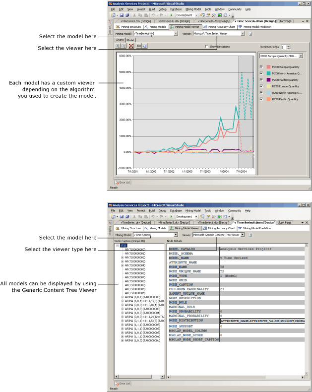

# Mining Model Viewers (Data Mining Model Designer)
Use the **Mining Model Viewer** tab to explore the mining models that a mining structure contains.  
  
 First you select the mining model and then you select a viewer. Each model always has two viewers available: a custom viewer, which can include multiple tabs, and the generic viewer.  
  
 For a walkthrough of how to use each viewer, see [Data Mining Model Viewers](../../Topics/TopicNameNotContainA/Data-Mining-Model-Viewers.md).  
  
## Common Options  
 **Refresh viewer content**  
 Reload the mining model in the viewer.  
  
 **Mining Model**  
 Choose a mining model to view that is contained in the current mining structure. The mining model will first open in its associated custom viewer.  
  
 **Viewer**  
 Choose a viewer to use to explore the selected mining model. This list includes the viewers that [!INCLUDE[msCoName](../../Topics/TopicNameContainA/includes/msCoName_md.md)] [!INCLUDE[ssNoVersion](../../Topics/TopicNameContainA/includes/ssNoVersion_md.md)] [!INCLUDE[ssASnoversion](../../Topics/TopicNameContainA/includes/ssASnoversion_md.md)] provides for each mining model, the [!INCLUDE[msCoName](../../Topics/TopicNameContainA/includes/msCoName_md.md)] Mining Content Viewer, and any plug-in viewers.  
  
 The following diagram shows a custom viewer and the generic viewer for the same model.  
  
-   The upper diagram shows the viewer for a mining model based on the Microsoft Time Series algorithm. This particular custom viewer automatically creates a graph of the time series and provides five predictions.  
  
-   The lower diagram shows the same model displayed using the **Microsoft Generic Content Tree Viewer**. This viewer presents the contents of the mining model according to a standardized schema. For more information, see [Microsoft Generic Content Tree Viewer (Data Mining)](../../Topics/TopicNameNotContainA/Microsoft-Generic-Content-Tree-Viewer--Data-Mining-.md).  
  
   
  
## Viewers and Their Components  
 Depending on the model that you select, you will see a different custom viewer, tailored to the algorithm that you used to create the selected data mining model. Each custom viewer has a variety of tools and dialog boxes for helping you explore the statistics and patterns in the model.  
  
 The following list describes the options in each of the custom viewers.  
  
### Microsoft Association Rules Algorithm  
  
-   [Browse a Model Using the Microsoft Association Rules Viewer](../../Topics/TopicNameContainA/Browse-a-Model-Using-the-Microsoft-Association-Rules-Viewer.md)  
  
    -   [Itemsets Tab (Mining Model Viewer)](../../Topics/TopicNameNotContainA/Itemsets-Tab--Mining-Model-Viewer-.md)  
  
    -   [Rules Tab (Mining Model Viewer)](../../Topics/TopicNameNotContainA/Rules-Tab--Mining-Model-Viewer-.md)  
  
    -   [Dependency Network Tab (Mining Model Viewer)](../../Topics/TopicNameNotContainA/Dependency-Network-Tab--Mining-Model-Viewer-.md)  
  
### Microsoft Clustering Algorithm  
  
-   [Browse a Model Using the Microsoft Cluster Viewer](../../Topics/TopicNameContainA/Browse-a-Model-Using-the-Microsoft-Cluster-Viewer.md)  
  
    -   [Cluster Diagram Tab (Mining Model Viewer)](../../Topics/TopicNameNotContainA/Cluster-Diagram-Tab--Mining-Model-Viewer-.md)  
  
    -   [Cluster Profiles Tab (Mining Model Viewer)](../../Topics/TopicNameNotContainA/Cluster-Profiles-Tab--Mining-Model-Viewer-.md)  
  
    -   [Cluster Characteristics Tab (Mining Model Viewer)](../../Topics/TopicNameNotContainA/Cluster-Characteristics-Tab--Mining-Model-Viewer-.md)  
  
    -   [Cluster Discrimination Tab (Mining Model Viewer)](../../Topics/TopicNameNotContainA/Cluster-Discrimination-Tab--Mining-Model-Viewer-.md)  
  
    -   [Mining Legend Dialog Box (Mining Model Viewer)](../../Topics/TopicNameNotContainA/Mining-Legend-Dialog-Box--Mining-Model-Viewer-.md)  
  
### Microsoft Decision Tree Algorithm  
  
-   [Browse a Model Using the Microsoft Tree Viewer](../../Topics/TopicNameContainA/Browse-a-Model-Using-the-Microsoft-Tree-Viewer.md)  
  
    -   [Decision Tree Tab (Mining Model Viewer)](../../Topics/TopicNameNotContainA/Decision-Tree-Tab--Mining-Model-Viewer-.md)  
  
    -   [Dependency Network Tab (Mining Model Viewer)](../../Topics/TopicNameNotContainA/Dependency-Network-Tab--Mining-Model-Viewer-.md)  
  
    -   [Mining Legend Dialog Box (Mining Model Viewer)](../../Topics/TopicNameNotContainA/Mining-Legend-Dialog-Box--Mining-Model-Viewer-.md)  
  
### Microsoft Linear Regression Algorithm  
  
-   [Browse a Model Using the Microsoft Neural Network Viewer](../../Topics/TopicNameContainA/Browse-a-Model-Using-the-Microsoft-Neural-Network-Viewer.md)  
  
    -   [Decision Tree Tab (Mining Model Viewer)](../../Topics/TopicNameNotContainA/Decision-Tree-Tab--Mining-Model-Viewer-.md)  
  
    -   [Dependency Network Tab (Mining Model Viewer)](../../Topics/TopicNameNotContainA/Dependency-Network-Tab--Mining-Model-Viewer-.md)  
  
    -   [Mining Legend Dialog Box (Mining Model Viewer)](../../Topics/TopicNameNotContainA/Mining-Legend-Dialog-Box--Mining-Model-Viewer-.md)  
  
### Microsoft Logistic Regression Algorithm  
  
-   [Browse a Model Using the Microsoft Neural Network Viewer](../../Topics/TopicNameContainA/Browse-a-Model-Using-the-Microsoft-Neural-Network-Viewer.md)  
  
### Microsoft Naïve Bayes Algorithm  
  
-   [Browse a Model Using the Microsoft Naive Bayes Viewer](../../Topics/TopicNameContainA/Browse-a-Model-Using-the-Microsoft-Naive-Bayes-Viewer.md)  
  
    -   [Dependency Network Tab (Mining Model Viewer)](../../Topics/TopicNameNotContainA/Dependency-Network-Tab--Mining-Model-Viewer-.md)  
  
    -   [Attribute Profiles Tab (Mining Model Viewer)](../../Topics/TopicNameNotContainA/Attribute-Profiles-Tab--Mining-Model-Viewer-.md)  
  
    -   [Attribute Characteristics Tab (Mining Model Viewer)](../../Topics/TopicNameNotContainA/Attribute-Characteristics-Tab--Mining-Model-Viewer-.md)  
  
    -   [Attribute Discrimination Tab (Mining Model Viewer)](../../Topics/TopicNameNotContainA/Attribute-Discrimination-Tab--Mining-Model-Viewer-.md)  
  
### Microsoft Neural Network Algorithm  
  
-   [Browse a Model Using the Microsoft Neural Network Viewer](../../Topics/TopicNameContainA/Browse-a-Model-Using-the-Microsoft-Neural-Network-Viewer.md)  
  
    -   [Dependency Network Tab (Mining Model Viewer)](../../Topics/TopicNameNotContainA/Dependency-Network-Tab--Mining-Model-Viewer-.md)  
  
    -   [Neural Network (Mining Model Viewer)](../../Topics/TopicNameNotContainA/Neural-Network--Mining-Model-Viewer-.md)  
  
    -   [Find Node Dialog Box (Mining Model Viewer)](../../Topics/TopicNameNotContainA/Find-Node-Dialog-Box--Mining-Model-Viewer-.md)  
  
### Microsoft Sequence Clustering Algorithm  
  
-   [Browse a Model Using the Microsoft Sequence Cluster Viewer](../../Topics/TopicNameContainA/Browse-a-Model-Using-the-Microsoft-Sequence-Cluster-Viewer.md)  
  
    -   [Sequence Clustering Cluster Diagram Tab (Mining Model Viewer](../Topic/Sequence%20Clustering%20Cluster%20Diagram%20Tab%20\(Mining%20Model%20Viewer.md)  
  
    -   [Sequence Clustering Cluster Profiles Tab (Mining Model Viewer](../Topic/Sequence%20Clustering%20Cluster%20Profiles%20Tab%20\(Mining%20Model%20Viewer.md)  
  
    -   [Sequence Clustering Cluster Characteristics Tab (Mining Model Viewer)](../Topic/Sequence%20Clustering%20Cluster%20Characteristics%20Tab%20\(Mining%20Model%20Viewer\).md)  
  
    -   [Sequence Clustering Cluster Discrimination Tab (Mining Model Viewer)](../Topic/Sequence%20Clustering%20Cluster%20Discrimination%20Tab%20\(Mining%20Model%20Viewer\).md)  
  
    -   [Sequence Clustering Cluster Transition Tab (Mining Model Viewer)](../Topic/Sequence%20Clustering%20Cluster%20Transition%20Tab%20(Mining%20Model%20Viewer).md)  
  
### Microsoft Time Series Algorithm  
  
-   [Browse a Model Using the Microsoft Time Series Viewer](../Topic/Browse%20a%20Model%20Using%20the%20Microsoft%20Time%20Series%20Viewer.md)  
  
    -   [Model Tab (Mining Model Viewers)](../Topic/Model%20Tab%20\(Mining%20Model%20Viewers\).md)  
  
    -   [Chart Tab (Mining Model Viewers)](../Topic/Chart%20Tab%20\(Mining%20Model%20Viewers\).md)  
  
    -   [Mining Legend Dialog Box (Mining Model Viewer)](../Topic/Mining%20Legend%20Dialog%20Box%20\(Mining%20Model%20Viewer\).md)  
  
## See Also  
 [Mining Models View (Data Mining Model Designer)](../Topic/Mining%20Models%20View%20\(Data%20Mining%20Model%20Designer\).md)   
 [Mining Structure View (Data Mining Model Designer)](../Topic/Mining%20Structure%20View%20\(Data%20Mining%20Model%20Designer\).md)   
 [Mining Accuracy Chart Designer (Data Mining)](../Topic/Mining%20Accuracy%20Chart%20Designer%20\(Data%20Mining\).md)   
 [Prediction Query Builder (Data Mining)](../Topic/Prediction%20Query%20Builder%20\(Data%20Mining\).md)