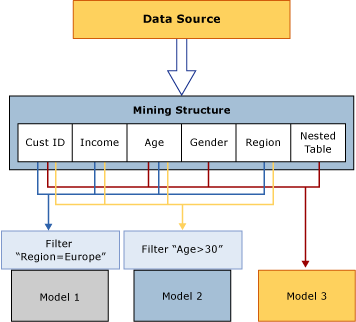

# Mining Structures (Analysis Services - Data Mining)
The mining structure defines the data from which mining models are built: it specifies the source data view, the number and type of columns, and an optional partition into training and testing sets. A single mining structure can support multiple mining models that share the same domain. The following diagram illustrates the relationship of the data mining structure to the data source, and to its constituent data mining models.  
  
   
  
 The mining structure in the diagram is based on a data source that contains multiple tables or views, joined on the CustomerID field. One table contains information about customers, such as the geographical region, age, income and gender, while the related nested table contains multiple rows of additional information about each customer, such as products the customer has purchased. The diagram shows that multiple models can be built on one mining structure, and that the models can use different columns from the structure.  
  
 **Model 1** Uses CustomerID, Income, Age, Region, and filters the data on Region.  
  
 **Model 2** Uses CustomerID, Income, Age, Region and filters the data on Age.  
  
 **Model 3** Uses CustomerID, Age, Gender, and the nested table, with no filter.  
  
 Because the models use different columns for input, and because two of the models additionally restrict the data that is used in the model by applying a filter, the models might have very different results even though they are based on the same data. Note that the CustomerID column is required in all models because it is the only available column that can be used as the case key.  
  
 This section explains the basic architecture of data mining structures: how you define a mining structure, how you populate it with data, and how you use it to create models. For more information about how to manage or export existing data mining structures, see [Management of Data Mining Solutions and Objects](../../Topics/TopicNameNotContainA/Management-of-Data-Mining-Solutions-and-Objects.md).  
  
## Defining a Mining Structure  
 Setting up a data mining structure includes the following steps:  
  
-   Define a data source.  
  
-   Select columns of data to include in the structure (not all columns need to be added to the model) and defining a key.  
  
-   Define a key for the structure, including the key for the bested table, if applicable.  
  
-   Specify whether the source data should be separate into a training set and testing set. This step is optional.  
  
-   Process the structure.  
  
 These steps are described in more detail in the following sections.  
  
### Data Sources for Mining Structures  
 When you define a mining structure, you use columns that are available in an existing data source view. A data source view is a shared object that lets you combine multiple data sources and use them as a single source. The original data sources are not visible to client applications, and you can use the properties of the data source view to modify data types, create aggregations, or alias columns.  
  
 If you build multiple mining models from the same mining structure, the models can use different columns from the structure. For example, you can create a single structure and then build separate decision tree and clustering models from it, with each model using different columns and predicting different attributes.  
  
 Moreover, each model can use the columns from the structure in different ways. For example, your data source view might contain an Income column, which you can bin in different ways for different models.  
  
 The data mining structure stores the definition of the data source and the columns in it in the form of *bindings* to the source data. For more information about data source bindings, see [Data Sources and Bindings (SSAS Multidimensional)](../../Topics/TopicNameNotContainA/Data-Sources-and-Bindings--SSAS-Multidimensional-.md). However, note that you can also create a data mining structure without binding it to a specific data source by using the DMX [CREATE MINING STRUCTURE (DMX)](assetId:///c0dec39c-e90f-4afd-aeaf-a9c3e1d1a5e0) statement.  
  
### Mining Structure Columns  
 The building blocks of the mining structure are the mining structure columns, which describe the data that the data source contains. These columns contain information such as data type, content type, and how the data is distributed. The mining structure does not contain information about how columns are used for a specific mining model, or about the type of algorithm that is used to build a model; this information is defined in the mining model itself.  
  
 A mining structure can also contain nested tables. A nested table represents a one-to-many relationship between the entity of a case and its related attributes. For example, if the information that describes the customer resides in one table, and the customer's purchases reside in another table, you can use nested tables to combine the information into a single case. The customer identifier is the entity, and the purchases are the related attributes. For more information about when to use nested tables, see [Nested Tables (Analysis Services - Data Mining)](../../Topics/TopicNameNotContainA/Nested-Tables--Analysis-Services---Data-Mining-.md).  
  
 To create a data mining model in [!INCLUDE[ssBIDevStudioFull](../../Topics/TopicNameContainA/includes/ssBIDevStudioFull_md.md)], you must first create a data mining structure. The Data Mining wizard walks you through the process of creating a mining structure, choosing data, and adding a mining model.  
  
 If you create a mining model by using Data Mining Extensions (DMX), you can specify the model and the columns in it, and DMX will automatically create the required mining structure. For more information, see [CREATE MINING MODEL (DMX)](assetId:///43e4b591-7b34-494c-9b2d-7f0fe69af788).  
  
 For more information, see [Mining Structure Columns](../../Topics/TopicNameNotContainA/Mining-Structure-Columns.md).  
  
### Dividing the Data into Training and Testing Sets  
 When you define the data for the mining structure, you can also specify that some of the data be used for training, and some for testing. Therefore, it is no longer necessary to separate your data in advance of creating a data mining structure. Instead, while you create your model, you can specify that a certain percentage of the data be held out for testing, and the rest used for training, or you can specify a certain number of cases to use as the test data set. The information about the training and testing data sets is cached with the mining structure, and as a result, the same test set can be used with all models that are based on that structure.  
  
 For more information, see [Training and Testing Data Sets](../../Topics/TopicNameNotContainA/Training-and-Testing-Data-Sets.md).  
  
### Enabling Drillthrough  
 You can add columns to the mining structure even if you do not plan to use the column in a specific mining model. This is useful if, for example, you want to retrieve the e-mail addresses of customers in a clustering model, without using the e-mail address during the analysis process. To ignore a column during the analysis and prediction phase, you add it to the structure but do not specify a usage for the column, or set the usage flag to Ignore. Data flagged in this way can still be used in queries if drillthrough has been enabled on the mining model, and if you have the appropriate permissions. For example, you could review the clusters resulting from analysis of all customers, and then use a drillthrough query to get the names and e-mail addresses of customers in a particular cluster, even though those columns of data were not used to build the model.  
  
 For more information, see [Drillthrough Queries (Data Mining)](../../Topics/TopicNameNotContainA/Drillthrough-Queries--Data-Mining-.md).  
  
### Processing Mining Structures  
 A mining structure is just a metadata container until it is processed. When you process a mining structure, [!INCLUDE[ssASnoversion](../../Topics/TopicNameContainA/includes/ssASnoversion_md.md)] creates a cache that stores statistics about the data, information about how any continuous attributes are discretized, and other information that is later used by mining models. The mining model itself does not store this summary information, but instead references the information that was cached when the mining structure was processed. Therefore, you do not need to reprocess the structure each time you add a new model to an existing structure; you can process just the model.  
  
 You can opt to discard this cache after processing, if the cache is very large or you want to remove detailed data. If you do not want the data to be cached, you can change the **CacheMode** property of the mining structure to **ClearAfterProcessing**. This will destroy the cache after any models are processed. Setting the **CacheMode** property to **ClearAfterProcessing** will disable drillthrough from the mining model.  
  
 However, after you destroy the cache, you will not be able to add new models to the mining structure. If you add a new mining model to the structure, or change the properties of existing models, you would need to reprocess the mining structure first. For more information, see [Processing Requirements and Considerations (Data Mining)](../../Topics/TopicNameNotContainA/Processing-Requirements-and-Considerations--Data-Mining-.md).  
  
### Viewing Mining Structures  
 You cannot use viewers to browse the data in a mining structure. However, in [!INCLUDE[ssBIDevStudioFull](../../Topics/TopicNameContainA/includes/ssBIDevStudioFull_md.md)], you can use the **Mining Structure** tab of Data Mining Designer to view the structure columns and their definitions. For more information, see [Data Mining Designer](../../Topics/TopicNameNotContainA/Data-Mining-Designer.md).  
  
 If you want to review the data in the mining structure, you can create queries by using Data Mining Extensions (DMX). For example, the statement `SELECT * FROM <structure>.CASES` returns all the data in the mining structure. To retrieve this information, the mining structure must have been processed, and the results of processing must be cached.  
  
 The statement `SELECT * FROM <model>.CASES` returns the same columns, but only for the cases in that particular model. For more information, see [SELECT FROM <structure\>.CASES](assetId:///36f50213-14dc-42da-b899-20240b781e1a) and [SELECT FROM <model\>.CASES (DMX)](assetId:///d58acb47-aaa6-40b7-b8c4-6a6700fbc1dd).  
  
## Using Data Mining Models with Mining Structures  
 A data mining model applies a mining model algorithm to the data that is represented by a mining structure. A mining model is an object that belongs to a particular mining structure, and the model inherits all the values of the properties that are defined by the mining structure. The model can use all the columns that the mining structure contains or a subset of the columns. You can add multiple copies of a structure column to a structure. You can also add multiple copies of a structure column to a model, and then assign different names, or *aliases*, to each structure column in the model. For more information about aliasing structure columns, see [Create an Alias for a Model Column](../../Topics/TopicNameContainA/Create-an-Alias-for-a-Model-Column.md) and [Mining Model Properties](../../Topics/TopicNameNotContainA/Mining-Model-Properties.md).  
  
 For more information about the architecture of data mining models, see [Mining Models (Analysis Services - Data Mining)](../../Topics/TopicNameNotContainA/Mining-Models--Analysis-Services---Data-Mining-.md).  
  
## Related Tasks  
 Use the links provided her to learn more about how to define, manage, and use mining structures.  
  
|Tasks|Links|  
|-----------|-----------|  
|Work with relational mining structures|[Create a New Relational Mining Structure](../../Topics/TopicNameContainA/Create-a-New-Relational-Mining-Structure.md)   [Add a Nested Table to a Mining Structure](../../Topics/TopicNameContainA/Add-a-Nested-Table-to-a-Mining-Structure.md)|  
|Work with mining structures based on OLAP cubes|[Create a New OLAP Mining Structure](../../Topics/TopicNameContainA/Create-a-New-OLAP-Mining-Structure.md)   [Filter the Source Cube for a Mining Structure](assetId:///05dce7e1-2fe5-4500-bacf-c1a8a76e1424)|  
|Work with columns in a  mining structure|[Add Columns to a Mining Structure](../../Topics/TopicNameContainA/Add-Columns-to-a-Mining-Structure.md)   [Remove Columns from a Mining Structure](../../Topics/TopicNameContainA/Remove-Columns-from-a-Mining-Structure.md)|  
|Change or query mining structure properties and data|[Change the Properties of a Mining Structure](../../Topics/TopicNameContainA/Change-the-Properties-of-a-Mining-Structure.md)|  
|Work with the underlying data sources and update source data|[Edit the Data Source View used for a Mining Structure](../../Topics/TopicNameContainA/Edit-the-Data-Source-View-used-for-a-Mining-Structure.md)   [Process a Mining Structure](../../Topics/TopicNameContainA/Process-a-Mining-Structure.md)|  
  
## See Also  
 [Analysis Services Objects (SSAS)](assetId:///f76d869b-fc1d-4807-9f28-da09c7be382d)   
 [Mining Models (Analysis Services - Data Mining)](../../Topics/TopicNameNotContainA/Mining-Models--Analysis-Services---Data-Mining-.md)