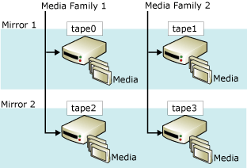

# Mirrored Backup Media Sets (SQL Server)
> [!NOTE]  
>  Mirrored backup media sets are supported only in the Enterprise edition of [!INCLUDE[ssNoVersion](../../Topics/TopicNameContainA/includes/ssNoVersion_md.md)].  
  
 Mirroring a media set increases backup reliability by reducing the impact of backup-device malfunctions. These malfunctions are very serious because backups are the last line of defense against data loss. As databases grow, the probability increases that a failure of a backup device or media will make a backup nonrestorable. Mirroring backup media increases the reliability of backups by providing redundancy.  
  
> [!NOTE]  
>  For information about media sets in general, see [Media Sets, Media Families, and Backup Sets (SQL Server)](../../Topics/TopicNameNotContainA/Media-Sets--Media-Families--and-Backup-Sets--SQL-Server-.md).  
  
 **In this Topic:**  
  
-   [Overview of Mirrored Media Sets](#OverviewofMirroredMediaSets)  
  
-   [Hardware Requirements for Backup Mirrors](#HardwareReqs)  
  
-   [Related Tasks](#RelatedTasks)  
  
##   Overview of Mirrored Media Sets  
 Media mirroring is a property of the media set. A *mirrored media set* consists of multiple copies (*mirrors*) of the media set. A media set contains one or more media families, each of which corresponds to a backup device. For example, if the TO clause of a BACKUP DATABASE statement lists three devices, BACKUP spreads the data among three media families, one per device. The number of media families and mirrors is defined when the media set is created (by a BACKUP DATABASE statement that specifies WITH FORMAT).  
  
 A mirrored media set possesses from two to four mirrors. Each mirror contains all the media families in the media set. The mirrors require the same number of devices, one per media family. Each mirror requires a separate backup device for each media family. For example, a mirrored media set that consists of four media families with three mirrors requires twelve backup devices. All of these devices must be equivalent. For example, tape drives that have the same model number from the same manufacturer.  
  
 The following illustration shows an example of a mirrored media set that consists of two media families with two mirrors. Each media family contains three media volumes, which are backed up one time per mirror.  
  
   
  
 Corresponding volumes on the mirrors have identical contents. This makes them interchangeable at restore time. For example, in the previous illustration, the third volume of tape2 is interchangeable with the third volume of tape0.  
  
 The [!INCLUDE[ssDEnoversion](../../Topics/TopicNameContainA/includes/ssDEnoversion_md.md)] guarantees that the mirrored media have identical contents by synchronizing writes to the devices. When any one of the mirrors fills, all the mirrors are spanned at one time.  
  
> [!IMPORTANT]  
>  A mirrored media set cannot be implicitly broken (split) by removing a mirror. If any tape or disk in a mirror is damaged or reformatted, the mirror is no longer usable for additional backups. If at least one full mirror remains intact, the media set can be read. If every mirror loses a given media family, the media set is useless.  
  
 Backup and restore operations impose different requirements on whether all the mirrors must be present. For a backup operation to write (that is, to create or extend) a mirrored media set, all the mirrors must be present. In contrast, when you are restoring a backup from a mirrored media set, you can specify only a single mirror for each media family. You can restore from fewer devices than families, but each media family is processed only one time. In the presence of errors, however, having the other mirrors enables some restore problems to be resolved quickly. You can substitute a damaged media volume with the corresponding volume from another mirror. This is because RESTORE and RESTORE VERIFYONLY support substitution of damaged media with the corresponding backup-media volume from another mirror.  
  
##   Hardware Requirements for Backup Mirrors  
 Mirroring applies both to disk and tape (disks do not support continuation tapes). All backup devices for a single backup or restore operation must be of the same type, disk or tape.  
  
 Within these broader classes, you must use similar devices that have the same properties. Insufficiently similar devices generate an error message (3212). To avoid the risk of a device mismatch, use devices that are equivalent, such as, only drives with the same model number from the same manufacturer.  
  
##   Related Tasks  
 **To back up to mirrored backup devices**  
  
-   [Back Up to a Mirrored Media Set (Transact-SQL)](../../Topics/TopicNameContainA/Back-Up-to-a-Mirrored-Media-Set--Transact-SQL-.md)  
  
## See Also  
 [Possible Media Errors During Backup and Restore (SQL Server)](../../Topics/TopicNameNotContainA/Possible-Media-Errors-During-Backup-and-Restore--SQL-Server-.md)   
 [RESTORE VERIFYONLY (Transact-SQL)](assetId:///cba3b6a0-b48e-4c94-812b-5b3cbb408bd6)   
 [Backup Devices (SQL Server)](../../Topics/TopicNameNotContainA/Backup-Devices--SQL-Server-.md)   
 [Media Sets, Media Families, and Backup Sets (SQL Server)](../../Topics/TopicNameNotContainA/Media-Sets--Media-Families--and-Backup-Sets--SQL-Server-.md)