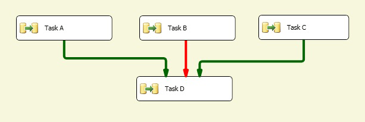

# Multiple Precedence Constraints
A precedence constraint connects two executables: two tasks, two containers, or one of each. They are known as the precedence executable and the constrained executable. A constrained executable can have multiple precedence constraints. For more information, see [Precedence Constraints](../../Topics/TopicNameNotContainA/Precedence-Constraints.md).  
  
 Assembling complex constraint scenarios by grouping constraints enables you to implement complex control flow in packages. For example, in the following illustration, Task D is linked to Task A by a **Success** constraint, Task D is linked to Task B by a **Failure** constraint, and Task D is linked to Task C by a **Success** constraint. The precedence constraints between Task D and Task A, between Task D and Task B, and between Task D and Task C participate in a logical *and* relationship. Therefore, for Task D to run, Task A must run successfully, Task B must fail, and Task C must run successfully.  
  
   
  
## LogicalAnd Property  
 If a task or a container has multiple constraints, the **LogicalAnd** property specifies whether a precedence constraint is evaluated singly or in concert with other constraints.  
  
 You can set the **LogicalAnd** property using the **Precedence Constraint Editor** in [!INCLUDE[ssIS](../../Topics/TopicNameContainA/includes/ssIS_md.md)] Designer, or in the Properties window that [!INCLUDE[ssBIDevStudioFull](../../Topics/TopicNameContainA/includes/ssBIDevStudioFull_md.md)] provides.  
  
## Related Tasks  
 [Set the Properties of a Precedence Constraint](../../Topics/TopicNameContainA/Set-the-Properties-of-a-Precedence-Constraint.md)