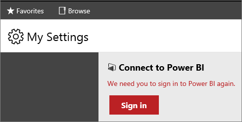

# My Settings for Power BI Integration (web portal)
The **My Settings** page in [!INCLUDE[ssRSnoversion](../../Topics/TopicNameContainA/includes/ssRSnoversion_md.md)] Report Manager is used by individual users to manage their sign-in with [!INCLUDE[sspowerbi](../../Topics/TopicNameNotContainA/includes/sspowerbi_md.md)]. When you  go through the steps to pin a report item, you will automatically be prompted to sign.  However,  you can use **My Settings** page if you need to manually sign in or if you need to sign out.  If the **My Settings** menu option is not visible, the report server has not been integrated with  [!INCLUDE[sspowerbi](../../Topics/TopicNameNotContainA/includes/sspowerbi_md.md)].  For more information, see [Power BI Report Server Integration (Configuration Manager)](../../Topics/TopicNameNotContainA/Power-BI-Report-Server-Integration--Configuration-Manager-.md).  
  
   
  
## Why Sign-in  
 When you sign in, you establish a relationship between your [!INCLUDE[ssRSnoversion](../../Topics/TopicNameContainA/includes/ssRSnoversion_md.md)] user account and  your [!INCLUDE[sspowerbi](../../Topics/TopicNameNotContainA/includes/sspowerbi_md.md)] account.  The sign-in creates a security token that is good for 90 days.  If you notice tiles are no longer refreshing on the [!INCLUDE[sspowerbi](../../Topics/TopicNameNotContainA/includes/sspowerbi_md.md)] dashboard, you need to sign-in again and a new security token will be created.  After you sign in, your dashboard tiles will begin updating on their previously configured schedules.  
  
   
  
## See Also  
 [Power BI Report Server Integration (Configuration Manager)](../../Topics/TopicNameNotContainA/Power-BI-Report-Server-Integration--Configuration-Manager-.md)   
 [Pin Reporting Services items to Power BI Dashboards](../../Topics/TopicNameNotContainA/Pin-Reporting-Services-items-to-Power-BI-Dashboards.md)   
 [Dashboards in Power BI](https://support.powerbi.com/knowledgebase/articles/424868-dashboards-in-power-bi)