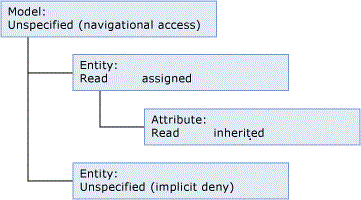

# Navigational Access (Master Data Services)
Navigational access applies to model object security, which is assigned on the **Models** tab.  
  
 Navigational access is the access you get to levels higher than where you’ve assigned security.  
  
 In this example, permissions are assigned to an entity, and so navigational access is granted at the model level.  
  
   
  
 **Entities**  
  
 When you assign permission to an entity, its leaf members, or its consolidated members, navigational access means you can read or update the name and code for all members. You can also read the model name.  
  
 **Attributes**  
  
 When you assign permission to an attribute, navigational access means you can read or update the name and code for all members in the entity. You can also read the model name.  
  
 **Collections**  
  
 When you assign permissions to collections, you can read or update the name, code, description and owner ID. You can also read the model name.  
  
## See Also  
 [How Permissions Are Determined (Master Data Services)](../../Topics/TopicNameNotContainA/How-Permissions-Are-Determined--Master-Data-Services-.md)